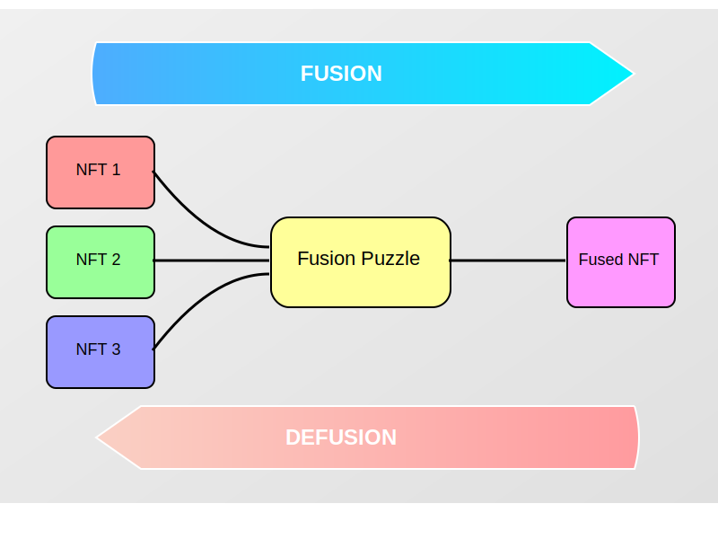

| CHIP Number   | 0021                                                                       |
|:--------------|:---------------------------------------------------------------------------|
| Title         | NFT Fusion Puzzle                                                          |
| Description   | Smart Coin Puzzle for fusing (combining), defusing, and upgrading NFTs     |
| Author        | [Brandt Holmes](https://github.com/BrandtH22) (BrandtH22/ClydeWallace22)   |
| Editor        | [Dan Perry](https://github.com/danieljperry)                               |
| Comments-URI  | [CHIPs repo, PR #86](https://github.com/Chia-Network/chips/pull/86)        |
| Status        | Final                                                                      |
| Category      | Informational                                                              |
| Sub-Category  | Chialisp Puzzle                                                            |
| Created       | 2023-10-01                                                                 |
| Requires      | [0015](https://github.com/Chia-Network/chips/blob/main/CHIPs/chip-0015.md) |
| Replaces      | None                                                                       |
| Superseded-By | None                                                                       |
| Extends       | None                                                                       |

## Abstract
The fusion puzzle was developed by [lucky8](https://github.com/trgarrett/fusion-clsp). 
The FusionZoo frontend was developed by [Gaerax](https://github.com/Gaerax).  
This development project was managed by [SumSet Tech](https://sumset.tech/) in partnership with [MonkeyZoo](https://www.MonkeyZoo.net/).

Proposal for a Chialisp puzzle that enables a trustless and decentralized method of fusing (combining), updating, dividing, and upgrading NFTs on the Chia blockchain.

Fusion: The single puzzle connects an input of one or more NFTs and an output of one or more NFTs; the input NFT(s) must be included in an offer file to claim the output NFT(s) locked with the smart coin puzzle.

Defusion: The puzzle also supports reversing the operation by anyone who controls the necessary NFT(s) (output NFT(s) must be included in an offer file to claim the input NFT(s)).



NOTE - this puzzle does not mint NFTs, if any additional NFTs are needed to fulfill the puzzle (ex. combining two already minted NFTs to create a new one), those new NFTs must be minted by the correct DID to remain compliant with [CHIP 0015](https://github.com/Chia-Network/chips/blob/main/CHIPs/chip-0015.md).

## Motivation
The current NFT standard on Chia is a truly hardened non-fungible standard and intentionally prevents an NFT owner or creator from changing, upgrading, dividing, or combining the NFT with others.

This puzzle enables a method of retaining the non-fungible design of Chia NFTs and associated provenance while introducing a method to change, upgrade, divide, or combine the NFT with others.

## Backwards Compatibility
This CHIP extension is fully backwards compatible and designed to be future-proof.

The use of CHIP 15 metadata aids display services (marketplaces, explorers, wallets, etc) to better display the intricacies associates with the NFT Fusion Puzzle including:
- NFT(s) that are locked in fusion puzzles (hints can be used to identify whether the NFT is locked in a puzzle)
- NFT(s) that have been changed in some way using a fusion puzzle (CHIP 15 metadata identifies the fusion puzzle address and the original NFT(s))
- NFT(s) that have been upgraded using the fusion puzzle (CHIP 15 metadata identifies the fusion puzzle address and the original NFT(s))
- NFT(s) that have been combined using the fusion puzzle (CHIP 15 metadata identifies the fusion puzzle address and the original NFT(s))

Existing NFTs: All current Chia NFTs can be used as inputs for the fusion puzzle without any modifications.
NFT Standard: The fusion puzzle adheres to the existing NFT standard (CHIP-0015), ensuring compatibility with current NFT wallets, marketplaces, and other infrastructure.
Metadata: The metadata format for fused NFTs extends the current standard, adding new fields without breaking existing parsers. Systems that do not understand the fusion specific metadata can still read and display the basic NFT information.
Offer System: The fusion puzzle leverages Chia's existing offer system, requiring no changes to the core protocol or wallet software.
Defusion: The ability to defuse (reverse) a fusion ensures that no NFTs are permanently altered or lost, maintaining backwards compatibility with their original forms.
Progressive Enhancement: Systems that are not updated to understand fusion will simply see the fused NFT as a regular NFT, while updated systems can take advantage of the additional functionality.

## Rationale
Describe the reasons for designing your features in the way you have proposed. Make sure to include:
  * Why did you choose your design?
    * Inclusion of CHIP 15 metadata ensures ease of integration and future-proofing.
    * Use of offer files enhances the user experience.
    * Use of a singleton ensures state changes can be identified and contracts can be easily identified on-chain.
    * On-chain puzzle ensures true decentralization post creation.
  * What design decisions did you make?
    * The use of a smart puzzle to enable on-chain provenance and immutability.
    * The use of offer files for a user-friendly experience.
    * The ability to reverse the puzzle enabling upgrading/downgrading.
    * The ability to use one or more NFTs on either side of the puzzle.
    * Not to have any overrides or master keysets involved in the puzzle.
  * What alternative designs did you consider?
    * Performing everything offline in a trusted manner (users send NFTs to a project creator to have the upgraded NFT returned), this requires trusting the project and severely limits future interactions such as defusing or downgrading.
    * The use of custom spend bundles requiring the user to download and run custom scripts as this would have simplified development.
    * Creating a 1-way only puzzle as this simplified development but drastically limits functionality.
    * Limiting the puzzle to single NFTs again simplified development but drastically limits functionality.
    * Including an escape spend that would enable the puzzle creator to remove NFTs from the puzzles. This was initially intended to be a security feature to ensure NFTs would not be bricked by the incorrect creation of contracts but was deemed too much of a security risk when the project is not known.
  * How have you achieved community consensus for your design?
    * Over the period of 1-year, we have discussed and reviewed the design and integration plans with display services, Chialisp developers, community members, and more.
    * We have drastically upgraded the initial design of the puzzle to enable the use of offer files rather than custom spend bundle logic.
    * We have developed a full implementation for the [MonkeyZoo project's](https://www.MonkeyZoo.net/) FusionZoo (link to be added).
  * What objections were raised during your discussions with the community, and how does your design address them?
    * Backwards compatibility - The ability to use this puzzle with any and all NFTs that currently exist on-chain ensures full backwards compatibility. Also, using CHIP15 metadata ensures display services already have the tools they need to display the intricacies of the puzzles.
    * Future compatibility - The ability to reverse the puzzle ensures that even future owners can claim back the original NFT(s) locked in the puzzle. Also, the ability to use cascading puzzles ensures ever-increasing functionality.
    * Ease of integration - Using primitives and CHIPs that are already present in the Chia ecosystem simplifies integration for display services. Developing a test case for the MonkeyZoo project and providing the full contract open source helps others to utilize the puzzle.
    * Purpose of integration - Expanding the current functionality of Chia NFTs in a way that enables ever-increasing functionality and expandability.

## Specification
The clsp codebase that supports this puzzle can be found [here](https://github.com/trgarrett/fusion-clsp).
The puzzle has two sides; side A is considered the new, fused, or upgraded NFT(s) while side B is considered the old, components, or outdated NFT(s).

The process flow below includes the commands used to demonstrate the fusion puzzle deployment and interactions for a fusion (combining multiple NFTs) and defusion (separating previously combined NFTs).

Process flow of the fusion puzzle:

1. NFTs are minted or NFT IDs are determined.

    `PREFIX=txch FINGERPRINT=<WALLET_FINGERPRINT> python3 -m fusion.fusion mint 3`

2. NFT IDs are used to create and deploy the singleton managing the puzzle with 1 mojo and any added fees (note the NFTs in this command accept a comma separator and are ordered `side A`,`side B`).

    `PREFIX=txch FINGERPRINT=<WALLET_FINGERPRINT> python3 -m fusion.fusion deploy nft13xchuymhuknmc27v478h6kymd2s6s46ux7sye05xkrwtzusax25srzpz7m nft1k065498d9qa398tt8x9sulv40gqy8yeqgzvr5zfj6c9uflxh5c5sezljp2,nft1cjp70ajuhfmy3dtqn0s0ft06wspef6m7ut5dx9w0740p92mlj9tslcgln7`

3. The state of the fusion puzzle is verified.

    `PREFIX=txch FINGERPRINT=<WALLET_FINGERPRINT> python3 -m fusion.fusion check 0xa89bdfcb028133ca149058b88c3de1f6a03de64e9b65554aef0c90081081ae86`

4. The side A NFT(s) are sent to the fusion puzzle.

    `chia wallet nft transfer -i 80 -ni nft13xchuymhuknmc27v478h6kymd2s6s46ux7sye05xkrwtzusax25srzpz7m -ta `

5. The fusion offer file is created.

    `chia wallet make_offer -o nft1k065498d9qa398tt8x9sulv40gqy8yeqgzvr5zfj6c9uflxh5c5sezljp2:1 -o nft1cjp70ajuhfmy3dtqn0s0ft06wspef6m7ut5dx9w0740p92mlj9tslcgln7:1 -r nft13xchuymhuknmc27v478h6kymd2s6s46ux7sye05xkrwtzusax25srzpz7m:1 -p offer.txt`

6. The fusion offer is pushed to the chain.

    `PREFIX=txch FINGERPRINT=<WALLET_FINGERPRINT> python3 -m fusion.fusion swap 0xa89bdfcb028133ca149058b88c3de1f6a03de64e9b65554aef0c90081081ae86 <offer.txt contents>`

7. The status of the fusion puzzle is verified (should not contain side B with side A being returned to the user).

    `PREFIX=txch FINGERPRINT=<WALLET_FINGERPRINT> python3 -m fusion.fusion check 0xa89bdfcb028133ca149058b88c3de1f6a03de64e9b65554aef0c90081081ae86`

8. The defusion offer file is created.

    `chia wallet make_offer -r nft1k065498d9qa398tt8x9sulv40gqy8yeqgzvr5zfj6c9uflxh5c5sezljp2:1 -r nft1cjp70ajuhfmy3dtqn0s0ft06wspef6m7ut5dx9w0740p92mlj9tslcgln7:1 -o nft13xchuymhuknmc27v478h6kymd2s6s46ux7sye05xkrwtzusax25srzpz7m:1 -p offer.txt`

9. The defusion offer is pushed to the chain.

    `PREFIX=txch FINGERPRINT=<WALLET_FINGERPRINT> python3 -m fusion.fusion swap 0xa89bdfcb028133ca149058b88c3de1f6a03de64e9b65554aef0c90081081ae86 <offer.txt contents>`

### Estimated Costs and Minimum Fees
The below are clvm costs associated with the Fusion process (combining multiple nfts), costs for the other operations can be estimated based on these.  
In addition to the cost for the operation, the associated minimum fee is listed (5 fee per cost) and also the cost variance for additional NFTs to be included in the process.

|                           | NFT <> NFT	    | 2 NFTs <> NFT	 | 1 -> 2 Variance	 | 3 NFTs <> NFT	 | 2 -> 3 Variance	 | 4 NFTs <> NFT |
|---------------------------|----------------|----------------|------------------|----------------|------------------|---------------|
| Deploy fusion fee (5fpc)	 | 689,458,415	   | 695,389,005	   | 5,930,590	       | 697,444,655	   | 2,055,650	       | 699,500,305   | 
| Deploy fusion cost	       | 137,891,683	   | 139,077,801	   | 1,186,118	       | 139,488,931	   | 411,130	         | 139,900,061   |
| Fusion fee (5fpc)	        | 1,731,994,570	 | 2,455,538,940	 | 723,544,370	     | 3,171,333,430	 | 715,794,490	     | 3,887,127,920 | 
| Fusion cost	              | 346,398,914	   | 491,107,788	   | 144,708,874	     | 634,266,686	   | 143,158,898	     | 777,425,584   |   
| De-fusion fee (5fpc)	     | 1,732,268,330	 | 2,486,667,410	 | 754,399,080	     | 3,233,316,610	 | 746,649,200	     | 3,979,965,810 | 
| De-fusion cost	           | 346,453,666	   | 497,333,482	   | 150,879,816	     | 646,663,322	   | 149,329,840	     | 795,993,162   |   
   
### Integrating the Fusion Puzzle
Each ecosystem member will have a different role to play in the adoption of this proposal:

**Display Service(s):**

Display services have the ability to parse the CHIP15 metadata and to identify Fusion Puzzles via hints in order to display:
- NFTs locked in fusion puzzles
- The provenance of fused/updated/upgraded NFTs
- Available interactions with fusion puzzles (defusing, reverting updates, downgrading, etc)
- Total number of fusion puzzles
- Total number of NFT associated with fusion puzzles
- Hint for identification: [`0x83241157e6b396cc2b428b8ad47b113de88a23a91eeed5430f086f36cc0385c9`](https://github.com/trgarrett/fusion-clsp/blob/main/fusion/fusion.py#L90)

**Minting Solution(s):**

Minting solutions have the ability to provide fusion, update, and/or upgrade services to creators by integrating the fusion puzzle into their minting solution.

**Creator(s):**

Creators have the ability to add additional functionality through fusions and upgrades or to update their NFTs as they deem fit (the NFT holder has the ability to follow through with the update or to keep their current version).

#### Fusion Example: Fusing (Combining) NFTs
NOTE - examples below are showing the data specific to displaying the components of a Fusion Puzzle and are not fully inclusive of CHIP15 capabilities. More complete examples can be found in the [CHIP assets](#additional-assets).

NOTE 2 - examples below are representative of specific attributes being fused but this CHIP can also be used for entire NFTs rather than just specific attributes. 

NOTE 3 - the puzzle can additionally be used to divide nfts and not just combine them, for this the inverse property of isPartOf can be used or a combination of hasPart and isPartOf might be applicable based on the resulting parts.

The below example shows an NFT that was created by fusing 5 attributes from 5 different NFTs.
This example identifies:

- type and encoding format of the fused NFT
- XCH address of the fusion puzzle
- all attributes that were fused to create the fused NFT
- the original NFT IDs of the fused attributes

| Property     | Type     | Required | Description                                                                                                                                                                                                  |
|--------------|----------|----------|--------------------------------------------------------------------------------------------------------------------------------------------------------------------------------------------------------------|
| `subjectOf`  | {object} | **Yes**  | denotes the NFT is associated with the noted property (a fusion puzzle in this case)                                                                                                                         |
| `@type`      | string   | **Yes**  | property type ("PropertyValue" should be used to denote that specific propertyIDs will be used)                                                                                                             |
| `propertyID` | string   | **Yes**  | property id ("Fusion Puzzle" denotes that this puzzle is used in the NFT, "Fused Attribute" denotes the NFT fuses attributes from 1 or more NFTs, "NFTid" denotes the original NFT containing the attribute) |
| `value`      | string   | **Yes**  | value of the identifier (an XCH address will be used for the puzzle, NFT IDs will be used for associated NFTs, attribute values will be used for attributes)                                                  |
| `hasPart`    | [array]  | **Yes**  | an array denoting parts contained in the NFT (fused attributes will be identified in the array)                                                                                                              |
| `isPartOf`    | [array]  | **Yes**  | an array denoting the source NFT from which the part originated (used for the parts of divided nfts)                                                                                                              |
| `identifier` | {object} | **Yes**  | denotes that additional information or data is provided for the NFT (refer to the contents of the identifier object for more details)                                                                        |
| `name`       | string   | **Yes**  | name or title of the identifier (attribute names will be used for fused attributes)                                                                                                                          |
| `mainEntity` | {object} | **Yes**  | object that identifies the original NFT containing the fused attribute                                                                                                                                       |

Note: Transformations should follow the schema defined by [glTF](https://registry.khronos.org/glTF/specs/2.0/glTF-2.0.html#transformations)

Use Cases:
- combining multiple NFTs into 1 or more other NFTs
- composable assets

 ```
"data": {
    "@context": "https://schema.org",
    "@type": "ImageObject",
    "encodingFormat": "image/webp",
    "contentSize": "178370",
    "width": "3584",
    "height": "2200",
    "duration": "{image_duration}",
    "subjectOf": {
      "@type": "PropertyValue",
      "propertyID": "Fusion Contract",
      "value": "{fusion_contract}"
    },
    "thumbnail": [
      {
        "@type": "ImageObject",
        "encodingFormat": "WEBP",
        "sha256": "5839a71f7f1ccb5f0ac8c60da8aca614a8f7c31d717952d02bd875476ee9d5d0",
        "height": "672",
        "width": "500",
        "name": "TEST MonkeyZoo Fused #46-672x500.png",
        "size": "24486",
        "url": "['https://ipfs.io/ipfs/bafybeib2htpmm3cxxpmorx2c7ndgwxzfysia6ii35d5tf4h2pnwicpeu6y/6f3fc4f4f4a367172f9437176fe44ba91977b50ed4cabee556133effe0aeaa52_thumb.webp']"
      }
    ],
    "encodesCreativeWork": [
      {
        "@type": "ImageObject",
        "encodingFormat": "image/webp",
        "sha256": "6e432e28605df0c51ee055ff830b52ff94fa4282ea9e65ee8879a677301ea43d",
        "height": "2200",
        "width": "3584",
        "name": "TEST MonkeyZoo Fused #46.webp",
        "size": "178370",
        "url": "['https://ipfs.io/ipfs/bafybeie2ytudmdstehrfduazevmsq4vdwk23hd2sroxekmkhbzheq5buke/6f3fc4f4f4a367172f9437176fe44ba91977b50ed4cabee556133effe0aeaa52.webp']"
      }
    ],
    "hasPart": [
      {
        "@type": "ImageObject",
        "encodingFormat": "image/webp",
        "sha256": "e2cc27b567236d8f68d4e3f7d5d0b4409072e26129ca92f4190f18318d87aa22",
        "identifier": {
          "@type": "PropertyValue",
          "propertyID": "Fused Attribute",
          "name": "Shorts: Yellow nana shorts /n 1",
          "value": "cheekymonkeyyellownanashorts"
        },
        "url": [
          "https://arweave.net/jBLpGYqVHyxhzHnsmlQpTQFhh5DlMzb-Ml-ZP96rOIk",
          "https://ipfs.io/ipfs/bafybeie24xihsmluxibomsfcubkx2mstcqeybmdc6lqgjhp6o454hgadsm/yellow-nana-shorts.webp",
          "https://gateway.pinata.cloud/ipfs/QmcSXS8P4L6Rc1ZboEiGPvqPTmA9xhkHzM31Hr3Z2wo5Eo"
        ],
        "mainEntity": {
          "@type": "PropertyValue",
          "propertyID": "NFTid",
          "value": "nft1aqp09kxxe3gj4wmfecehdeszg503a2jt02hkzuxlg7lenz6dcztsvlr4ln"
        },
        "additionalProperty": [
          {
            "@type": "PropertyValue",
            "name": "Transformation",
            "value": "{\"scale\":[1,1,1],\"rotation\":[0,0,0,1],\"translation\":[0,0,4]}"
          }
        ]
      },
      {
        "@type": "ImageObject",
        "encodingFormat": "image/webp",
        "sha256": "ca07cd21435fe913ad7bb880da3ccbfee97441be921e2f68af27d04005019d70",
        "identifier": {
          "@type": "PropertyValue",
          "propertyID": "Fused Attribute",
          "name": "Objects: Clown Hat /n 3",
          "value": "cheekymonkeyclownhat"
        },
        "url": [
          "https://arweave.net/PAOMQRi7zLfWlvXy8dOjpWbie7s0PEd7PJKqndTAEqI",
          "https://ipfs.io/ipfs/bafybeiglpsxpm4snolarfjlc25aviwj5n3ebnuxpr3xgxpauc3fv5ukub4/clown-hat.webp",
          "https://gateway.pinata.cloud/ipfs/QmXs4xm9hdT5MQQ9V4aX4jAqCthBpWrfYBb4mYUNiy3AP6"
        ],
        "mainEntity": {
          "@type": "PropertyValue",
          "propertyID": "NFTid",
          "value": "nft1aqp09kxxe3gj4wmfecehdeszg503a2jt02hkzuxlg7lenz6dcztsvlr4ln"
        },
        "additionalProperty": [
          {
            "@type": "PropertyValue",
            "name": "Transformation",
            "value": "{\"scale\":[1,1,1],\"rotation\":[0,0,0,1],\"translation\":[0,0,4]}"
          }
        ]
      },
      {
        "@type": "ImageObject",
        "encodingFormat": "image/webp",
        "sha256": "e3568110e5b3bfa10b1db4145514890619f4415b6f56b65934d6b39b77be6457",
        "identifier": {
          "@type": "PropertyValue",
          "propertyID": "Fused Attribute",
          "name": "Body: Base layer",
          "value": "cheekymonkeybaselayer"
        },
        "url": [
          "https://arweave.net/2Eystx2TLyTrtqmJq2oz4I1Z56YPSsLHOGZVjdtvGwU",
          "https://ipfs.io/ipfs/bafybeibaucupzaofgrtibknvalkiko433ucu6xqqyyut3qd3fwmk5odqcm/base-layer.webp",
          "https://gateway.pinata.cloud/ipfs/QmYDVqzWDTypM9SsCUcGpwbWb9MEJ7e2P8XHw2wJKjqkFR"
        ],
        "mainEntity": {
          "@type": "PropertyValue",
          "propertyID": "NFTid",
          "value": "nft1aqp09kxxe3gj4wmfecehdeszg503a2jt02hkzuxlg7lenz6dcztsvlr4ln"
        },
        "additionalProperty": [
          {
            "@type": "PropertyValue",
            "name": "Transformation",
            "value": "{\"scale\":[1,1,1],\"rotation\":[0,0,0.5000001943375613,0.8660252915835662],\"translation\":[0,0,0]}"
          }
        ]
      },
      {
        "@type": "ImageObject",
        "encodingFormat": "image/webp",
        "sha256": "c9d4310c146326774ba35dd7cb2b6e2092498fa77171adb53324be6b7e775225",
        "identifier": {
          "@type": "PropertyValue",
          "propertyID": "Fused Attribute",
          "name": "Backgrounds: Turquoise background /n 1",
          "value": "cheekymonkeyturquoisebackground"
        },
        "url": [
          "https://arweave.net/M9opubzVJ3rLjClyQkLtjKXHN2cSJkmtfPaLsG3mDD0",
          "https://ipfs.io/ipfs/bafybeifvv52xe4qdc5jkabqcuv35z6smn6ya55jiwhlm7fmwk4iei4tmmq/turquoise-background.webp",
          "https://gateway.pinata.cloud/ipfs/QmQkRqpv9KiehvtE71EoaSmL1cUakTLudYsbcgBqkgedqG"
        ],
        "mainEntity": {
          "@type": "PropertyValue",
          "propertyID": "NFTid",
          "value": "nft1aqp09kxxe3gj4wmfecehdeszg503a2jt02hkzuxlg7lenz6dcztsvlr4ln"
        },
        "additionalProperty": [
          {
            "@type": "PropertyValue",
            "name": "Transformation",
            "value": "{\"scale\":[1,1,1],\"rotation\":[0,0,0,1],\"translation\":[0,0,-10]}"
          }
        ]
      }
    ]
}
 ```

#### Update Example: Changing NFT Attributes or Data
NOTE - examples below are showing the data specific to displaying the components of an Update Puzzle and are not fully inclusive of CHIP15 capabilities. More complete examples can be found in the [CHIP assets](#additional-assets).

NOTE 2 - examples below are representative of specific attributes being updated but this CHIP can also be used for entire NFTs rather than just specific attributes.

The below example shows an NFT that was created with a typo in the Shorts attribute ("Red Shortz 1" vs "Red Shorts 1") and is being updated with a corrected NFT.

This example identifies:
- type and encoding format of the updated NFT
- XCH address of the update puzzle
- all attributes and their original values that were updated to create the updated NFT
- the original NFT IDs of the updated attributes

| Property     | Type     | Required | Description                                                                                                                                                                                            |
|--------------|----------|----------|--------------------------------------------------------------------------------------------------------------------------------------------------------------------------------------------------------|
| `subjectOf`  | {object} | **Yes**  | denotes the NFT is associated with the noted property (an update puzzle in this case)                                                                                                                  |
| `@type`      | string   | **Yes**  | property type ("PropertyValue" should be used to denote that specific propertyIDs will be used)                                                                                                       |
| `propertyID` | string   | **Yes**  | property id ("Update Puzzle" denotes that this puzzle is used in the NFT, "Updated Attribute" denotes the NFT updates attributes of an NFT, "NFTid" denotes the original NFT containing the attribute) |
| `value`      | string   | **Yes**  | value of the identifier (an XCH address will be used for the puzzle, NFT IDs will be used for associated NFTs, original attribute values will be used for updated attributes)                           |
| `hasPart`    | [array]  | **Yes**  | an array denoting parts contained in the NFT (updated attributes will be identified in the array)                                                                                                      |
| `identifier` | {object} | **Yes**  | denotes that additional information or data is provided for the NFT (refer to the contents of the identifier object for more details)                                                                  |
| `name`       | string   | **Yes**  | name or title of the identifier (attribute names will be used for updated attributes)                                                                                                                  |
| `mainEntity` | {object} | **Yes**  | object that identifies the original NFT containing the updated attribute                                                                                                                               |

Use Cases:
- fixing typos or other errors in NFTs while maintaining provenance
- updating values in an NFT based on other conditions (ex. an NFT that represents seasons or releases of a card game)

 ```
"data": {
  "@context": "https://schema.org",
  "@type": "ImageObject",
  "encodingFormat": "image/png",
  "subjectOf": {
    "@type": "PropertyValue",
    "propertyID": "Update Puzzle",
    "value": "xchxr9snwz8rv084p2fhpa7je4z8sc9dapqxdwghcg53my3slsp902fe"
  },
  "hasPart": [
    {
      "@type": "ImageObject",
      "encodingFormat": "image/png",
      "identifier": {
        "@type": "PropertyValue",
        "propertyID": "Updated Attribute",
        "name": "Shorts",
        "value": "Red Shortz 1"
      },
      "mainEntity":{
        "@type": "PropertyValue",
        "propertyID": "NFTid",
        "value": "nft1u840lusdgpc5vp708fjwmlshjnvueqwhplrsk59mjdwaet8vgqxq0p3eu6"
      },
      "additionalProperty": [
        {
          "@type": "PropertyValue",
          "name": "Transformation",
          "value": "{\"scale\":[1,1,1],\"rotation\":[0,0,0,1],\"translation\":[0,0,-10]}"
        }
      ]
    }
  ]
}
 ```

#### Upgrade Example: Upgrading NFT Attributes
NOTE - examples below are showing the data specific to displaying the components of an Upgrade Puzzle and are not fully inclusive of CHIP15 capabilities. More complete examples can be found in the [CHIP assets](#additional-assets).

NOTE 2 - examples below are representative of specific attributes being upgraded but this CHIP can also be used for entire NFTs rather than just specific attributes.

The below example shows an NFT that is having the Shorts attribute upgraded ("Red Shorts 1" to "Flaming Red Shorts 3").

This example identifies:
- type and encoding format of the upgraded NFT
- XCH address of the upgrade puzzle
- all attributes and their original values that were upgraded to create the upgraded NFT
- the original NFT IDs of the upgraded attributes

| Property     | Type     | Required | Description                                                                                                                                                                                              |
|--------------|----------|----------|----------------------------------------------------------------------------------------------------------------------------------------------------------------------------------------------------------|
| `subjectOf`  | {object} | **Yes**  | denotes the NFT is associated with the noted property (an upgrade puzzle in this case)                                                                                                                   |
| `@type`      | string   | **Yes**  | property type ("PropertyValue" should be used to denote that specific propertyIDs will be used)                                                                                                         |
| `propertyID` | string   | **Yes**  | property id ("Upgrade Puzzle" denotes that this puzzle is used in the NFT, "Upgraded Attribute" denotes the NFT updates attributes of an NFT, "NFTid" denotes the original NFT containing the attribute) |
| `value`      | string   | **Yes**  | value of the identifier (an XCH address will be used for the puzzle, NFT IDs will be used for associated NFTs, original attribute values will be used for upgraded attributes)                            |
| `hasPart`    | [array]  | **Yes**  | an array denoting parts contained in the NFT (upgraded attributes will be identified in the array)                                                                                                       |
| `identifier` | {object} | **Yes**  | denotes that additional information or data is provided for the NFT (refer to the contents of the identifier object for more details)                                                                    |
| `name`       | string   | **Yes**  | name or title of the identifier (attribute names will be used for upgraded attributes)                                                                                                                   |
| `mainEntity` | {object} | **Yes**  | object that identifies the original NFT containing the upgraded attribute                                                                                                                                |

Use Cases:
- upgrading specific attributes or entire NFTs while maintaining on-chain provenance and the ability to downgrade

 ```
"data": {
  "@context": "https://schema.org",
  "@type": "ImageObject",
  "encodingFormat": "image/png",
  "subjectOf": {
    "@type": "PropertyValue",
    "propertyID": "Upgrade Puzzle",
    "value": "xchxr9snwz8rv084p2fhpa7je4z8sc9dapqxdwghcg53my3slsp902fe"
  },
  "hasPart": [
    {
      "@type": "ImageObject",
      "encodingFormat": "image/png",
      "identifier": {
        "@type": "PropertyValue",
        "propertyID": "Upgraded Attribute",
        "name": "Shorts",
        "value": "Red Shorts 1"
      },
      "mainEntity":{
        "@type": "PropertyValue",
        "propertyID": "NFTid",
        "value": "nft1u840lusdgpc5vp708fjwmlshjnvueqwhplrsk59mjdwaet8vgqxq0p3eu6"
      },
      "additionalProperty": [
        {
          "@type": "PropertyValue",
          "name": "Transformation",
          "value": "{\"scale\":[1,1,1],\"rotation\":[0,0,0,1],\"translation\":[0,0,-10]}"
        }
      ]
    }
  ]
}
 ```

### Verifying Data
Display services should follow these steps when verifying fused NFT data:

1. Minting DID Verification:
    - For any newly created assets resulting from a fusion, verify that the minting DID matches the authorized creator's DID based on the licenses associated with the component NFTs.
    - This is crucial for maintaining the integrity of the NFT creation process.
    - Example: In the FusionZoo project, all new NFTs should be minted by the MonkeyZoo DID.

   ```javascript
   function verifyMintingDID(nft, authorizedCreatorDID) {
     if (nft.mintingDID !== authorizedCreatorDID) {
       throw new Error(`Invalid minting DID. Expected ${authorizedCreatorDID}, got ${nft.mintingDID}`);
     }
     return true;
   }
   ```

2. License Compatibility Check (if applicable):
    - If the newly minted NFT doesn't have a direct relation to its components, verify that the licenses of the component NFTs permit their usage in this manner.
    - This step is crucial for preventing potential license infringements and should be performed on a case by case basis until some form of on-chain licensing is available.
    - Display services and end users should perform this validation.

3. CHIP-0015 Metadata Parsing and Validation:
    - Once the minting DID and/or licensing use has been verified, proceed with parsing and validating the metadata according to the CHIP-0015 standard.
    - Verify the presence and correctness of fusion-specific fields.

   ```javascript
   function parseFusionMetadata(metadata) {
     // Check for the presence of fusion-related fields
     const fusionData = metadata.data.subjectOf.find(item => item.propertyID === "Fusion Contract");
     if (!fusionData) {
       throw new Error("Fusion metadata not found");
     }

     // Verify the hasPart array for component NFTs
     const componentNFTs = metadata.data.hasPart;
     if (!Array.isArray(componentNFTs) || componentNFTs.length === 0) {
       throw new Error("No component NFTs found in metadata");
     }

     // Additional checks based on CHIP-0015 standard can be implemented here

     return {
       fusionContractAddress: fusionData.value,
       componentNFTs: componentNFTs
     };
   }
   ```

By implementing these verification steps, display services can ensure the integrity and accuracy of fused NFT data. This process helps in providing users with reliable information about the composition, origin, and licensing of these complex digital assets.

Display services should use these verifications as a foundation and may implement additional checks based on their specific requirements and the complexity of the fused NFTs they're handling.

## Test Cases
This CHIP is informational in nature, focusing on the concept of the NFT Fusion Puzzle, how to identify fusion puzzles on-chain, and how to interpret the associated metadata. 

### 1. Fusion Puzzle Identification

Objective: Verify the ability to correctly identify fusion puzzle instances on the blockchain.

Test Scenarios:
a) Given a coin solution containing the fusion puzzle hint, the system should identify it as a fusion puzzle.
b) Given a coin solution without the fusion puzzle hint, the system should not identify it as a fusion puzzle.
c) Test with various edge cases, such as partially matching hints or hints in unexpected locations.

Importance: Correct identification is crucial for tracking and interacting with fusion puzzles on the blockchain.

### 2. Metadata Parsing

Objective: Ensure accurate parsing and interpretation of fusion-related metadata.

Test Scenarios:
a) Parse metadata from a fused NFT, verifying correct extraction of:
- Fusion contract address
- Component NFT information
- Fused attributes
  b) Handle cases with missing or malformed metadata fields gracefully.
  c) Verify parsing of metadata for NFTs involved in multiple fusion operations.

Importance: Proper metadata parsing is essential for displaying accurate information about fused NFTs and their components.

### 3. Minting DID Verification

Objective: Confirm the system can verify the minting DID of newly created fused NFTs.

Test Scenarios:
a) Verify a fused NFT minted with an authorized DID.
b) Attempt to verify a fused NFT minted with an unauthorized DID, expecting appropriate error handling.
c) Test scenarios with missing or malformed DID information.

Importance: This ensures that only authorized entities can create valid fused NFTs, maintaining the integrity of the fusion process.

### 4. Fusion Contract Interaction

Objective: Validate correct interpretation of fusion contract data.

Test Scenarios:
a) Retrieve and interpret the state of a fusion contract, including locked component NFTs.
b) Verify the system can correctly determine if a fusion operation is possible given a set of component NFTs.
c) Test scenarios involving incomplete or invalid fusion attempts.

Importance: Proper contract interaction is crucial for accurately representing the current state of fusion operations to users.

### 5. Defusion Process Verification

Objective: Ensure the system correctly interprets and represents the possibility of defusion.

Test Scenarios:
a) Verify that the system correctly identifies NFTs eligible for defusion.
b) Test the interpretation of metadata related to the defusion process.
c) Ensure the system accurately represents the outcomes of a potential defusion operation.

Importance: This allows users to understand the reversibility of fusion operations and the potential to recover component NFTs.

### 6. Visual Representation Testing

Objective: While not directly testable in code, implement user acceptance testing for the visual representation of fused NFTs.

Test Scenarios:
a) Verify that fused NFTs are visually distinct from regular NFTs in the user interface.
b) Ensure that the component NFTs of a fused NFT are clearly displayed or accessible.
c) Test the representation of the fusion and potential defusion processes in the UI.

Importance: Clear visual representation is crucial for user understanding and interaction with fused NFTs.

Implementers should develop specific test cases based on these scenarios, adapting them to their particular implementation environment. These tests should focus on the correct interpretation and use of the fusion puzzle concept, metadata structures, and blockchain interactions as described in this CHIP, rather than the internal workings of the CLSP puzzle itself.

## Reference Implementation
The clsp codebase that supports this puzzle was developed by Lucky8 can be found [here](https://github.com/trgarrett/fusion-clsp).

## Security
- Ownership Verification: The puzzle must ensure that only the rightful owners of the input NFTs can initiate a fusion or defusion process. This is achieved by requiring offer files that include the necessary NFTs, which can only be created by the NFT owners.
- Immutability of Original NFTs: The original NFTs are locked in the fusion puzzle and cannot be modified or transferred independently. This preserves the integrity of the original assets.
- Puzzle Integrity: The puzzle's code is immutable once deployed, preventing any unauthorized modifications to the fusion logic.
- Atomicity: The fusion and defusion processes are atomic operations. They either complete fully or not at all, preventing partial fusions that could result in lost or stuck assets. 
- No Central Authority: The puzzle operates without a central authority, reducing the risk of centralized points of failure or manipulation. This puzzle does not have a centralized escape spend meaning the only users who can interact with teh puzzle are those that have the necessary assets to do so.

## Additional Assets
Example schemas for this CHIP can be found in the following locations:
* Fusion: [assets/chip-0021/fusion_example_full.json](../assets/chip-0021/fusion_example_full.json)
* Update: [assets/chip-0021/update_example_full.json](../assets/chip-0021/update_example_full.json)
* Upgrade: [assets/chip-0021/upgrade_example_full.json](../assets/chip-0021/upgrade_example_full.json) 

## Copyright
Copyright and related rights waived via [CC0](https://creativecommons.org/publicdomain/zero/1.0/).
