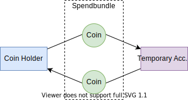
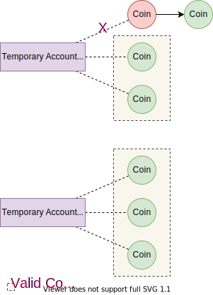

CHIP Number   | 0023
:-------------|:----
Title         | On-chain Vote
Description   | A standard for implementing simple on-chain vote on Chia's blockchain
Author        | [Shuang Liang](https://github.com/wizicer) ([@icerdesign] on Twitter)
Editor        | [Dan Perry](https://github.com/danieljperry)  
Comments-URI  | [https://github.com/Chia-Network/chips/pull/90](https://github.com/Chia-Network/chips/pull/90)
Status        | Draft
Category      | Standards Track
Sub-Category  | Guideline
Created       | 2023-11-26
Requires      | None
Replaces      | None
Superseded-By | None

## Abstract

We propose a secure, transparent, and easy-to-implement on-chain voting system for DAOs and any community-led initiatives. The voting system offers a voting mechanism that proportionally represents all XCH or CAT holders. The proposed system involves a double-transaction method and public derivation of temporary accounts' private keys, enhancing security and preventing vote manipulation. The flexible design considerations allow the system to accommodate diverse voting scenarios and token types, driving robustness and adaptability.

## Motivation

Voting mechanisms are paramount to community-led initiatives, especially DAOs, providing a conduit for collective decision-making. However, off-chain voting systems come with inherent risk due to centralization and susceptibility to manipulation. To circumvent these issues, we propose a straightforward, safe, and implementable on-chain voting protocol. This proposal makes voting proportional to XCH or CAT holdings, further democratizing decisions and reinforcing security within the Chia community.

## Backwards Compatibility

On-chain vote does not introduce any breaking changes to Chia.

## Rationale

### Design decisions


**Public Private Keys**

Keys for the temporary accounts are intentionally public and derived based on the form content and associated option. This decision prevents abuse from malicious actors using expired forms or options to manipulate the voting process. It uniquely ties each vote to a specific option and form and ensures the integrity of each vote.


**Token Type Flexibility in Voting Form**

Rather than imposing a rigid structure on the type of tokens used for voting, we considered more flexibility. The types of tokens permitted for any given vote, as well as any additional criteria or conditions, can be detailed in the voting form description. This approach maintains the robustness of the system while accommodating a diverse array of voting scenarios and token assets.


## Specification

The proposed voting mechanism consists of three integral aspects: creation of a voting form, execution of the on-chain vote, and tallying of the voting results.

### Voting Form Design

The voting form is designed in a JSON format, encompassing attributes such as the query proposed for voting, voting deadline, and the potential response options. A JSON Schema will be leveraged to validate the form.
To assist users in distinguishing one voting form from another, each form is uniquely identified by a 'fingerprint', much like Chia's fingerprinting feature. In this context, the 'fingerprint' references a distinctive identifier that underscores the uniqueness of each form.
The JSON representation of the form can be fused with the metadata of a Chia NFT, which is also in JSON format.

Here's an illustration of a simplified example voting form in JSON format.

```json
{
    "title": "Blockchain Upgrade Proposal",
    "description": "Seeking community consensus on a proposed upgrade of the blockchain.",
    "deadline": "4500000",
    "options": [
        "Agree",
        "Disagree",
        "Abstain"
    ]
}
```

- "title": is the question or issue that is up for vote. 
- "description": provides additional information or context about the vote. 
- "deadline" is the last block height when the vote will be accepted.
- "options" is an array, where each value represents a possible response.

JSON Schema:

```json
{
    "$schema": "http://json-schema.org/draft-07/schema#",
    "type": "object",
    "properties": {
        "title": {
            "type": "string"
        },
        "description": {
            "type": "string"
        },
        "deadline": {
            "type": "string",
            "pattern": "^[0-9]+$"
        },
        "options": {
            "type": "array",
            "items": {
                "type": "string"
            },
            "minItems": 2
        }
    },
    "required": ["title", "deadline", "options"]
}
```

In this schema, each field in the voting form JSON is declared with its type, and in the case of "deadline," an additional pattern requirement to ensure it's a number. It also specifies that at least two options are needed.


### On-Chain Voting

Voting essentially involves two transactions: sending the XCH/CAT tokens for voting to a temporary account and bridging the tokens back to the same account. Both transactions are contained in the same spendbundle which ensures their simultaneous completion, eliminating the risk of tokens getting stuck in the temporary account.



Interestingly, the temporary account's private key is public and can be derived from the form content. The computation rule for the private key is sk = SHA256(SHA256(form), option). This links the temporary private key to the specific voting form and option, preventing malicious actors from abusing expired voting forms or options to attract incorrect votes.

### Voting Results Calculation

Voting results are determined by looking at each option's address within the voting form. Each option's score is calculated by the total value of unspent coins linked to its specific address.



The calculation of the score is restricted according to the voting deadline, requiring that all coins used for voting remain in an unspent state before this block height.

## Test Cases

Test cases for On-chain Vote are located in the main branch of the Pawket GitHub repository, in the [packages/pawket-chia-lib/test/vote](https://github.com/SutuLabs/Pawket/blob/main/packages/pawket-chia-lib/test/vote) folder.

## Reference Implementation

The reference implementation for On-chain Vote is located in the main branch of the Pawket GitHub repository.

## Security

**Double Transaction Safety**

The simultaneous execution of both transactions in the voting process prevents the risk of tokens getting lost. This is ensured by containing both transactions within the same spendbundle. 

**Private Key Derivation**

The temporary account's private key is intentionally made public and calculated from the voting form's content following the rule sk = SHA256(SHA256(form), option). This unique association with a specific voting form and option helps prevent abuse from malicious actors using expired forms or different options, ensuring the authenticity and integrity of the voting procedure.

**Voting Token Status**

The on-chain voting system requires all voting tokens to remain in an unspent state before the voting deadline height. This feature ensures that votes are counted accurately and prevents potential manipulations related to last-minute token movements.

**Information Transparency**

As all transactions are recorded on the blockchain, this system provides complete traceability and transparency, allowing users to verify the fairness of the voting process.


## Additional Assets
None

## Copyright
Copyright and related rights waived via [CC0](https://creativecommons.org/publicdomain/zero/1.0/).