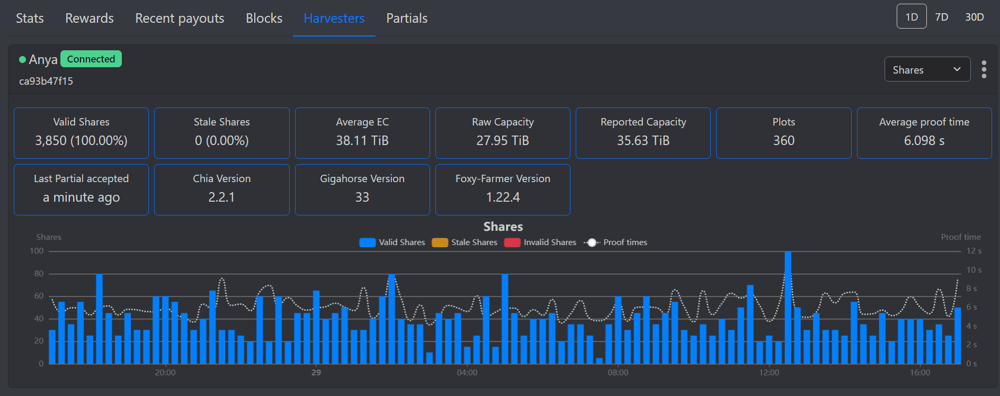

CHIP Number   | 0033
:-------------|:----
Title         | Add additional partial headers
Description   | Add farmer and harvester peer id and version as well as harvester raw/effective capacties and plot count to partial headers
Author        | [Felix Brucker](https://github.com/felixbrucker)
Editor        | [Dan Perry](https://github.com/danieljperry)
Comments-URI  | [CHIPs repo, PR #114](https://github.com/Chia-Network/chips/pull/114)
Status        | Last Call
Category      | Informational
Sub-Category  | Informative
Created       | 2024-03-29
Requires      | None
Replaces      | None
Superseded-By | None

## Abstract

Add farmer and harvester peer id and version as well as harvester raw and effective capacities and plot count to the header of partial submit requests to pools, so that pools can correctly show farmers with their version and harvesters with their respective version, capacities and plot count.

## Motivation

Currently, a partial submitted to a pool contains the following information (among others):
- the harvester peer id of the harvester who found the proof of space as part of the partial payload
- the farmer version as part of the `user-agent` header

This does not allow pools to correctly map a version to a harvester (as they only know the farmers version) and it does not allow them to map an identity to the farmer version. This means currently pools can not correctly show the version of their users' software.

For example: A pool knows that harvester A is using a farmer with version x.y.z, but it does know the version of harvester A. In addition it can not create a farmer entity to attach additional pool specific functionality (like a name, version and vendor, notification settings, connected harvesters, total space, etc.) to, as there is no id to link the x.y.z farmer version to.

The following is an example of how a harvester overview in a pool looks like, when it includes the additional information. A farmer overview could look similar.

Implementing this change is very easy and has already been done, see below.

## Backwards Compatibility

This proposal only adds http request headers and is fully backwards compatible to the current implementation.

## Rationale

Adding the information to http headers allows for concise naming and easy retrieval of values without complex extraction (for example extracting the farmer version from the user agent header) without modifying the partial payload, which could cause problems.

## Specification

Introduce two new config fields:

- `farmer.include_harvester_stats_in_partials`: boolean which defaults to `true`. This option determines whether harvester capacities and plot counts are included in partial submit headers.
- `farmer.obfuscate_farmer_peer_id_in_partials`: boolean which defaults to `false`. This option determines whether the farmer peer id is obfuscated in the partial headers by hashing the PlotNFT launcher id and farmer peer id together and using that instead.

The following new headers will be included in partial submits:
- `chia-farmer-peer-id`: the farmer peer id (bytes32 as hex), for example: `ca93b47f157b4be9e91e88943a3c7ab9c2d6def0d7bd42dd0d468e54a14812f6`
- `chia-farmer-version`: the full farmer version, same as already part of the user agent, for example: `2.2.1.giga35`
- `chia-harvester-peer-id`: the harvester peer id (bytes32 as hex), already part of the partial payload, included for consistency, for example: `f7959d25848dcccbf684f44951272d0a2323e1511f90e3f44651e1e10463eeb9`
- `chia-harvester-version`: the full harvester version, for example: `2.2.1-dr-0.15.0`

As well as the following optional headers, based on availability and whether the `farmer.include_harvester_stats_in_partials` is `true`:
- `chia-harvester-raw-capacity-bytes`: the total raw capacity in bytes of this harvester and PlotNFT, for example: `1099511627776`
- `chia-harvester-effective-capacity-bytes`: the total effective capacity in bytes of this harvester and PlotNFT, for example: `4398046511104`
- `chia-harvester-plot-count`: the total plot count of this harvester and PlotNFT, for example: `1337`

## Reference Implementation

The current implementation in the form of a PR is available [here](https://github.com/Chia-Network/chia-blockchain/pull/17788)

## Security

This proposal only adds additional headers to the https secured pool partial requests.

## Additional Assets

- [Harvester Overview](../assets/chip-felix-add-additional-partial-headers/harvester-overview.png)

## Copyright

Copyright and related rights waived via [CC0](https://creativecommons.org/publicdomain/zero/1.0/).

