CHIP Number   | 0048
:-------------|:----
Title         | New Proof of Space
Description   | Add a new Proof of Space and format to the Chia blockchain's core consensus
Author        | [Dr. Nick](https://github.com/drnick23)
Editor        | [Dan Perry](https://github.com/danieljperry)
Comments-URI  | [CHIPs repo, PR #160](https://github.com/Chia-Network/chips/pull/160)
Status        | Draft
Category      | Standards Track
Sub-Category  | Core
Created       | 2025-05-19
Requires      | None

## Table of Contents

- [Table of Contents](#table-of-contents)
- [Abstract](#abstract)
- [Definitions](#definitions)
- [Motivation](#motivation)
- [Backwards Compatibility](#backwards-compatibility)
  - [Protocol Impact](#protocol-impact)
  - [Alternatives to Hard Fork](#alternatives-to-hard-fork)
  - [Easing Transition](#easing-transition)
- [Rationale](#rationale)
  - [Theoretical foundation and trade-offs](#theoretical-foundation-and-trade-offs)
  - [Comparison to Original Proof of Space](#comparison-to-original-proof-of-space)
  - [Design Overview of Proof of Space](#design-overview-of-proof-of-space)
    - [From Challenge to Proofs](#from-challenge-to-proofs)
    - [Plot Format](#plot-format)
    - [Proofs and Proof Fragments](#proofs-and-proof-fragments)
    - [Challenges, Quality Links, and Quality Chain](#challenges-quality-links-and-quality-chain)
  - [Major Design Rationale](#major-design-rationale)
    - [Design Constraints on Core Security Assumptions](#design-constraints-on-core-security-assumptions)
    - [Table Roles (T1 -\> T5)](#table-roles-t1---t5)
    - [New Matching Algorithm](#new-matching-algorithm)
    - [Proof Fragments \& Leaf-First Challenges](#proof-fragments--leaf-first-challenges)
    - [Bipartite Pairing](#bipartite-pairing)
    - [Benes Compression](#benes-compression)
    - [Partitioned Tables](#partitioned-tables)
    - [Small Plots (~1.6 GiB for k28)](#small-plots-16-gib-for-k28)
  - [Plotting Time](#plotting-time)
  - [Long Term Security](#long-term-security)
  - [Alternative Designs](#alternative-designs)
    - [Community Consensus](#community-consensus)
    - [Number of Tables](#number-of-tables)
    - [Number of Quality Links](#number-of-quality-links)
    - [Different Table Sizes](#different-table-sizes)
    - [Higher Compute on g Function](#higher-compute-on-g-function)
    - [Optional Extra Bits for Baseline Support](#optional-extra-bits-for-baseline-support)
    - [Many Other Variants Considered](#many-other-variants-considered)
- [Specification](#specification)
  - [Technical Specifications and Performance](#technical-specifications-and-performance)
    - [Plot Sizes](#plot-sizes)
    - [Plotting Performance and Requirements](#plotting-performance-and-requirements)
    - [Proof Solving Times](#proof-solving-times)
  - [HDD Activity](#hdd-activity)
  - [Proof of Space Specification](#proof-of-space-specification)
  - [Pooling Protocol Specification](#pooling-protocol-specification)
    - [Optional](#optional)
  - [Transition Period](#transition-period)
- [Test Cases](#test-cases)
- [Reference Implementation](#reference-implementation)
- [Security](#security)
  - [Security: Partition Grinding Attacks](#security-partition-grinding-attacks)
    - [Rental Attack Resistance Analysis](#rental-attack-resistance-analysis)
      - [Profitability Analysis](#profitability-analysis)
      - [Network attack analysis](#network-attack-analysis)
    - [T3 Grinding Attack](#t3-grinding-attack)
    - [T4 Partition Grinding Attack](#t4-partition-grinding-attack)
      - [Attack variant (1)](#attack-variant-1)
      - [Attack variant (2)](#attack-variant-2)
      - [Attack variant (3)](#attack-variant-3)
      - [T4 Grinding Attack Analysis](#t4-grinding-attack-analysis)
    - [Overall Grinding Attack Analysis](#overall-grinding-attack-analysis)
    - [Mitigation](#mitigation)
      - [Using Bipartite partitions: lower and upper](#using-bipartite-partitions-lower-and-upper)
      - [Shrink T4 and T5 relative to T3](#shrink-t4-and-t5-relative-to-t3)
      - [Eliminate Attack with R pointers on T5 or random L pointers on T4](#eliminate-attack-with-r-pointers-on-t5-or-random-l-pointers-on-t4)
  - [Security: Quality Chaining](#security-quality-chaining)
    - [Bit dropping choices](#bit-dropping-choices)
      - [Attack calculation: bit dropped T4 R pointers for chain](#attack-calculation-bit-dropped-t4-r-pointers-for-chain)
        - [Improving disk performance](#improving-disk-performance)
    - [Attack Approach #2: chain false positives](#attack-approach-2-chain-false-positives)
      - [Difficulty and chance of a block win](#difficulty-and-chance-of-a-block-win)
      - [Bit drop choices](#bit-drop-choices)
      - [Number of Quality Links](#number-of-quality-links-1)
      - [Combinatorial analysis](#combinatorial-analysis)
    - [Statistical Attacks](#statistical-attacks)
      - [Removing Underperforming Partitions](#removing-underperforming-partitions)
      - [Favoring Larger Plots](#favoring-larger-plots)
    - [Further Attack Mitigation](#further-attack-mitigation)
  - [Non-Viable Attacks](#non-viable-attacks)
    - [Theoretical Compression](#theoretical-compression)
    - [Block Difficulty Filtering](#block-difficulty-filtering)
    - [Proof Fragment Compression](#proof-fragment-compression)
      - [Why Limit to 2k Bits?](#why-limit-to-2k-bits)
    - [Hellman Attacks](#hellman-attacks)
    - [Table Restructuring](#table-restructuring)
    - [Underweighted Data](#underweighted-data)
  - [Summary and Conclusions](#summary-and-conclusions)
    - [Summary of Parameters and their Effects](#summary-of-parameters-and-their-effects)
    - [Parameter Tuning for Optimal Settings](#parameter-tuning-for-optimal-settings)
      - [Parameter Influence Map for Proof of Space](#parameter-influence-map-for-proof-of-space)
  - [Future Proofing](#future-proofing)
- [Copyright](#copyright)

## Abstract

We propose a new Proof of Space protocol for the Chia blockchain that addresses weaknesses in energy efficiency, rental attack resistance, and plot format stability. Our design shifts security costs to infrequent events—winning a block or pool partial—allowing honest farmers to operate with minimal ongoing energy use. Farmers store Proof Fragments (bit-dropped, encrypted x-values from a proof) that are chained into a Quality Chain, which saturates bit-dropping attacks and forces attackers into full table grinding-based strategies. These are mitigated through a tunable plot strength setting that adjusts plotting effort without increasing harvester energy or solver compute demands. The design achieves near-zero viable plot compression on current hardware to eliminate economic advantages of compressed plots and secure long-term fairness. Farmers select plot configurations based on expected longevity—potentially many years—while the format supports small plots and remains accessible to low-end devices like Raspberry Pi 5. A hard fork and phased replot transition will deprecate legacy plots, establishing a durable, future-proof format that reinforces Chia’s commitment to a green, decentralized blockchain.

## Definitions

Throughout this document, we'll use the following terms:

* **Proof of Space**: The underlying protocol mechanism that enables storage-based consensus. It is a cryptographic primitive that proves a prover has reserved a certain amount of storage space. This mechanism underpins block creation by requiring farmers to demonstrate and validate storage commitments as part of consensus.
* **Plot Format**: A specific structure and method for organizing data in a file so it can be used as a valid `Proof of Space`. Plot formats define how data is laid out, how proofs are generated, and the computational requirements for plotting and farming. Multiple plot formats can exist that all implement the same Proof of Space protocol, but with varying performance characteristics and energy efficiency.
* **Plot Stability Index (PSI)**:
A measure of a plot format’s long-term economic viability without replotting. High PSI indicates resilience to protocol changes, hardware evolution, energy/storage trade-offs, and market shifts (e.g., XCH price, netspace, or block rewards). Conversely, a low PSI implies a higher likelihood of replotting based on those factors.
* **X-value**: A k-bit value that forms the fundamental building block of a proof. X-values are initially generated and then recursively paired and matched until a full proof is formed.
* **Proof**: an ordered set of 32 k-bit values that satisfy the matching requirements for a proof. 
* **Proof Fragments**: A partial, encrypted summary of a proof's child x-values with embedded partition routing. Comprises a 2 k-bit value derived from 8 k-bit x-values that are partially bit-dropped and then encrypted. Each Proof Fragment belongs to one of the leaf node paths of a proof: LL, LR, RL, or RR. These can form components for a Quality Link. One proof yields four Proof Fragments (one for each of the LL, LR, RL, RR branches).
* **Quality Link**: A set of three Proof Fragments used to construct parts of the Quality Chain.
* **Quality Chain**: A chain of Quality Links, linked together in a specific sequence to evaluate the proof's quality.
* **Plot ID Filter**: At signage points a challenge specifies which plots are valid for a response (a 1/(`Plot ID Filter`) chance).
* **Honest Plot**: A plot stored with the plot format designed for the Proof of Space to represent the network approved storage required that is not further compressible without resorting to attacks.
* **Farmer**: An entity (human or otherwise) which performs the tasks required to participate in ensuring the security of the PoST-backed blockchain——such as reserving storage space with plots and responding to challenges with proofs using those plots.
* **Honest Farmer**: A farmer using only honest plots.
* **Compressed Plot**: Generally, all plots use compression methods to losslessly reduce data and then decompress that data to restore the original. In this document, compressed plots refer to plots that have reduced data compared to the honest plot, typically through the use of bit dropping.
* **Bit Dropping**: Removing some bits of information from a stored plot, that is later re-created using compute to respond to challenges. Typically each bit dropped doubles the compute required to restore the information.
* **Plot Grinding**: Creating new plots on the fly, possibly that specifically target plot IDs that can respond to challenges from the network, requiring no storage and just compute.
* **Rental Attacks**: Specifically use plot grinding to take control over the network by renting enough compute power to simulate a majority of the netspace.
* **Table-Dropping Attack**: Some tables from the plot format are dropped, and then reconstructed using hints or full plot grind.
* **Attacker**: An individual or entity looking to exploit weaknesses in Proof of Space to gain a financially incentivized advantage to an honest farmer, typically through the use of high-performance and efficient compute (e.g. GPUs) to reduce or eliminate storage requirements.
* **Log 2 Rule**: A compute–storage tradeoff lets an attacker drop a number of bits proportional to `log₂(attacker perf / baseline perf)`.
* **Block Filter**: Determines whether a Proof of Space qualifies to win a block based on its quality (Quality Chain). It applies a global difficulty target that reflects how difficult it is to find a winning proof on the entire network. Only proofs whose Quality Chain hashes below this dynamically adjusted threshold are eligible to create new blocks. This ensures consistent block timing (e.g. every ~18.75 seconds) and periodically adjusts with changes in netspace to maintain consensus.
* **Pool Partial Filter**: Used in pooled farming to assess whether a submitted proof (a "partial") meets the pool’s custom difficulty setting. This filter is usually less strict than the block filter and allows farmers to prove ongoing participation and receive proportional rewards. Pools set this threshold to balance network bandwidth and fairness.
* **Bit Drop Saturation**: An event that occurs when the effort to recompute dropped bits exceeds the effort of a full plot grind.
* **Compression Resistance**: A measure of how effective the Proof of Space is against an attacker trading increased compute for reduced storage.
* **Bipartite**: A graph whose nodes can be divided into two disjointed sets.
* **ANS**: Asymmetrical Numerical Systems, a type of entropy coding used in data compression.
* **Benes**: a novel compression algorithm that outperforms ANS by a few bits per entry on plot structured data.


## Motivation

The primary motivations behind this proposal are addressing three critical issues identified in the existing protocol:

* **High Energy Consumption from Compressed Plots**: Previous compression techniques, such as DrPlotter, significantly increase ongoing energy requirements, thus undermining Chia's commitment to energy efficiency.
* **Rental Attack Risks:** Advances in GPU technology raised concern that a future attacker could potentially rent enough powerful GPUs to spoof a majority of the netspace.
* **Low Plot Stability Index of Current Plot Formats**: The coexistence of multiple plot formats (e.g., DrPlotter, Bladebit, Gigahorse, NoSSD) creates fragmentation and uncertainty for farmers. With no clear long-term standard, farmers are pressured to continually assess whether replotting to a newer format offers better efficiency or profitability. This erodes confidence in plot permanence and undermines long-term sustainability.

This proposal benefits Chia's overall ecosystem by:
- enhancing resistance to rental attacks
- reducing overall network energy consumption
- simplifying the plotting ecosystem
- improving the Plot Stability Index for proposed plot formats
- improving plotting accessibility
- improving farming efficiency and support for low-end devices like Raspberry Pi 5
- enabling smaller plots for more versatility

The technical feasibility of this proposal will be demonstrated through testing and reference implementations with sufficient performance optimization to validate expected results and claims.


## Backwards Compatibility

### Protocol Impact

The proposed new Proof of Space is not backwards compatible with the v1 plots in use today. A consensus change is therefore required so that:

- Blocks and pool partials generated with the Quality Chain proofs are valid after the fork-height, and

- Proofs that rely on legacy plots become invalid after a defined sunset date.

Because the validity rules change and must accept a new Proof of Space that was previously invalid, this upgrade must be introduced by a hard fork, and will require a full netspace replot by the end of a phase-out period for the legacy plots.

### Alternatives to Hard Fork
[CHIP-12](https://github.com/Chia-Network/chips/blob/main/CHIPs/chip-0012.md) which reduces the plot filter on a schedule, is already in effect. However, this update merely keeps compression resistance on pace with developing technology, and does not sufficiently address the risk of rental attacks. It does not resolve any of the three critical issues we identified in [Motivation](#motivation). Changing the plot filter to a more aggressive schedule would also result in a hard fork. 

### Easing Transition
A separate CHIP is proposed to schedule the hard fork date and ease the transition from the existing Proof of Space to the new one.  

Production level plotters and harvesters will be released in the advance of the hard fork date.

Regardless of the ease of transition, we still expect some netspace will be left behind, but the majority will be incentivized to replot.


## Rationale

### Theoretical foundation and trade-offs

Proof of Space (PoS) must balance inclusivity with security. Design choices that reduce disk I/O to support slow HDDs, minimize energy use, or support low-end devices like Raspberry Pi, can also let an attacker scale up with fast SSD storage and compute with GPUs like the RTX 5090, which are **thousands** of times more performant.

Under the `log 2 rule`, the wider the performance gap between a baseline supported system and an attacker's system, the more bits can be dropped for the attacker to expose different compute-storage benefits relative to the honest farmer.

Two apparent "fixes" to PoS illustrate the trade-off:

| PoS variant      | log2 gap | drawback |
|--------------|---------|------------|
| **GPU-centric** (every farmer must own a high-end GPU) | Raises the baseline to GPU performance, so `(attacker perf) / (baseline perf) ~ 1`; almost *no* bits can be dropped | Becomes Proof of Work -- high energy, expensive hardware, defeats eco-friendly & accessibility goals |
| **SSD-only** (full-proof every challenge) | Forces low-latency I/O and returns 100% of each proof, boosts compression resistance by up to 30,000x (256x plot filter reduction, 128x larger quality string). The compute gap, however, is still unchanged, and the `log 2 rule` leaves ~10% compressibility to top-gear | Bricks the entire HDD plot market and existing netspace. Grinding speed and vulnerability to rental attacks remains unchanged | 

Neither option meets the green, cheap, universal target, and hybrids merely shuffle the same drawbacks.

Our answer to Proof of Space is the **Quality Chain**. We push almost all security work to a single, infrequent event—when a challenge response clears the block or pool partial filter —- so honest farmers do almost no extra work, while attackers face prohibitive recompute cost between each challenge interval.

| Mechanism | What it does | Why it hurts attackers |
|---|---|---|
| **Quality Link** (encrypted, bit-dropped Proof Fragments) | Includes only a **partial reveal** of the proof per challenge | Extra bit-dropping requires expensive on-the-fly reconstructions for each challenge response | 
| **Quality Chain** (linked Quality Links)  | Each proof depends on the hashes of the previous Quality Link, forming a chain. Full proof is rebuilt **only** if the chain survives the block or pool-partial filter. | Dropping bits on a link creates an explosion of false positives; combinatorial cost scales out of reach. |
| **Super-Saturated Set of Quality Links** | Number of Quality Links set so that reconstruction of bit-dropped Proof Fragments would generate more entries than the initial entries for full plot generation |  Renders bit-dropping on the plot format less viable than a full plot grind. Forces attacker into plot grinding methods which are simpler to defend against. |

The **Quality Chain** increases the recompute timing headroom for an honest farmer's baseline system up to the full 30-second block interval for __any__ size farm, whereas an attacker's response time headroom is typically only a few milliseconds at every challenge. This dictates how many plots they can support; the `log 2 rule` advantage is severely reduced.

The network-wide energy profile is also dramatically reduced. Full recomputes run only on a winning block —- or on the farmer’s own, deliberately infrequent, pool-partial wins -- so network-wide recompute drops to near-zero.

Compression resistance is significantly stronger. Bit-drop saturation is achieved on all bits present in the plot format structure, so attackers must resort to table-dropping attacks, which don't benefit from exponential drop-off prior to Table 3.

Finally, the baseline system's processing power is determined by the largest k-size plot a farmer intends to solve proofs for (see the section on [technical specifications and performance](#technical-specifications-and-performance)).

The **Quality Chain** underpins all subsequent design choices in this proposal.

### Comparison to Original Proof of Space

The previous Proof of Space offered only moderate protection against attacker compression. DrPlotter produced 22.1 GiB plots, ≈ 22 % of the 101.4 GiB original. Our new Proof of Space shows no economically viable compression on today’s hardware, and adds safeguards to keep that edge as hardware advances.

The scheduled plot reduction filter (CHIP-12) helped to limit the potential for further compression, but the plot ecosystem remains fragmented across many plot format offerings, each with a low plot stability index. Our solution is expected to have a high plot stability index, as well as to simplify the choice of plot format.

The original uncompressed plots imposed virtually no HDD load and negligible energy use during harvesting. The new format increases disk activity by about a factor of 10. It also increases processing requirements per challenge, so larger farms may outgrow ultra-low-end boards such as a Raspberry Pi. Even so, the energy-per-terabyte remains far below Proof-of-Work levels.

Resistance to rental attacks is over 100× higher than in the original PoS, with scheduled adjustments to the plot ID filter, the proof fragment scan filter, and manual increases to the minimum plot strength able to raise that bar over time. See CHIP-49 for more info.

### Design Overview of Proof of Space

We first provide a brief overview of the system from the incoming challenge to the outgoing proofs. Next, we provide more details into the components that make the Proof of Space work: the plot format, proofs, Proof Fragments, Quality Links, and Quality Chain.

#### From Challenge to Proofs

A simplified view of the PoS system is shown below.

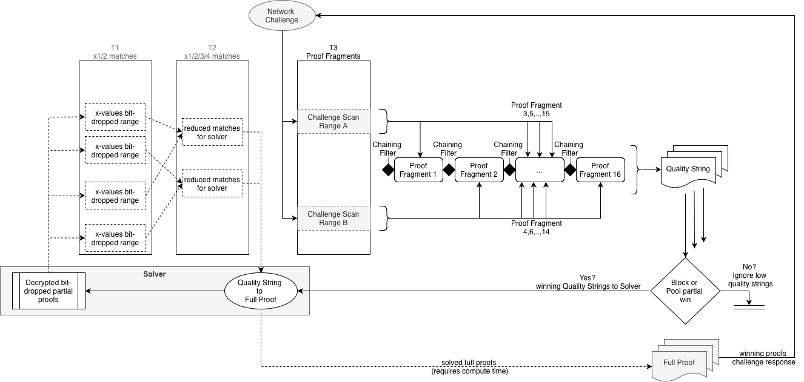

1. A challenge from the network defines a **Proof Fragment Scan Filter** to perform, which is a range in a partition (A) with a defined probability to pass.
2. Proof Fragments that pass the filter are found by scanning the sorted elements in partition (A) in table T3. These are child nodes of a proof, and other sibling Proof Fragments tell us which other partition (B) they match with.
3. We find all paths for proofs that share child Proof Fragments present in both partition (A) and partition (B). Each path links three sibling Proof Fragments, called a **Quality Link**.
4. We collect the set of Quality Links. 
5. We use the first Quality Link found in step (2), to seed the first element in a **Quality Chain**. We add links to this chain by testing a chaining filter hash on each Quality Link in the set from (4). This could produce multiple forks of chains if more than one Quality Link passes each round.
6. Each Quality Chain is then checked if it passes the block difficulty (or pool partial difficulty). If it passes, congratulations, we have a good Proof of Space.
7. We fetch one more Proof Fragment in T3 for each Quality Link to complete the set of four Proof Fragments for a proof. We then decrypt each Proof Fragment to find bit-dropped x-values. These need a recompute reconstruction of the full x-values in proofs using the Solver.
8. The final full proof is all the solved x-values in the chaining sequence.

For security and compression resistance, the:
- **Minimum Plot Strength**: is a tunable parameter (via soft fork) that increases plot construction time, and resistance to grinding attacks.
- **Bit-drop saturation**: is created by having a set of Quality Links large enough that all unique Proof Fragments that could be reconstructed for building the Quality Chain would create a set of x-value ranges larger than the range of reconstructing a plot from scratch.
- **Chaining Filter**: with 16 Quality Links, the number of additional Quality Chains an attacker would create by bit dropping would be overwhelmingly expensive.

Full analyses of security features are found in the [Security](#security) section.

#### Plot Format

Proof of Space visual representation.

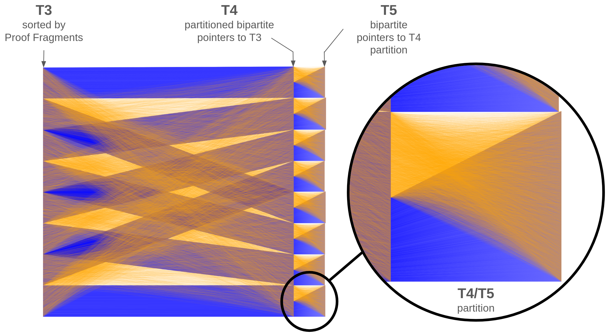
*Figure: Sample k-18 plot (8 partitions, ~17,000 proofs). Blue lines trace a left-side match from a pair back to its origin; orange lines do the same for a right-side match.*

#### Proofs and Proof Fragments

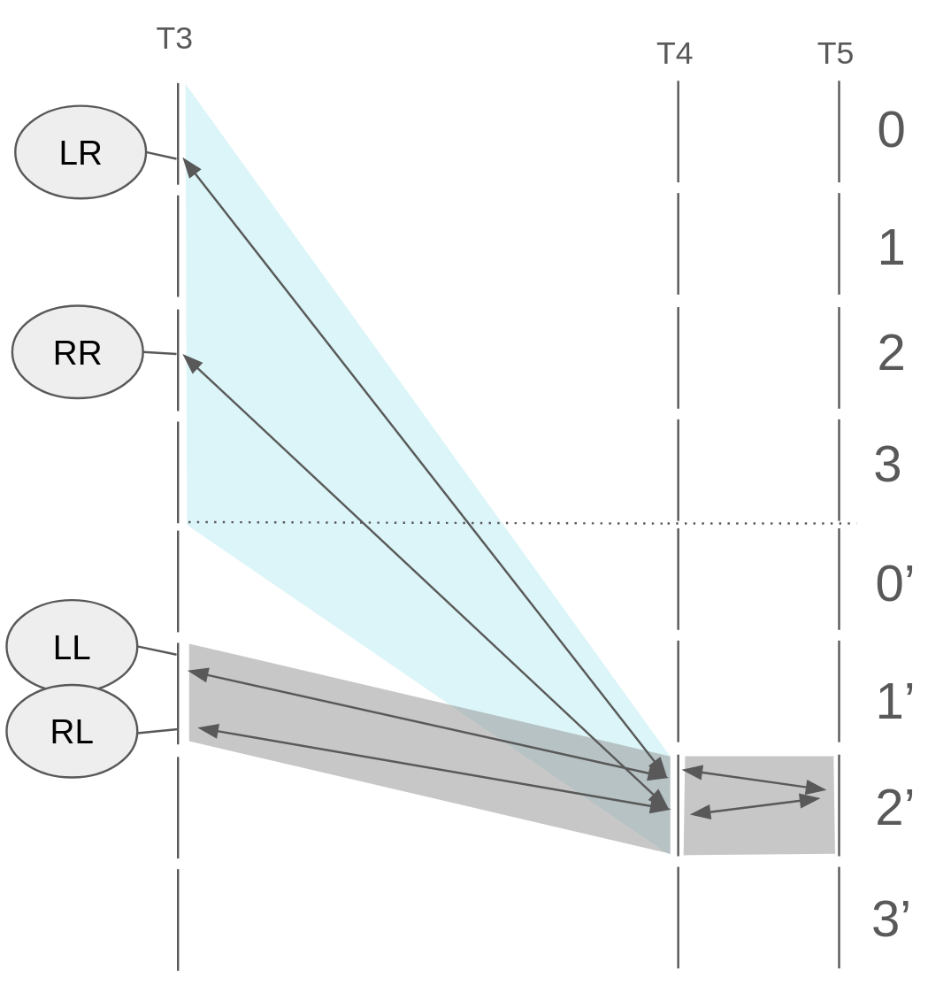

- Table T3 stores Proof Fragments in sorted order.
- A complete set of Proof Fragments for a proof is assembled by following back-pointers from T5 -> T3, collecting the four Proof Fragments on the leaf paths LL, LR, RL, or RR.
- One proof therefore yields exactly four Proof Fragments. The proofs' full set of 32 x-values can be restored by recomputing the bit-dropped x-values from decrypting the Proof Fragments.

#### Challenges, Quality Links, and Quality Chain 

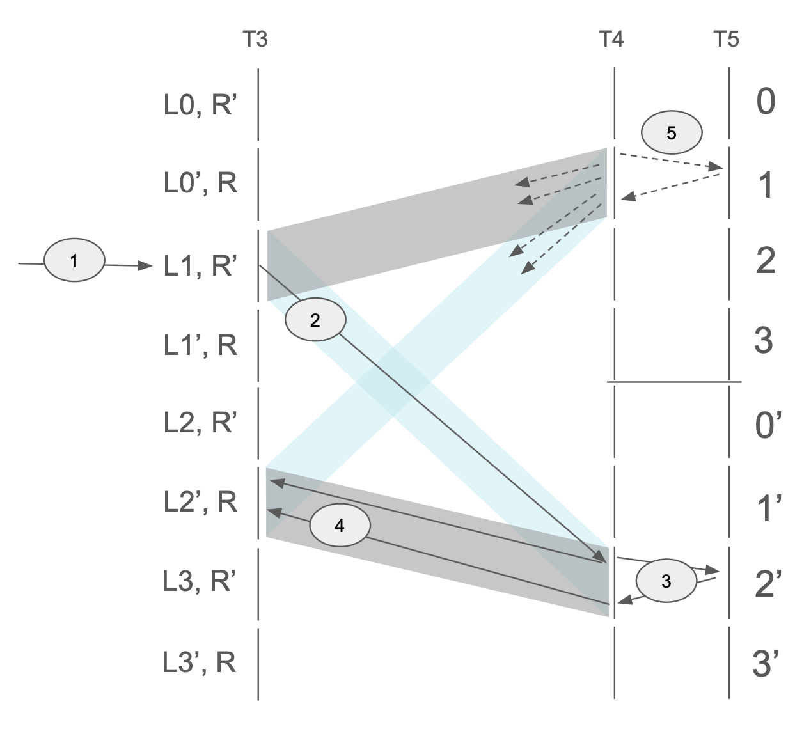

The protocol chains 16 Quality Links into a Quality Chain.

1. Challenge hit on partition (A) – A network challenge selects a passing first Proof Fragment in partition 1 (aka partition "A")

2. Target partition (B) – That entry carries an R′ pointer to partition 2′ (aka partition "B"). We follow the T4 back-pointer to reach it. From that T4 back pointer, we find the adjacent L-side sibling that pairs with the first Proof Fragment.
 
3. Parent lookup – From that T4 node we step up to its T5 parent. 

4. Sibling crawl – We walk down to the sibling leaves for opposite-side Proof Fragments of the proof. The L-side sibling will be part of the same partition (4), and the R-side sibling points to a Proof Fragment in a third partition which is not collected until we need to get the full proof.

5. Set of Quality Links - We find all paths between partition (A) and partition (B) to collect Quality Links.

Note that it takes only 3 disk seeks to find the full set of Quality Links. First, to scan the Proof Fragments. Then, only if it passes the filter, do we need another disk seek and full partition read for each of partitions (A) and (B).

To build a Quality Chain, each Quality Link becomes a candidate for adding to the Quality Chain and creating a longer chain. 

There may be lots of parallel Quality Chains. Each Quality Chain then tests whether it passes the block or pool partial difficulty for a winning proof.

A block win is a rare event, so is unlikely to have more than 1 passing Quality Chain. A pool partial win can be more frequent depending on a farmer's pool settings: for this case we require that a farmer submit at most one valid proof per plot ID, so they don't solve using more compute than necessary. This is easy to implement for the pool but would be a difficult (and unnecessary) condition for the blockchain itself.

### Major Design Rationale

Please see the following video for a descriptive overview of this CHIP's design:
* [CHIP-48 (Proof of Space) design](https://youtu.be/cFf_mjuTqcY)

#### Design Constraints on Core Security Assumptions

- **Attackers have unlimited random-access performance; honest farmers are limited by HDDs.**
The format assumes adversaries can scan large proof ranges instantly (e.g., from SSD or RAM), whereas honest farmers rely on slow, sequential HDD reads. This informs design choices that minimize benefits from random-access scanning.

- **Attackers have virtually unlimited memory; honest farmers have consumer hardware.**
We assume attackers can use high-end systems to load entire plots into memory, enabling attacks that are impractical on normal equipment. Therefore, the format assumes large memory attacks are feasible and avoids relying on k-size increases for security.

#### Table Roles (T1 -> T5)

| Table | Security purpose | Details | Compression<br>k = x-value bits<br># partitions = 2*2^partition_k 
|----|---|---|---|
|T1-T2 (hidden)| Basis for every recompute. Inflicts bit-dropping saturation on Quality Links. | Tuned so that a Raspberry Pi 5 can rebuild a k-28 proof in under 9 seconds (time interval for one signage point) | 0 bits |
|T3 | Enforce structural ordering. Plot strength and grinding resistance layer. | Challenges originate on Proof Fragment ranges. Restricts or adds costs on exploits to re-order data for certain compression attacks. | ~2k bits <br>ANS compression|
|T4 (partitioned) | Random non-localized data | Mixes entries across T3. Breaks an attacker's ability to grind on data targeted to just one partition in T3  | ~(k - partition_k) bits<br>ANS + Benes compression
|T5 (partitioned) | Provides a large combinatorial fanout | Gives us many independent paths to chain while keeping them on the same disk partition | ~(k - partition_k) bits<br>ANS + Benes compression

Each table will be close to the theoretical compression limit for random data. We rely on structure, not padding with extra tables, for security.

#### New Matching Algorithm

The matching algorithm is novel in two ways:

- Per-table tunable strength – lets us set plotting cost (resistance to rental & compression attacks) by O(2^N) while keeping verification O(1).

- Asymmetric hashing for pairing – honest farmers can recompute the full proof pairs of x-values efficiently, as the cost to solve for the first pair of x-values is expensive, but subsequent x-values for the proof are cheap. Conversely, an attacker looking to solve for a subset of the proof must incur the initial expense of the first solved pair repeatedly.

#### Proof Fragments & Leaf-First Challenges

**Proof Fragment**: For every matching set of x-values at T3 we:
- **Bit-drop** to the security budget. The ideal amount of bit-dropping is detailed in the [Security](#security) section.
- **Encrypt** the remainder, then
- **Sort** the resulting Proof Fragments in T3

**Challenge on Proof Fragments**. The challenge now begins at the leaves, using an ordered-scan filter over the Proof Fragments (aka the Proof Fragment Scan Filter). Because the Proof Fragments are sorted, neighboring entries decrypt to statistically unrelated x-values. An attacker can no longer harvest “similar” neighbors or reuse partial work; any bit-dropping attacks must target the Proof Fragments themselves. 

- Old format: challenge began at the root (last table) which stored a redundant final hash which could be recomputed by collecting all x-values from the proof. Attackers could rearrange leaves at will to open many significant exploits, and/or exploit the redundant final hash with recompute.

- New format: the leaf-first scan locks the ordering. If an attacker re-orders data, they must add bits to restore ordering for the scan, which negates compression gains.

**Bit Drops and Recompute Times**. A Proof Fragment represent 8 x-values of a proof (x1,x2,...,x8). We first remove all x2/4/6/8 values, and bit drop the remaining x-values by k/2 bits, to give 2k bits comprising only half the bits in x1/3/5/7.

The Chacha cipher allows fast and secure cryptographic hashing of 2^k results on a Raspberry Pi 5. The even-number x-values rely on those hashes. The odd-number x-values use a slower hash (Blake 3) over a certain number of iterations to check for matches. Proof solving amortizes results for 1 Proof Fragment over a set of Proof Fragments from the fully chained proof. Below, we show that solving for 32 Proof Fragments takes 29.3ms, less than 1ms per Proof Fragment, whereas just 2 Proof Fragments takes over 10ms alone.

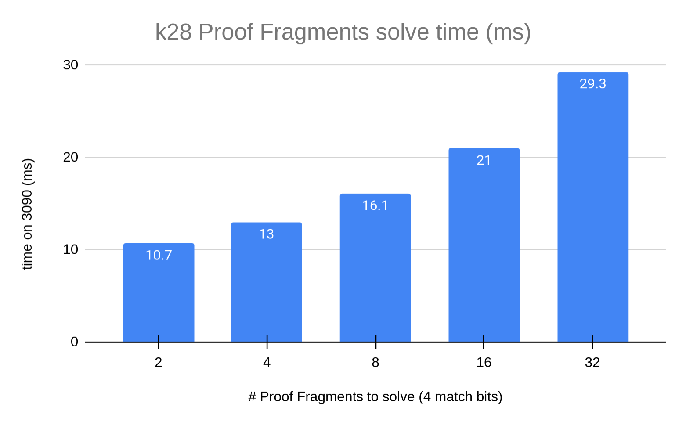

Compare to using k/4,k/4 bits, which is faster on a single solve but slower overall when applied on all x-value pairs (256 pairs in total).

More about Proof Fragments and how much they bit-drop before encryption is discussed in the [Security](#security) section.

#### Bipartite Pairing
Left-side and right-side pairs live in disjoint datasets. The pairing order is implicit, so an attacker cannot “flip” entries to gain extra compression.

#### Benes Compression

Benes compression (see [blog post 1](https://www.chia.net/2024/08/08/approaching-the-next-generation-of-proof-of-space/), [blog post 2](https://www.chia.net/2024/12/11/upcoming-changes-for-chias-new-proof-of-space-format/), and the [Security](#security) section) uses a novel compression algorithm to give the best compression on plot structured data, saving multiple bits per entry versus ANS compression. However, it has two main drawbacks:

- (1) plotting needs huge RAM and many random reads at large k-sizes. A straight k-32 Benes plot would demand GPU clusters.
- (2) too many disk reads for HDD usage, requiring 3-9x the disk seeks of other compression methods.

This would fragment the ecosystem across high/low-end systems and HDD/SSD storage, leaving baseline system farmers with plots that are larger and less competitive than their Benes compressed counterparts.

To solve this problem, we introduced [partitioned tables](#partitioned-tables) to construct and process Benes networks in much smaller chunks that easily fit into small cache-level RAM. This reduces Benes hardware requirements to the baseline system for all farmers.

#### Partitioned Tables

Partitioned tables, in addition to making Benes compression possible for all farmers, trades off some security against certain attacks, but strengthens security against other low-hanging fruit attacks. In the [Security](#security) section we detail these in depth.

Partitions are structured to reduce HDD seeks to allow for construction of Quality Chains when responding to challenges. A trade-off is the bigger storage reads required to load all partition data into memory. This also incurs additional ANS decompression overhead, which may limit some lightweight harvester systems to a smaller number of plots. 

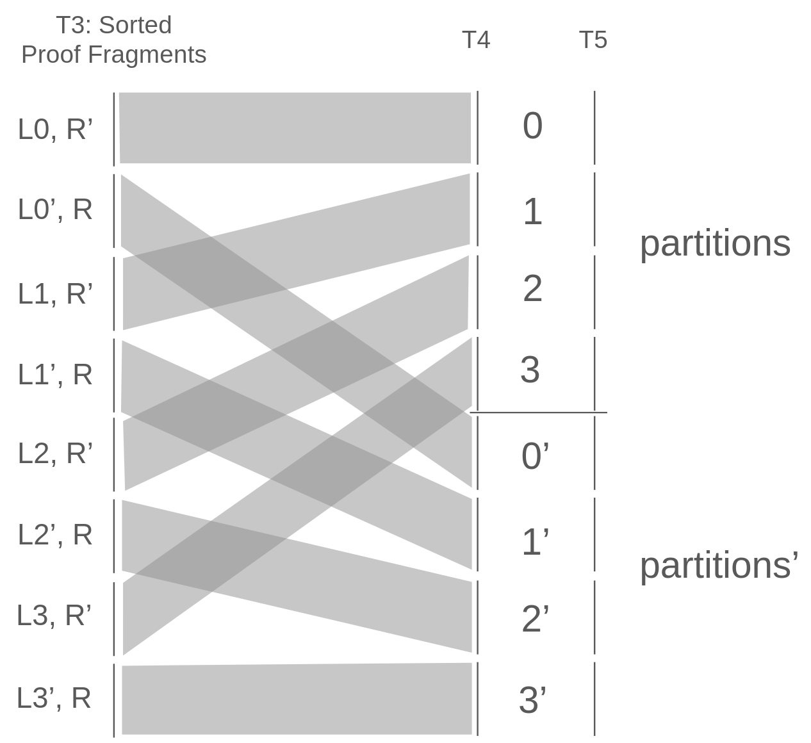
*Showing mapping from T3 Proof Fragments to lateral (L) partition from T4/5.*

Each table is divided into partitions, and partitions can either be lower or upper partitions. In the example above there are 8 partitions, with 4 lower and 4 upper. The Proof Fragment bits define the partitions (see [Technical Specifications](#proof-of-space-specification)). The Proof Fragments in T3 may have one or both of the following pointers from T4: a lateral (L) pointer, and/or a crossover (R) pointer.  These two pointers will always reside in different partitions—one in the lower, and one in the upper—but never in the same partition. The L pointers from a partition in T4 will all map to the same partition in T3. The R pointers to an encrypted X will come from any of the opposite side partitions in T4. An additional benefit is that no R pointer from T4 will point to the same partition as an L pointer in T4, which is important to reduce unused paths that could be dropped for an attacker as we want to build chains between two unique partitions.

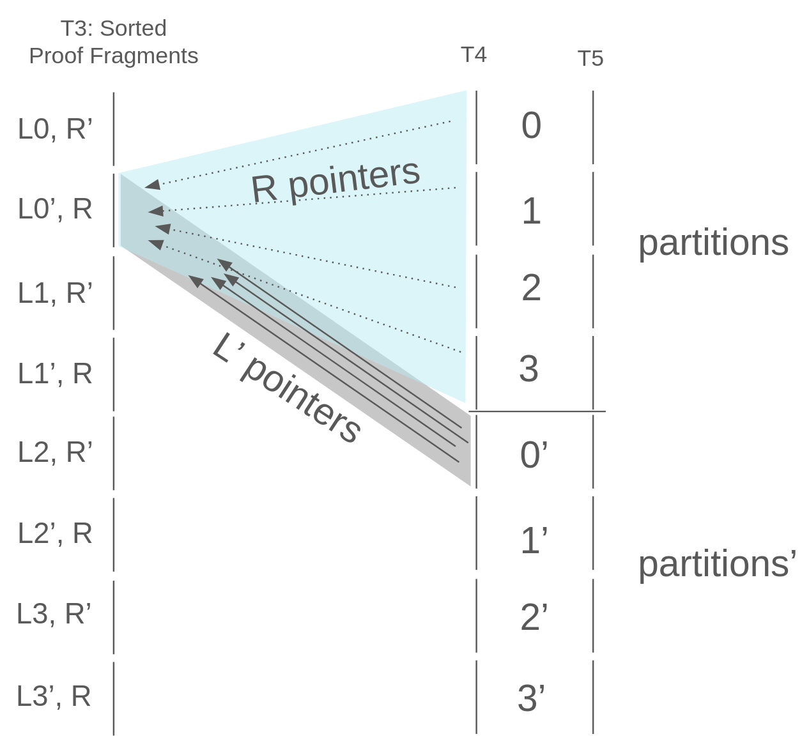
*In partition (L0', R) all L pointers from T4 come from the 0' partition, and all R pointers can come from any of the 0-3 partitions.*

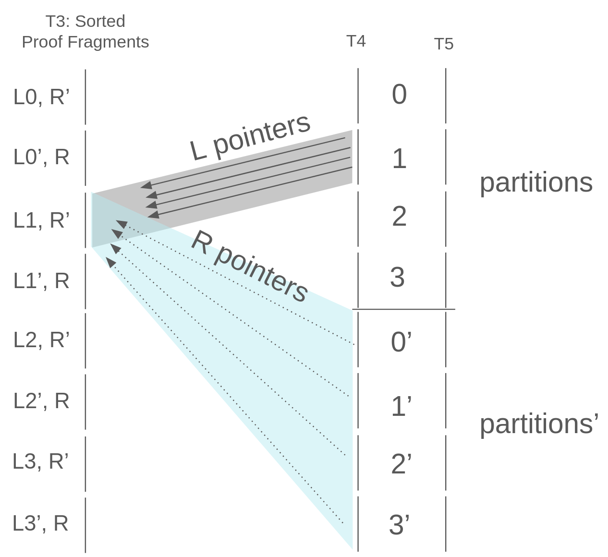

*Figure: In partition (L1, R') all L pointers from T4 come from the 1 partition, and all R pointers can come from any of the 0'-3' partitions.*

The optimal number of partitions is determined by our Security Analysis on Partitions.

#### Small Plots (~1.6 GiB for k28)

Due to only using 3 tables in the final plot format, plots are much smaller than the original Proof of Space (see the technical section for an overview of plot sizes).

Smaller plots result in:
- Increased HDD load to balance against the Plot ID Filter
- Reduced all-RAM plotting requirements so most low-end systems can plot without temporary disk
- No additional risk to rental attacks (see [Security](#security) section)

There are also a couple engineering concerns, although these are separate from consensus:

- **Harvester Startup time** : 13,000 plots per 20 TiB HDD disk ⟹ ≈ 130s to read headers. Index files or lazy loading fix this.
- **Harvester Memory**: many indices eat RAM. Partition boundaries are few (~512 - 2048 depending on k-size), so compressed metadata may be small enough. Possible alternative to discard indices and guess partition location with scan for partition markers.

### Plotting Time

Plotting time must **always** exceed the threshold to guard against Rental Attack security. For this reason CPU plotting is only practical for a small number of plots. Time for plotting is shown in the technical details section, and more is covered in the [Security](#security) section.

### Long Term Security

While comprehensive security analysis requires an in-depth understanding, we summarize here the key trade-offs likely to spark differing views within the community about preferred directions and long-term priorities. There are two main methods for long-term security:

1. **Plot ID Filter** – controls the frequency of challenge responses per plot  
2. **Plot Strength** – defines a minimum strength for valid plots

Each of these has trade-offs, highlighted below:

| Factor            | Plot ID Filter Reduction                    | Plot Strength Increase              | Details |
|-------------------|---------------------------------------------|-------------------------------------|-|
| **Harvester**     | Increased energy, reduced farm size support | No impact                           | The Quality Chain branching factor has compute overhead for harvesters. This can be (1) relaxed to allow all low-end farmers to support multiple-petabytes of plots, but potentially allow attackers ~2–4% compression, or (2) limit cpu-based harvesting to a couple Petabytes, and shut out any possible compression. For (2) Plot ID Filter reductions may eventually push CPU-based harvesters towards GPU.
| **HDD activity**  | Increases, eventually impractical           | No impact                           | We initially target so the smallest plots generate ~10% load on a 20 TB standard HDD. Increasing HDD activity will push harvesters to use larger k-sizes and towards GPU solvers.
| **Plotting time** | No impact                                   | Proportional increase with strength | Plotting time is a core security parameter. It must be tuned to make rental and grinding attacks economically non-viable.
| **Plot expiry**   | No                                          | Yes, plots below threshold expire   | Strength-based plot expiry reduces the Plot Stability Index, but can be delayed until improvements in technology necessitate it. Increasing the minimum plot strength does not affect harvester performance, and farmers can replot at any point prior to an increase.  

We recommend tuning the **default plot strength** to provide a strong multi-year buffer against technological advances, while also allowing farmers to opt for faster plotting with lighter strength and shorter expiry periods. Farmers can choose between long-term, high-strength plots or short-term, fast plots depending on their hardware and time constraints.

For **Plot ID Filter**, we target a configuration where the smallest plots generate ~10% load on a 20 TB standard HDD—ensuring that low-end harvester systems remain viable without requiring larger k-sizes or GPU-based harvesting.

### Alternative Designs

#### Community Consensus

Various stages of the design have been presented in blog posts and Discord discussions with the community. Feedback has shaped key parameters.

The strongest push-back was against a GPU-only plotter and harvesters. We kept a CPU path, albeit slower, and ensured that finished plots can still be harvested and solved on Raspberry-Pi-class hardware. Disk-write speed is no longer the bottleneck with modest system RAM, and CPUs remain somewhat practical for plotting a small amount.

At an earlier stage, designs to offload GPU solving to pool operators or service providers were scrapped: pool operators raised concerns about high costs and possible centralized points of failure.

#### Number of Tables

Doubling the table count approximately doubles the bits in every proof, which in turn lets us lower the Plot ID Filter and double compression resistance. However, every extra table also doubles proof size, which increases on-chain storage. Adding tables would incur more disk reads, as well as shift security concerns.

Larger plots also require significantly more memory during plotting —- low-end systems would be unable to avoid swapping of RAM to storage which slows plotting and increases disk wear, creating a larger plot time delta to high RAM systems and rental attacks.

Five tables is the sweet spot: small enough proofs with chaining, strong security, and realistic plotting hardware.

#### Number of Quality Links

Currently we are using 16 Quality Links in a Quality Chain, although this could be reduced to 12 or even 8 if we relax some security goals. This would reduce the total size for a proof on-chain. Options are explored in detail in the [Security](#security) section.

#### Different Table Sizes

We tested uneven table sizes—smaller/larger first tables and smaller/larger final tables—but each tweak closed one attack vector while opening another. These attacks move bits per entry from the larger table into the smaller ones, to get a relative deduction in overall bits. The current uniform table widths give the most balanced defense surface.

#### Higher Compute on g Function

Raising the cost of the first g hash would indeed slow attackers, but it would also raise network-wide verification cost and energy use. Worse, a malicious peer could flood the network with bogus proofs that force heavy validation on every node. We chose to keep g lightweight and move difficulty (strength) into plotting with the matching algorithm and the Quality Chain instead.

#### Optional Extra Bits for Baseline Support

We considered embedding extra raw bits beside every Proof Fragment in T3 to speed recompute for very low-end devices. However, due to the recompute nature of Proof Fragments a significant amount of bits would need to be added to break through the x-values scan for right-side values missing in the Proof Fragments. This would significantly inflate plot size, complicate tooling, and split the ecosystem into “fat” and “slim” plots. This does not need to be part of core Proof of Space consensus and can be introduced later as a plot format variant (possibly by community fork) if demand emerges.

#### Many Other Variants Considered

Prior to inventing the Quality Chain, we explored many hybrids attempting a balance between GPU-centric and high I/O extremes to meet our baseline system and HDD requirements. In addition, we explored many designs using the Quality Chain but which had fragmented Benes/ANS/SSD/HDD plot formats or reduced compression resistance. While we don't document all these variants in this CHIP, they could be fall-back options if any significant flaws are found with our current proposal.

## Specification

### Technical Specifications and Performance

#### Plot Sizes

> [!NOTE]
> Subject to change pending final parameters

Supported Plot Sizes:

The new Proof of Space format allows plots as small as 1.6GiB. Due to the symmetric properties of the format, only even-sized k-sizes are supported. The following table highlights current expectations for plotted sizes. Depending on further security analysis and tuning, other group sizes or changes to plot table sizes may influence the final size.

| k size | plot size |
|--------|-----------|
| 28     | ~1.6 GiB  | 
| 30     | ~4.2 GiB  |  
| 32     | ~10.6 GiB | 

#### Plotting Performance and Requirements

CPU plotting will be possible but will be less efficient than GPU. All times shown are for all-RAM plotting, although farmers can trade cpu RAM for temporary SSD storage, which results in slightly slower performance.

> [!NOTE]
> Pending Plot ID Filter and Plot Strength settings. Aim will be for 3060 to plot >20TiB/day

(TBD)

| Plot Size | RAM Requirement            | Raspberry Pi 5 | Ryzen 5600 (6-core) | Nvidia 3090                   |
|-----------|----------------------------|----------------|---------------------|-------------------------------|
| k28       | - GiB (min - MiB)          | ~- minutes     | ~- minutes          | ~ seconds *(min - MiB VRAM)*  |
| k30       | - GiB (min - MiB)          | N/A            | ~- minutes          | ~- seconds *(min - MiB VRAM)* |
| k32       | - GiB (min - GiB)          | N/A            | ~- hours            | ~- minutes *(min - GiB VRAM)* |
| **Plotted space/day** | —              | Up to - GiB    | Up to - GiB         | Up to - TiB                   |


#### Proof Solving Times

After a proof of sufficiently high quality is found it needs to be _solved_, which reconstructs the full proof so it can be verified by others. Proof-solving hardware requirements depend on the maximum k-size in the farm. Solve times should ideally stay under 8 seconds. Plot security has been tuned for the Pi 5 to solve a k28 proof in under 8 seconds.

> [!NOTE]
> See the reference code for benchmarking your own system on the Solver.

(TBD)

| Plot Size | Raspberry Pi 5 | Ryzen 5600 (6-core)  | Threadripper | Nvidia 3060 |
|-----------|----------------|----------------------|--------------|-------------|
| k28       | ~6.8 seconds   | ~1 seconds           | < 1 second    | 60 ms       |
| k30       | ~15.6 seconds  | ~3.3 seconds         | < 3 seconds   | 240 ms      |
| k32       | N/A            | ~11.7 seconds        | < 8 seconds   | 960 ms      |

### HDD Activity

Lower k-sizes increase disk activity but reduce minimum hardware requirements for proof solving (see previous section). For SSDs, k28 plots are recommended due to their minimal impact on farming performance, although large farms could benefit from larger k sizes for a proportional reduction in harvesting compute energy to process the Quality Chains. The Plot ID Filter will tune HDD disk activity to the levels shown in the table. Depending on plot filter scheduling and further security analysis we may relax these requirements to lower hdd usage levels.

| Plot Size | Full 5TiB Disk Activity | Full 20TiB Disk Activity |
|-----------|-------------------------|--------------------------|
| k28       | ~2.5%                   | ~10%                     | 
| k30       | ~0.6%                   | ~2.4%                    | 
| k32       | ~0.23%                  | ~0.9%                    | 


### Proof of Space Specification

> [!NOTE]
> Current work in progress on the formal specifications. The PoS has been finished, although parts of the specification here are pending implementations and testing.

* [Proof of Space specification](../assets/chip-0048/chip-specification-pos.md)
* Proof of Space construction: pending. See reference plotter code.
* Proof of Space solving: see reference Solver code.


### Pooling Protocol Specification

> [!NOTE]
> Pooling Protocol is not part of the hard fork, and is currently still a work-in-progress.

- The pooling protocol should only accept 1 proof from the same plot ID (group) for a given challenge.
    - helps reduce farmer solving requirements
- Pools should also accept that solving timings should be relaxed if a farmer wins more than 1 pool partial for a challenge, so that a farmer isn't forced to overload their proof recomputes to respond within a given time. 
- Software will prioritize block wins for solving

#### Optional

Pooling operator could accept only the Quality Chain and save the farmer doing full proof recomputes. This would require the pooling operator to trust or verify as a service.

### Transition Period

The **Transition Period** where new plots are accepted and old plots are phased out are proposed in a separate CHIP.


## Test Cases

A suite of tests can be found in the [github repository for the chip](https://github.com/Chia-Network/pos2-chip).


## Reference Implementation

Full reference implementations for this chip are in:
[https://github.com/Chia-Network/pos2-chip](https://github.com/Chia-Network/pos2-chip)

* C/C++ cpu based plotter. Generates test plot (uncompressed). 
* C/C++ cpu based solver. 
* C/C++ prover : responds to challenge and provides proofs from stored plot. Soon.
* C/C++ benes compressed plot: TBD.
* C/C++ cuda (nvidia) plotter. TBD.
* C/C++ opencl/vulkan/other plotters. TBD.
* C/C++ gpu based solver. TBD.


## Security

### Security: Partition Grinding Attacks

There are three primary partition grinding attacks:
1) **Rental Attack Grind**: no plot data is retained, all data reconstructed to T3 then focused on T4 and T5 partitions required by challenge.
2) **T3 Grinding Attack**: only T3 is retained, if Proof Fragment Scan filter passes on T3 then perform rental attack grind.
3) **T4 Partition Grinding Attack**: an attacker collects data focused on partitions needed by challenges, that supply hints to reconstruct the partitions when needed.

In our data presented for the tables, while a full Total Cost of Ownership (TCO) model—taking into account hardware amortization, maintenance, financing, etc.—is ultimately the most accurate way to assess incentives, we use a simplified comparison of both energy (Watts) and up-front cost ($) to highlight the key points:

- When both energy and cost for an attack exceed those of an honest farmer, it serves as a clear deterrent.
- Any percentage value over 100 % means the attacker would pay more than an honest farmer for the same effective proof-of-space capacity.

#### Rental Attack Resistance Analysis

A rental attack, aka a full plot grind attack, has the advantage it can pre-filter generation of plots to always pass the Plot ID Filter across 3-4 signage points. It only has to grind the full T3 table, then perform the Proof Fragment Scan Filter and if there are passing results, then only grind the T4 and T5 partitions required for the challenge.

$$
\text{Time to grind} = \frac{\left(\text{T3 reconstruction time} + \frac{\text{T4 and T5 Filtered Partitions}}{\text{Proof Fragment Scan Filter}}\right)}{\text{Plot ID Filter} \times 3.5}
$$


##### Profitability Analysis
| plot filter | k28 T3 time w/ 3090 (ms) | spoofed plots<br>(Plot ID Filter \* 3.5 \* 9375/ T3 Time) | Spoofed eTiB | Honest Farmer W @ 5.5W per TB | Honest Farmer $/TB | Attacker W (GPU W) | Attacker $/eTiB |
| ----------- | ------------------------ | --------------------------------------------------------- | ------------ | ----------------------------- | ------------------ | ------------------ | --------------- |
| 256         | 3000                     | 2800                                                      | 4.375        | 24.0625                       | 10                 | 250                | 91.42857143     |
|             |                          |                                                           |              |                               |                    | 1038.96%           | 914.29%         |
| 128         | 3000                     | 1400                                                      | 2.1875       | 12.03125                      | 10                 | 250                | 182.8571429     |
|             |                          |                                                           |              |                               |                    | 2077.92%           | 1828.57%        |
| 64          | 3000                     | 700                                                       | 1.09375      | 6.015625                      | 10                 | 250                | 365.7142857     |
|             |                          |                                                           |              |                               |                    | 4155.84%           | 3657.14%        |
| 32          | 3000                     | 350                                                       | 0.546875     | 3.0078125                     | 10                 | 250                | 731.4285714     |
|             |                          |                                                           |              |                               |                    | 8311.69%           | 7314.29%        |

It is clear, that on-the-fly recompute for spoofing Proof of Space is far beyond reach for earning regular farming rewards. It's main incentive is for Network Attacks, discussed in the following section.

##### Network attack analysis

To be resistant against network attacks, we choose a lower bound at 5% of all 2027 100M forecast H100e, or 5,000,000 H100e GPU's. Since plotting time to T3 is our resistance time, we can calculate the min T3 time needed for a H100e with the following formula:

$$
\text{Time to T3}_{\mathrm{ms}} = \frac{\text{GPUs} \times \text{PlotIdFilter} \times 3.5 \times \text{BlockInterval(ms)} \times \frac{\text{PlotSize GiB}}{1024}}{\text{TotalNetspace TiB}}
$$


Now, with a discounted netspace of 10 EiB, we look at the effects of the Plot ID Filter on minimum required plotting time for up to T3.


| \# H100e  | Netspace required to spoof (EiB) | Plot Filter | Min H100e Time for k28 T3 (ms) | ~ 3060 time (ms) | ~ 3060 TiB/day plotting |
| --------- | -------------------------------- | ----------- | ------------------------------ | ------------------ | --------------------- |
| 5,000,000 | 10                               | 256         | 5,867                          | 26,403             | 5.11                  |
| 5,000,000 | 10                               | 128         | 2,934                          | 13,201             | 10.23                 |
| 5,000,000 | 10                               | 64          | 1,467                          | 6,601              | 20.45                 |
| 5,000,000 | 10                               | 32          | 733                            | 3,300              | 40.90                 |
| 5,000,000 | 10                               | 16          | 367                            | 1,650              | 81.81                 |

From the above, we can see that a 256 Plot ID Filter mandates almost a 6 second H100e plotting time to prevent rental attacks, which forces a long plotting time of over 26s for a 3060 plotter (under 5 TiB/day). Ideally, we could target 20TiB/day for 3060-class plotters with a Plot ID Filter of 64 or less. Currently our proposal recommends a Plot ID Filter of 32.

#### T3 Grinding Attack

Similar to Rental Attack Grind, except instead of pre-filtering by the Plot ID, it filters full grind by T3 Proof Fragment Scan Filter. It has additional storage cost, which is T3 (approximately 47% of plot size). However, if the T3 Proof Fragment Scan filter is set high enough, it becomes more economical than the rental attack.

$$
\text{Time to grind} = \frac{\text{T3 reconstruction time} + \text{T4 and T5 Filtered Partitions}}{\text{Proof Fragment Scan Filter} \times \text{Plot ID Filter}}
$$

Here an attack only retains the T3 from the plot format. When a challenge comes in, the attacker performs the first Proof Fragment Scan as normal. If the Proof Fragment Scan Filter passes, the attacker then performs a **full grind** up to T3 to get all the metadata and then just reconstructs the T4 and T5 partitions required for the challenge.

#### T4 Partition Grinding Attack

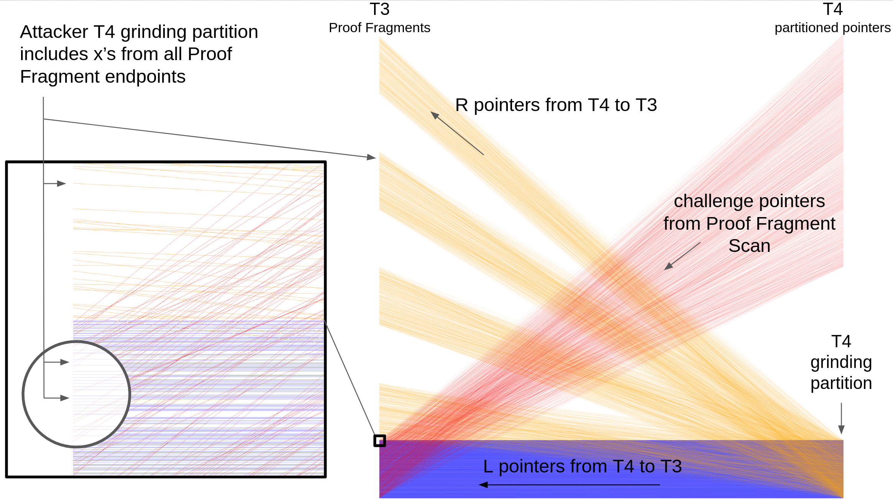
*A visual representation of a small sample plot showing source of all endpoints for collecting x's into a T4 grinding partition for an attacker.*

A challenge works between two (or more) partitions.  The first partition originates from a defined range of Proof Fragment candidates. An attacker groups data required to generate partitions used in the challenge. Below are viable options for an attacker:

- (1) group all x's required for the Proof Fragment Scan and the x-values required to regenerate a T4 and T5 partition all together.
- (2) generate a filtered T3 Proof Fragment table that only includes R pointers that don't overlap with L pointers, and group all x values required to generate a T4 and T5 partition.
- (3) same as the above, except store T2 match indexes instead of x-values.

Attack variant (1) compresses more for higher bit dropping on x-values but requires more compute to reconstruct due to increased number of x-values, and (2) uses less storage for lower bit dropping values and has lower reconstruction costs due to less x-values.

Note that it is not sufficient to collect x's solely from T3 partitioned data. An attacker could regenerate all Proof Fragments for the initial challenge Proof Fragment Scan, but will fail to reconstruct T4 and T5 as the R-pointers across T3 will be missing.

##### Attack variant (1)

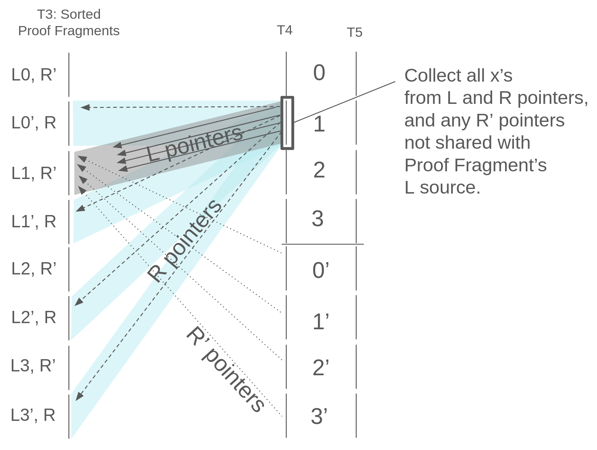
*Collecting x's from source data to store partition grinding attack.*

Once x's are collected, they are sorted (with any duplicates removed) and compressed. These form the basis for all data required to reconstruct the Proof Fragment for the T3 partition in which a challenge initiates a Proof Fragment Scan. Critical is also the inclusion of the R' pointers, which originate from the same Proof Fragments pointed to by the L pointers. However, due to pruning and match filtering, there will be a set of R' Proof Fragments that aren't pointed to by the L pointers, so these must additionally be included in the list of xs for proper reconstruction to respond to a challenge successfully.

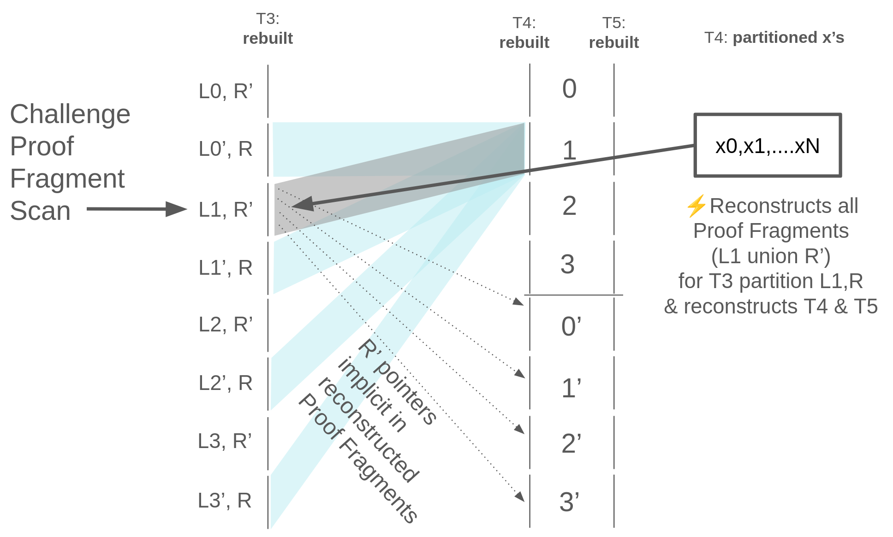
*Reconstructing tables T3 to T5 focused on first partition required for challenge.*

When a challenge comes in and finds a particular Proof Fragment range to scan, the attacker immediately reconstructs the plot using the xs list for that partition. This will result in a full set of Proof Fragments used in the scan. The attacker completes the Proof Fragment Scan to find the filtered list of R' pointers to follow, which will be in other partitions. The attacker then does an additional full reconstruction of all other partition data from the x lists of the destination partitions. Now the attacker has all partitions required for the challenge chaining filter.

##### Attack variant (2)

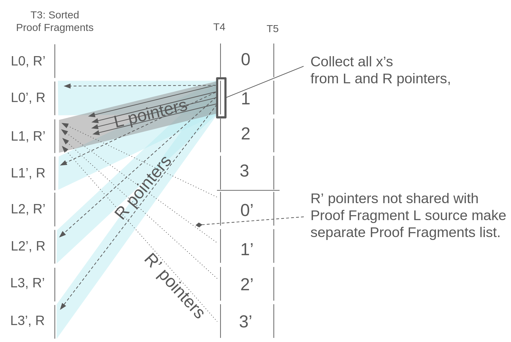
*Collecting x's from source data to store partition grinding attack, and filtering list of Proof Fragments for unique R scan values.*

Similar to approach (1), except we maintain a separate list of Proof Fragment filtered to only those with unique R pointers that don't overlap with any L pointers, and only include x values necessary to generate the T4 and T5 partition.

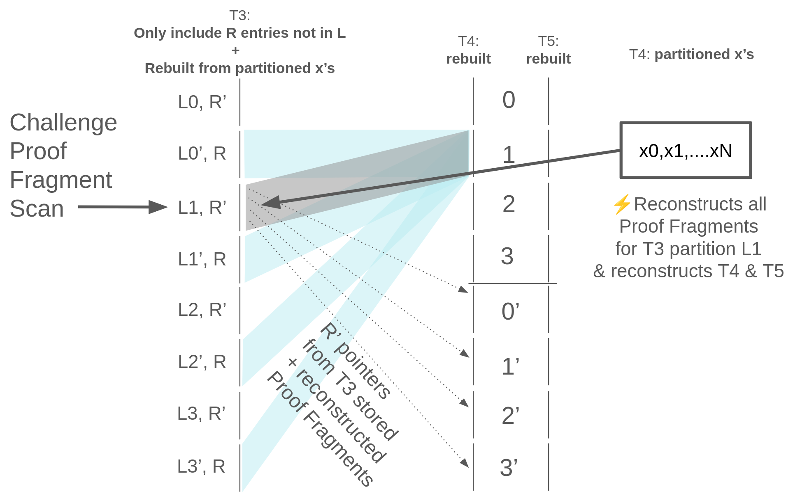
*Using filtered Proof Fragments and reconstructing tables T3 to T5 focused on first partition required for challenge.*

In contrast to approach (1) we interleave our list of filtered Proof Fragments with the Proof Fragments reconstructed from the partitioned x's list.

##### Attack variant (3)

Instead of collecting x-values from T1, an attacker could instead collect indexes from pairings in T2 to reduce their stored data. This would, however, require an attacker to grind T1 to then filter out T2 by those indexes. More analysis needs to be done as to the feasibility of this approach, and adjustments to the T1 Match Key Bits could be necessary in the future.


##### T4 Grinding Attack Analysis

There is significant benefit to dropping all tables and sparing just the list of x's required to reconstruct the fully dropped tables (approach (1)) or including just a list of Proof Fragments needed for the scan but not the reconstruction (approach (2)). The attacker additionally can trade additional compute for reduced storage by bit dropping on each x. Approach (2) would only bit drop on the x-values used in the T4 partitioned x's, and not on the T3 filtered list of Proof Fragments, as the scan would otherwise increase the number of candidate partitions the R pointers would reach, which would incur additional partitions to solve for the attacker that would generate additional work and result in increased chaining paths as well as false candidates that would be discarded when validating a proof.

The goal for the attacker is to reduce the number of bits so that the collective partitioned x's are smaller than an honest plot. Results below are estimated with T4 Partition Attack at 85% of plot size with 4090 @ $1600 350W.

| Plot ID Filter | Proof Fragment Scan Filter | k28 T3 time w/ 4090 (ms) | \# gpu-assisted plots | eTiB  | Honest Farmer W @ 5.5W per TB | Honest Farmer $/TB | Attacker W (GPU W + HDD W) | Attacker $/eTiB |
| -------------- | ----------------------- | ------------------------ | --------------------- | ----- | ----------------------------- | ------------------ | -------------------------- | --------------- |
| 16             | \-                      | 72                       | 2,083                 | 3.54  | 19.48                         | 10                 | 366.56                     | 455.95          |
|                |                         |                          |                       |       |                               |                    | 1881.71%                   | 4559.50%        |
| 32             | \-                      | 72                       | 4,167                 | 7.08  | 38.96                         | 10                 | 383.12                     | 230.08          |
|                |                         |                          |                       |       |                               |                    | 983.35%                    | 2300.78%        |
| 64             | \-                      | 72                       | 8,333                 | 14.17 | 77.92                         | 10                 | 416.23                     | 117.39          |
|                |                         |                          |                       |       |                               |                    | 534.18%                    | 1173.88%        |
| 128            | \-                      | 72                       | 16,667                | 28.33 | 155.84                        | 10                 | 482.46                     | 60.67           |
|                |                         |                          |                       |       |                               |                    | 309.59%                    | 606.74%         |
| 256            | \-                      | 72                       | 33,333                | 56.67 | 311.68                        | 10                 | 614.93                     | 32.44           |
|                |                         |                          |                       |       |                               |                    | 197.29%                    | 324.40%         |

A partial implementation of the T4 Partition Grinding attack is required for more accurate results, tuned for various levels of compression. This is currently planned.

#### Overall Grinding Attack Analysis

Let's revisit the cost to grind for T3 and Rental Attacks:

$$
\text{T3 Attack Cost to grind} = \frac{\left(\text{T3 reconstruction time} + \frac{\text{T4 and T5 Filtered Partitions}}{\text{Proof Fragment Scan Filter}}\right)}{\text{Plot ID Filter} \times 3.5}
$$

$$
\text{Rental Attack Cost to grind} = \frac{\text{T3 reconstruction time} + \text{T4 and T5 Filtered Partitions}}{\text{Plot ID Filter} \times \text{Proof Fragment Scan Filter}}
$$

Assuming **T4 & T5 grinding time is negligible** compared to **T3 reconstruction time**, both equations simplify to:

$$
\text{T3 cost to grind} \approx \frac{\text{T3 reconstruction time}}{\text{Plot ID Filter} \times \text{Proof Fragment Scan Filter}}
$$

and

$$
\text{Rental Attack Cost to grind} \approx \frac{\text{T3 reconstruction time}}{\text{Plot ID Filter} \times 3.5}
$$

From this, we observe:

**If**

$$
\text{Proof Fragment Scan Filter} < 3.5 \times \text{Plot ID Filter}
$$

**then it is more viable for an attacker to use a rental attack grind than a T3 grind.**

Since increasing the Proof Fragment Scan Filter also reduces disk activity, it creates additional room to **lower the Plot ID Filter**. Therefore, optimal parameters can be found by setting the Proof Fragment Scan Filter and tuning the Plot ID Filter as low as possible to within HDD activity constraints. 

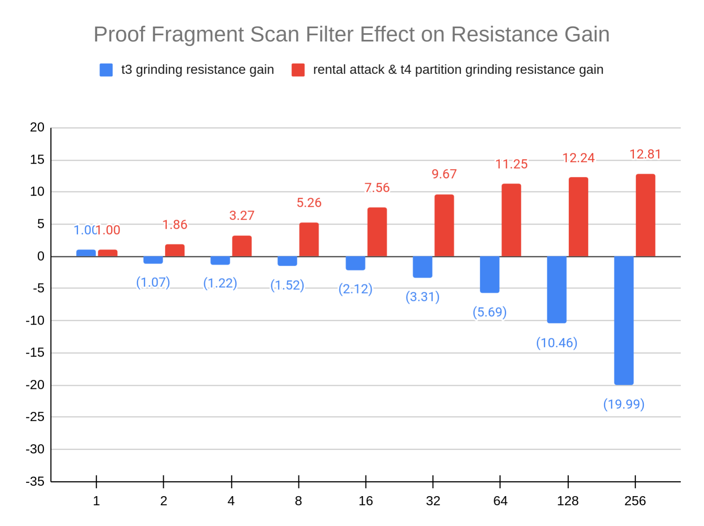

As we can see there are diminishing returns for raising Proof Fragment Scan Filter, especially beyond 32. It also begins to more significantly reduce t3 grinding resistance as we can no longer decrease the Plot ID Filter proportionally to the increase in the Proof Fragment Scan Filter. We have shown that we can use a Proof Fragment Scan Filter of around 4 without weakening security. Beyond that, we must be careful not to weaken too much against the T3 grinding attack.

This is highlighted again in the calculation of **relative effort** (how much W/TB an attacker spends relative to an honest farm's W/TB) expended using various Proof Fragment Scan Filter settings paired with minimum Plot ID Filter settings to support our HDD timing requirements. 
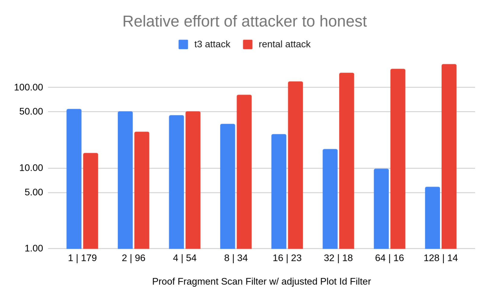

And similarly below a calculation of **relative price/TB** (a value of 2 means an attacker spends double the price per eTiB than an honest farmer).
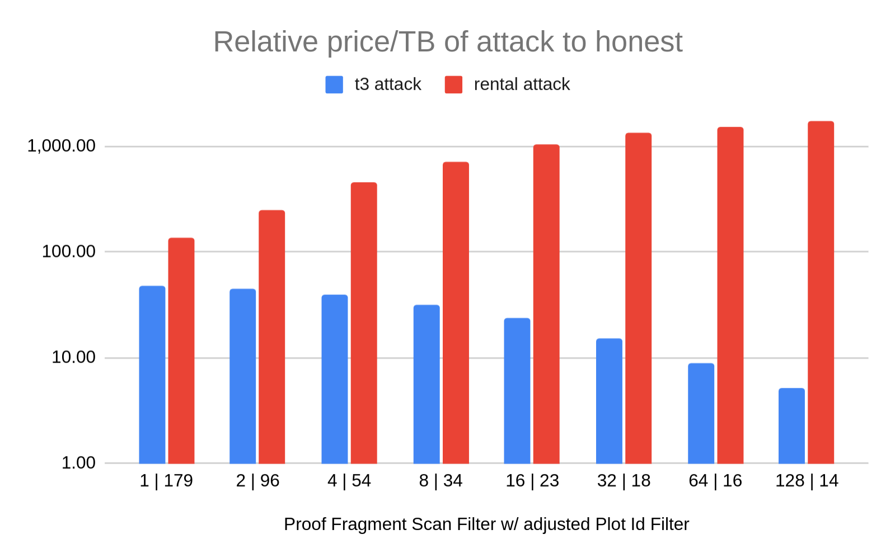

Note, that the Proof Fragment Scan Filter has no effect on an attacker's T4 Partition attack, as they must complete the grind prior to using the filter. In this case, a lower Plot ID Filter is always better for resistance.

While there are diminishing returns on resistance, there are still another benefits to a higher Proof Fragment Scan Filter: less work for the harvester to process challenges, and less HDD activity as we skip the large partition reads for constructing Quality Links.

While our models show we are comfortably resistant both in terms of energy and hardware costs against T3 grinding attacks with a high Proof Fragment Scan Filter, further analysis into future outlook is required.

| Plot ID Filter | Proof Fragment Scan Filter | k28 T3 time w/ 4090 (ms) | \# gpu-assisted plots | eTiB   | Honest Farmer W @ 5.5W per TB | Honest Farmer $/TB | Attacker W (GPU W + HDD W) | Attacker $/eTiB |
| -------------- | ----------------------- | ------------------------ | --------------------- | ------ | ----------------------------- | ------------------ | -------------------------- | --------------- |
| 16             | 32                      | 1650                     | 2,909                 | 4.95   | 27.20                         | 10                 | 361.44                     | 327.72          |
|                |                         |                          |                       |        |                               |                    | 1328.76%                   | 3277.20%        |
| 32             | 32                      | 1650                     | 5,818                 | 9.89   | 54.40                         | 10                 | 372.88                     | 165.96          |
|                |                         |                          |                       |        |                               |                    | 685.41%                    | 1659.63%        |
| 64             | 32                      | 1650                     | 11,636                | 19.78  | 108.81                        | 10                 | 395.76                     | 85.08           |
|                |                         |                          |                       |        |                               |                    | 363.73%                    | 850.84%         |
| 128            | 32                      | 1650                     | 23,273                | 36.36  | 200.00                        | 10                 | 434.11                     | 48.21           |
|                |                         |                          |                       |        |                               |                    | 217.06%                    | 482.06%         |
| 16             | 64                      | 1650                     | 5,818                 | 9.89   | 54.40                         | 10                 | 372.88                     | 165.96          |
|                |                         |                          |                       |        |                               |                    | 685.41%                    | 1659.63%        |
| 32             | 64                      | 1650                     | 11,636                | 18.18  | 100.00                        | 10                 | 392.06                     | 92.21           |
|                |                         |                          |                       |        |                               |                    | 392.06%                    | 922.06%         |
| 64             | 64                      | 1650                     | 23,273                | 36.36  | 200.00                        | 10                 | 434.11                     | 48.21           |
|                |                         |                          |                       |        |                               |                    | 217.06%                    | 482.06%         |
| 128            | 64                      | 1650                     | 46,545                | 72.73  | 400.00                        | 10                 | 518.23                     | 26.21           |
|                |                         |                          |                       |        |                               |                    | 129.56%                    | 262.06%         |
| 256            | 64                      | 1650                     | 93,091                | 145.45 | 800.00                        | 10                 | 686.46                     | 15.21           |
|                |                         |                          |                       |        |                               |                    | 85.81%                     | 152.06%         |

*Table data using 4090 @ $1600 consuming 350W.*

In the above we see that a Proof Fragment Scan Filter of 64 shows some weaknesses at Plot ID Filter of 128 and 256, as an attacker begins to save on energy costs relative to the honest farmer. Either we need to increase Plot Strength at this setting, to raise the plotting time, or have an aggressive Filter change schedule ready before the next generation of GPU's.

#### Mitigation

##### Using Bipartite partitions: lower and upper

A previous version of the proof of space did not split the L and R pointers across lower and upper partitions. This results in higher fanouts of T3 to T4, which substantially reduces the number of x-values to include in a T4 partitioned x-values set. Each partition in T4 would receive 2N inputs from T3, and generate N outputs, giving an average of 2 fanouts per T3 entry. 

By splitting into lower and upper partitions, each T4 partitioned set receives 4N inputs from T3, and and filter 50% to return 2*N back pointers. Due to collisions and pruning, this averages closer to 1.35 back pointers to each Proof Fragment, instead of 2 from the earlier version-- which requires more storage for the T4 Partitioned Attack to reduce it's effectiveness.

##### Shrink T4 and T5 relative to T3

Since the attacker drops tables T4 and T5, an effective approach to reduce the effectiveness of these attacks is for the honest plot to have reduced T4 and T5 sizes. This also reduces the average number of fanouts from T3 to T4, which increases the ratio of the number of X's collected per entry for the partition, however the additional pruning reduces the amplitude of this effect.

This however reduces the plot size, which in turn increases stress on HDD storage and potentially requires an increase in the Plot ID Filter, which would in turn reduce compression resistance. Another side effect is influence on the number of Quality Links in a partition set, which may not reach bit-drop saturation and open a separate attack vector.

Another possible side-effect is a smaller T5 relative to T4 can open up general compression optimizations by re-organizing data between T4 and T5 to account for different relative table sizes, although generally we find it more optimal only in cases where T4 would be smaller relative to T5.

More analysis would be required to balance the trade-offs against choosing relative table sizes.

##### Eliminate Attack with R pointers on T5 or random L pointers on T4

We have explored options to secure T5 by pairing across different partitions, but this inevitably increases HDD load and makes building Quality Chains difficult, requiring us to raise the Plot ID Filter to compensate which weakens resistance to the other attacks.


### Security: Quality Chaining

A critical design of the Quality Chain is that a challenge start with a scan on Proof Fragments to follow an R pointer into T4 that then defines Partition B. If the challenge specified the Partition A and Partition B directly, the attacker could organize data into pre-determined groups by those partitions by using only data collected in T3, instead of T4, which would be substantially less x inputs than for T4.

#### Bit dropping choices

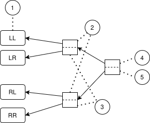
*Figure: all possible bit dropping options on Quality Links*

| Bit drop on | notes | effectiveness |
|-|-|-|
|(1) Proof Fragment|Each link has 3 Proof Fragments, each sibling pair must be disambiguated independently. Can work with probability to reduce number of solves, but still must often fetch sibling node outside of the partition. | 1 bit drop = X solves for each member in link set. Often must disambiguate using sibling node in other partition, not feasible on HDD. |
|(2) T4 L back pointers | Each link has 2 nodes with T4 L back pointers. Must disambiguate each side of the Link | 1 bit drop = 4 solves for each member in link set. |
|(3) T4 R back pointers | Each link has one node with T4 R back pointer. Must disambiguate just one side for each Link. Each partition can find limited set of R pointers from T3 that point into T4. Disambiguation resolved by checking each R bit-dropped reconstruction against it's L sibling for a match. Recompute cost is reduced to set of Proof Fragments, amount of bit dropping negligible impact.  | **Most effective.** All bit drops = 1 solve for each unique Proof Fragments to disambiguate in link set.|
|(4 & 5) T5 L/R back pointers | Each link has one node with T5 L/R back pointer. To disambiguate must recompute child nodes to find correct pairing in T5. | 1 bit drop = 4 solves for each member in link set. |


Bit-dropping on T4 R-pointers is the most effective option for attackers. Because R-pointers point to a limited set of Proof Fragments, the attacker first solves for that set to get all x-values. Then, to resolve the dropped R bits, the attacker pairs each candidate R with the known L side of the match. Since the x-values are already solved, brute-forcing the correct R is fast—just a simple hash pairing check with L and the candidate Rs, which is only 2^(bits dropped) possibilities.

##### Attack calculation: bit dropped T4 R pointers for chain

Prior to chaining, the attack can solve all R Proof Fragments in a partition pointed to by the other partition, and all L Proof Fragments, and store their meta results for a subsequent T4 pairing.

| k size | sub_k | # partitions (in each upper & lower) | elements in partition | total data in challenged partitions | Proof Fragment Scan hdd<sup>1</sup> time (ms) | Partitions seek and read time<sup>1</sup> (ms) | # unique Proof Fragments for attack | % of plot to solve | est. 3090 solve time (ms)<br>TBD | 
|----|--|--|--|---|--|-|-|-|-|
| 28 | 17 | 2048 | 52.2k | 834kB | 10ms | 32ms | 42 | 0.78% | ~36ms | 
| 28 | 18 | 1024 | 105.6k | 1.6M | 10ms | 46ms | 342 | 8.3% | ~220ms | 
| 28 | 19 |  512 | 208.8k | 3.4MB | 10ms | 72ms | 1375 | 33.6% | ~870ms | 
| 28 | 20 |  256 | 417.8k | 7.2MB | 10ms | 124ms | 5504 | 134% | plot grind | 

<sup>1</sup><sub>hdd seek time: 10ms, read: 70MB/s</sub>

While the attack solving times may seem high, note these attacks are only performed after a passing Proof Fragment Scan Filter, and drops enough bits to make T4 storage almost zero (~30% compression). Small sub_k partitions don't provide enough unique Proof Fragments in chain selections, resulting in weak compression resistance.

Larger sub_k sizes dramatically increase the number of unique Proof Fragments an attacker must solve for. When we reach sub_k=20 on a k28 we achieve **bit drop saturation** -- the cost to recompute dropped bits exceeds the cost of a plot grind. Due to the Proof Fragments choice of bit drops, processing these linearly results in even worse time (a sequence of 5504 Proof Fragment solves would take over a minute on a 3090). Note that bit dropping on any other element than the T4 R pointer will bit drop saturate earlier in lower sub_k sizes, so there are no incentives for an attacker to use other bits to drop.

At large sub_k sizes there is a larger amount of data per partition that must be read to respond to the challenge-- this requires longer read times and some non-negligible ANS decompression time that can limit the number of plots a harvester can support. This can be eased with the Proof Fragment Scan Filter. 

Due to bit drop saturation forcing the attacker to resort to grinding attacks as a more economical option, we can tune T3 match key bits to increase resistance against grinding attacks, and trade-off plotting time. Since no changes to security in the first two tables are necessary against grinding attacks, the honest farmer's solver performance is unaffected. 

Finally, **bit drop saturation** is the most beneficial way to ensure long-term compression resistance for an indefinite amount of time. The Plot ID and Proof Fragment Scan Filter cannot be reduced to less than 1. After that point, improvements in compute performance will eventually start favoring bit drops on the R pointers as they begin to outperform grinding results. The only way to mitigate bit dropping results is to increase T1 match key bits, which then more significantly affects solver times for a CPU vs advances in GPU.

###### Improving disk performance

Due to high data read volume, it's possible to group plots together under a mechanism where they share the same plot ID, plus an additional identifier to distinguish among plots with the same plot ID. Then for T3 we can interleave plot data for the Proof Fragment Scan Filter, to have one disk seek across N plots. However, after analysis this can reduce overall disk activity by 10-15% using an optimal group size of only 2. More research would be needed to determine if this extra complexity is worthwhile or whether there are more advanced methods to further reduce overall disk time with plot groupings. 


#### Attack Approach #2: chain false positives

Instead of disambiguating each Quality Link prior to chaining, an attacker can leave false positives and combine those into new possible chains, and only after all chains are collected see which pass the block difficulty, to then resolve at that time.

##### Difficulty and chance of a block win

A plot of size 1.5GiB, given netspace of 19EiB, has a 1 in 13.6 billion chance of winning. If an attacker thus creates a few billion Quality Chains of false positives, they could in theory avoid a recompute if all fail to win the block. The resistance against this attack, is the effort to compute and maintain all the Quality Chains, through combinatorial explosion.

##### Bit drop choices

|Bit drop on | results |
|---|---|
| Proof Fragment | 1 bit drop results in 3 chains with 2 false positives. 3^(bits_dropped) |
| T4 L | 1 bit drop results in 3 chains with 2 false positives. 3^(bits_dropped) |
| T4 R | 1 bit drop results in 2 chains with 1 false positive. 2^(bits_dropped) |
| T5 L | 1 bit drop results in 2 chains with 1 false positive. 2^(bits_dropped) |
| T5 R | 1 bit drop results in 2 chains with 1 false positive. 2^(bits_dropped) |

Since a Quality Link is comprised of an asymmetrical set of 3 Proof Fragments, and only one of those is an R side sibling, an attack is incentivized to bit drop on T4 R, T5 L, and T5 R. An attacker would choose based on the larger of the T4 or T5 tables to bit drop on for most effect. Proof Fragments are the least economically viable, even if T3 is larger in size, due to the much higher baseline to exponent with each bit dropped.


##### Number of Quality Links 

| k size | sub_k | # partitions | elements in partition | # cross overs | total candidate Quality Links A->B and B->A |
|----|--|--|--|---|--|
| 28 | 18 | 1024 | 104.4k | 202.4 | 405 | 
| 28 | 19 |  512 | 208.8k | 812 | 1624 | 
| 28 | 20 |  256 | 417.8k | 3258 | **6516** |

For security we currently choose k28 with sub_k 20, which has on average about 6516 selectable Quality Links.

##### Combinatorial analysis

| chain | honest hashes | attacker hashes | honest total hashes | attacker total hashes | honest cpu ms | attacker cpu ms | honest gpu ms | attacker gpu ms | honest TiB supported CPU | attacker gpu TiB |
| ----- | ------------- | ------------------ | ------------------- | --------------------- | ------------- | --------------- | ------------- | --------------- | ------------------------ | ---------------- |
| 1     | 6,516         | 13,032             |                     |                       |               |                 |               |                 |                          |                  |
| 2     | 13,032        | 52,128             |                     |                       |               |                 |               |                 |                          |                  |
| 3     | 26,064        | 208,512            |                     |                       |               |                 |               |                 |                          |                  |
| 4     | 52,128        | 834,048            |                     |                       |               |                 |               |                 |                          |                  |
| 5     | 104,256       | 3,336,192          |                     |                       |               |                 |               |                 |                          |                  |
| 6     | 208,512       | 13,344,768         |                     |                       |               |                 |               |                 |                          |                  |
| 7     | 417,024       | 53,379,072         |                     |                       |               |                 |               |                 |                          |                  |
| 8     | 834,048       | 213,516,288        | 1,661,580           | 284,684,040           | 13.62         | 2,333.17        | 0.12          | 21.21           | 2,203.01                 | 1,414            |
| 9     | 1,668,096     | 854,065,152        | 3,329,676           | 1,138,749,192         | 27.29         | 9,332.79        | 0.25          | 84.84           | 1,099.35                 | 354              |
| 10    | 3,336,192     | 3,416,260,608      | 6,665,868           | 4,555,009,800         | 54.63         | 37,331.25       | 0.50          | 339.37          | 549.14                   | 88               |
| 11    | 6,672,384     | 13,665,042,432     | 13,338,252          | 18,220,052,232        | 109.32        | 149,325.11      | 0.99          | 1,357.50        | 274.43                   | 22               |
| 12    | 13,344,768    | 54,660,169,728     | 26,683,020          | 72,880,221,960        | 218.68        | 597,300.53      | 1.99          | 5,430.00        | 137.18                   | 6                |
| 13    | 26,689,536    | 218,640,678,912    | 53,372,556          | 291,520,900,872       | 437.42        | 2,389,202.24    | 3.98          | 21,720.00       | 68.58                    | 1                |
| 14    | 53,379,072    | 874,562,715,648    | 106,751,628         | 1,166,083,616,520     | 874.90        | 9,556,809.08    | 7.95          | 86,880.00       | 34.29                    | 0                |
| 15    | 106,758,144   | 3,498,250,862,592  | 213,509,772         | 4,664,334,479,112     | 1,749.85      | 38,227,236.42   | 15.91         | 347,520.02      | 17.14                    | 0                |
| 16    | 213,516,288   | 13,993,003,450,368 | 427,026,060         | 18,657,337,929,480    | 3,499.75      | 152,908,945.79  | 31.82         | 1,390,080.08    | 8.57                     | 0                |

Table X: settings using chain branching factor of 2 with 6516 selectable chains, plot filter 256 and Proof Fragment Scan Filter of 8, and attacker with 1 bit dropped on T4 R, T5 L, or T5 R.

A chain branching factor is the average number of links eligible to create new chains with. It will result in (number of chains)^branching_factor Quality Chains by the end of the chaining sequence.

From the table we see that an honest farmer, with 8 chains, can support a farm with CPU around 2 PiB in size, whereas the attacker must resort to a GPU can with 1 bit drop support a farm with 1.4 PiB. With 12 chains, an attacker's supported farm size is crippled to just 6TiB, however the honest farmer would only support 218TiB on CPU (but more than enough on GPU).

The table below explores more results by tuning the Chaining Factor. The **attacker false positives** is the ratio of times an attacker will have a Quality Chain passing the difficulty filter, but fail to have a valid proof. For example, using 12 chains with a branching factor of 1.35 with 1 bit drop, the attacker could only support 174 TiB, in addition to doing full proof recomputes on average 1733 times to find a valid proof. A raspberry Pi 5 could support a farm size of 1 PiB, which is a negligible cost for the CPU work compared to the storage energy required. Chaining with 16 Links has significant impact both on reducing honest farmer compute, and increasing resistance against attacks. It does, however, increase the number of Proof Fragments and final proof size to 512 x-values, which requires reducing the number of match bits in T1 so our Pi Solver can still compute in time. 

Note that the # of chains influences the number of Proof Fragments and thus x-values in a proof, which requires more storage on the blockchain as well as increased solve time.

| \# chains                     | 12            | 16             | 16            | 16             | 16                 |
| ----------------------------- | ------------- | -------------- | ------------- | -------------- | ------------------ |
| chaining factor               | 1.35          | 1.21           | 1.1           | 1              | 1                  |
| honest supported farm on Pi 5 | 1PiB          | 1PiB           | 2.8PiB        | 6.3PiB         | 6.3PiB             |
| \# bit drops for attacker     | 1             | 1              | 1             | 1              | 2                  |
| attacker total hashes         | 1,150,600,150 | 12,698,963,319 | 3,270,327,725 | 12,698,963,320 | 37,314,675,858,960 |
| attacker false positives      | 1,733         | 1,348          | 13,960        | 8,191          | 357,913,941        |
| attacker supported farm size  | 174TiB        | 15.85TiB       | 61.56TiB      | 235TiB         | 0.01TiB            |

Table Calculations based on Plot ID Filter of 32, Proof Fragment Scan Filter of 32. These performance numbers are based on estimates from early benchmarking. 

| Chains / Factor | Plot ID Filter | Proof Fragment Scan Filter | chaining time w/ 4090 (ms) | \# gpu-assisted plots | eTiB   | Honest Farmer W @ 5.5W per TB | Honest Farmer $/TB | Attacker W (GPU W + HDD W) | Attacker $/eTiB | Attacker plot compression |
| --------------- | -------------- | ----------------------- | -------------------------- | --------------------- | ------ | ----------------------------- | ------------------ | -------------------------- | --------------- | ------------------------- |
| 16 / 1          | 32             | 32                      | 32                         | 300,000               | 510.02 | 2,805.13                      | 10                 | 3,114.49                   | 12.99           | 1.45%                     |
|                 |                |                         |                            |                       |        |                               |                    | 111.03%                    | 129.92%         |                           |
| 16 / 1.1        | 32             | 32                      | 243                        | 39,506                | 67.16  | 369.40                        | 10                 | 714.05                     | 33.68           | 1.45%                     |
|                 |                |                         |                            |                       |        |                               |                    | 193.30%                    | 336.78%         |

Our current recommendation is to chain 16 Quality Links with a chaining factor of 1.1, which would give enough security against even a 100x more powerful GPU. Chaining attacks are not affected by Plot Strength, so here we err on the side of extra resistance so we see minimal potential for compression in the next decades. 

One caveat to using longer chains is the distribution of results is affected, so that a challenge will get no valid responses most of the time and a large collection of results more infrequently. We deal with this in the pooling protocol. Also, by front-loading high probabilities and tapering results down the chain, we can trade some additional compute for a more even distribution of results. This CHIP will be updated with final settings once production-level code can verify timings.

#### Statistical Attacks

##### Removing Underperforming Partitions

Partitions may exhibit slight variance in the number of Quality Links used for Quality Chain construction. For example, in a `k = 28` plot with `sub_k = 20`, our analysis shows that the average number of Quality Link connections (cardinality) from a given partition to all others can differ by up to 1% from the expected value.

We calculate the **relative proof effectiveness** of that partition using:

$$
\left( \frac{\text{Number of Quality Links in Partition}}{\text{Expected Number of Quality Links}} \right)^{\text{Quality Chain length}} = \text{Relative Proof Effectiveness}
$$

**Example:**

- Expected average cardinality: `6516`
- Observed underperforming partition: `6457`

$$
\left( \frac{6457}{6516} \right)^{16} = 0.86
$$

This means the underperforming partition would produce only **86% as many Quality Chains** as the average partition.

If an attacker drops this partition to improve average performance, they:

- Improve proof performance by:

  $$
  \frac{1 - 0.86}{512} = 0.0273\%
  $$

- But lose `1/512` of all challenge opportunities because any challenge involving that partition will now fail.

So, while gaining 0.0273% efficiency, they sacrifice:

$$
\frac{1}{512} = 0.1953\% 
$$

The net result is worse than honest plotting — dropping partitions decreases total performance.

##### Favoring Larger Plots

Plot entry counts can vary slightly due to statistical distribution. In the Quality Chain design, **output variance compounds with the number of chains**, making small deviations in entry count more impactful.

A plot deviating from the mean expected number of entries will produce a number of proofs approximately proportional to:

$$
\frac{\text{Length of Quality Chain}^{(\frac{\text{Number of Entries in Plot}}{\text{Expected Number of Entries}})} }{ \text{Length of Quality Chain} } = \text{Relative Output}
$$

Because of their smaller size, **k=28 plots** exhibit the largest potential deviation. Early estimates suggest that:

- Raw plot size could be up to `0.1%` smaller or larger than the expected plot size.
- Compounded variance from chaining could raise proof output by up to `0.3%` by selecting only the larger plots.

Further empirical testing is needed to validate these estimates across many real-world plots. In any case, farmers wanting to free up space by removing plots should start by selecting the smallest plots to remove.


#### Further Attack Mitigation

- Possible to include chain branching factor on a scheduled difficulty adjustment
- Possible to increase number of chains on scheduled difficulty adjustment

### Non-Viable Attacks

This section summarizes attack strategies we have evaluated and determined to be infeasible under the proposed Proof of Space design.

#### Theoretical Compression

We believe there is no meaningful room for further plot data compression:

- **Benes compression** reaches near-theoretical efficiency in T4 and T5, outperforming optimal ANS implementations.
- **ANS compression** is already near-optimal in T3 on sorted Proof Fragments. Benes cannot be applied to T3 due to its requirement for permutation-based encoding.

#### Block Difficulty Filtering

In the original Proof of Space, attackers could filter false positives by testing partial proofs against the global difficulty, avoiding full recompute. In the Quality Chain design, full proof recompute is required for each candidate, making such pruning attacks impossible.

#### Proof Fragment Compression

Each Proof Fragment encodes:
- A lateral partition (`L`) using the top `partition_bits`
- Two ordering bits
- A cross-over partition (`R`) using the bottom `partition_bits`

These bits are *not redundant*. T4 no longer stores `R` partition information—it is reconstructed via T3 scan. Dropping or reassigning bits across tables provides no advantage:

- The `L` bits are high-order and do not participate in the ANS delta compression.
- Moving `R` partition bits from Proof Fragments to T4 would save nothing, as T3 and T4 are pruned to the same size.

##### Why Limit to 2k Bits?

Each Proof Fragment encodes 4 of 8 x-values with `k/2` bits, totaling `2k` bits. Exceeding this would make it more efficient to store two `k`-bit back-pointers instead, defeating the compression intent. While such a structure may compress slightly better, it would impose unacceptable HDD load and enable attackers with high-speed SSDs to gain an edge.

Further, because of aggressive bit dropping, reconstructing a Proof Fragment yields ~1.47 false pairings (≈ 4 × 1/e). Attackers must resolve sibling fragments to eliminate these, incurring additional compute and cross-partition disk seeks—prohibitive on HDDs.

#### Hellman Attacks

Hellman attacks work best either on early tables, which are already dropped in our PoS, or using final output values in the last table, which is not used in our PoS. It would be extremely difficult or impractical to apply a Hellman attack. The Quality Chain requirements would also force thousands of Hellman recompute passes, erasing any precomputation benefit.

#### Table Restructuring

We evaluated whether reordering or splitting tables could yield better compression:

- With T3–T5 sized equally, redistributing compression across tables offers no benefit.
- Splitting Proof Fragments into decrypted x-values to group by similarities adds prohibitive scan/reconstruction overhead or requires storing extra bits.

Even assuming free random access, attempts to relocate decrypted data to earlier tables (e.g., T2) fail:
- Back-pointers to T2 would still be `2k` bits.
- T2 could be compressed to near-zero using sorting, but the overall size after including back-pointers remains equal or worse than current Proof Fragments.

Any attempt to drop bits runs into the **bit saturation limit**, where reconstructing Quality Chains becomes more expensive than replotting to T3—and thus less viable than using a grinding attack.

#### Underweighted Data

If certain plot data were rarely used, attackers might hope to drop it and reconstruct on-demand to save space. However:

- Partition routing explicitly avoids reuse: no partition ever points to itself for both `L` and `R`, or receives both.
- This disjoint design ensures all data is actively used during challenges.
- Statistical attempts to exploit underused partitions (see [Security – Statistical Attacks](#statistical-attacks)) were ineffective.

In short, the plot format avoids storing any redundant or underused data.

### Summary and Conclusions

The **bit-drop saturation** and the **plot strength** are a powerful combination, as we can assess security and if we need to strengthen it, we can increase resistance to grinding without compromising our requirements for the solver, chaining compute, or HDD activity. It pushes the onus on the plotting time, which is a one-time inconvenience. As a result, we prioritize high convenience for farmers without compromising compression or rental attack resistance.

#### Summary of Parameters and their Effects

| Desc | T1 match bits | T2 match bits | T3 match bits (plot strength) | T4 Match bits | T5 match bits | Plot ID Filter | Proof Fragment Scan Filter | Chaining factor | # Chains |  Notes |
|--|--|--|--|--|--|--|--|--|--|--|
|harvester|   |   |   |   |   | proportional effect - higher better, hdd load - tuned to 10% for k28 and 20TB HDD | relaxes hdd and harvester chaining compute load, higher better - tuned to 10% for k28 and 20TB HDD | tuned for CPU harvester to support >1PiB
|solver|Tuned for Pi 5 | Tuned for Pi 5 | | | | | |  | #x's to solve = 32 * # chains |
|bit dropping | most effect | small effect | negligible | negligible | negligible | proportional effect - lower better | proportional effect - lower better | | | bit-drop saturation forces T3 grinding / T4 partition grinding attacks
|T3 grinding attack | equal effect | equal effect | equal effect | small effect<br>(1/num_partitions) | small effect<br>(1/num_partitions) | proportional effect - lower better | proportional effect - lower better | | | Attack uses initial Proof Fragment scan
|T4 partition grinding attack| equal effect | equal effect | equal effect | small effect<br>(1/num_partitions) | small effect<br>(1/num_partitions) |proportional effect - lower better | | | | Attack must recompute partition prior to Proof Fragment Scan |
|Full plot grind | equal affect | equal effect| equal effect | small effect<br>(1/num_partitions) | small effect<br>(1/num_partitions) | proportional effect - lower better | |
|Chaining attack | | | | | | | | higher better | higher better | increasing number of chains can lower chaining factor for same resistance but grows proof size on blockchain |

#### Parameter Tuning for Optimal Settings

Fixed constraints:
- Solver must solve a k28 on a Raspberry Pi in under 9 seconds
- HDD activity on a 20TB HDD filled with k28 plots must not exceed 10%
- Rental Attack Resistance must initially defend against 5 million H100s
- Harvester must support at least a 200 TiB farm on a CPU
- Full grinding attack resistance (no compression possible)
- Maximum chaining attack resistance (<1% compression possible)

Relaxed Constraints:
- Lower HDD activity
- Faster Plotting Times
- Lower Harvester Energy

Our proposed filter settings are:
- Plot ID Filter: 32
- Proof Fragment Scan Filter: 32
- Number of Chains: 16
- Chaining Factor: 1.1
- T1 Match Bits: 2
- T2 Match Bits: 2
- T3 Match Bits (Plot Strength): 2
- T4 Match Bits: 2
- T5 Match Bits: 2
  
With those settings we believe we hit all our goals. However, when we have more tools and benchmarks ready we can tune further to improve on our relaxed constraints.

Plot Strength is a general regulator, and can be tuned to compensate for any lack of resistance at the expense of longer plotting times. Below, we show an influence map for tuning, as care and re-evaluation is needed for any changes.

##### Parameter Influence Map for Proof of Space

```mermaid
graph TD
  FragmentScan[Proof Fragment Scan Filter]
  HDD[HDD Activity]
  PlotId[Plot ID Filter]
  T3Grind[T3 Attack Resistance]
  T4Grind[T4 Attack Resistance]
  Rental[Rental Attack Resistance]
  PS[Plot Strength]
  HFS[Harvester Farm Size]
  Chains[Number of Chains]
  ChainFactor[Chaining Factor]
  Proof[Proof Size]
  Solver[Solver Time]
  T1Match[T1 Match Key Bits]
  ChainAttack[Chaining Attack]
  Plot[Plotting Time]

  PlotID --> HDD
  FragmentScan --> HDD
  FragmentScan --> T3Grind
  PlotID --> T3Grind
  PlotID --> T4Grind
  PlotID --> Rental
  PD --> T3Grind
  PD --> Rental
  PD --> T4Grind
  FragmentScan --> HFS
  Chains --> HFS
  ChainFactor --> HFS
  Chains <--> Proof
  Proof --> Solver
  T1Match --> Solver
  ChainFactor --> ChainAttack
  Chains --> ChainAttack
  PD --> Plot
  T1Match --> Plot
  ```
### Future Proofing

Other CHIPs will present solutions for future-proofing, which work by introducing schedules to our filters and by manually increasing the minimum plot strength. The automated changes prevented or delayed with soft forks, as we respond to technological advances over the years.


## Copyright
Copyright and related rights waived via [CC0](https://creativecommons.org/publicdomain/zero/1.0/).


