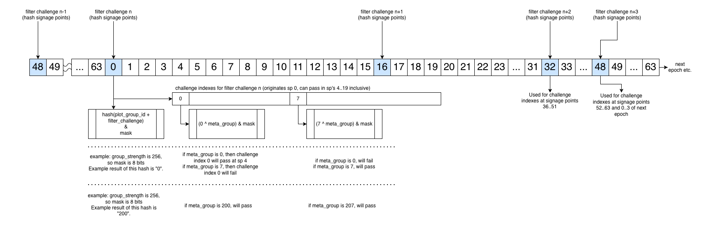

CHIP Number  | 0049
:------------|:----
Title        | 3.0 Fork Info
Description  | Provide all info that will be included in the 3.0 fork
Author       | [Arvid Norberg](https://github.com/arvidn)
Editor       | [Dan Perry](https://github.com/danieljperry)
Comments-URI | [CHIPs repo, PR #161](https://github.com/Chia-Network/chips/pull/161)
Status       | Draft
Category     | Standards Track
Sub-Category | Core
Created      | 2025-05-19
Requires     | [0048](https://github.com/Chia-Network/chips/pull/160)

## Abstract
[CHIP-48](https://github.com/Chia-Network/chips/pull/160), which introduces the new Proof of Space format (PoS v2), requires a hard fork of the Chia blockchain. This document describes how PoS v2 will be integrated with the blockchain, as well as how original plots will be phased out. This CHIP also proposes a few other hard-fork changes, unrelated to PoS v2.

## Motivation
The current Proof of Space format (PoS v1) was released in July 2020, during the Chia blockchain’s beta phase. Today, PoS v1 remains secure. However, two broad issues exist, one of which is still hypothetical, and the other of which is already in production.

The hypothetical issue is plot grinding. This is where a farmer creates an entire plot and submits a proof within around 28 seconds. Plot grinding is described in detail in [CHIP-12](https://github.com/Chia-Network/chips/blob/main/CHIPs/chip-0012.md).

The other issue is plot "compression," where bits are dropped during a plot's creation, and added back in while farming. The result is a farm that squeezes more proofs into the same space. Plot compression is described in detail in a [blog post](https://www.chia.net/2023/01/21/plot-compression-is-here/).

Neither of these issues is an attack on the network itself, but in both cases, they make time-space tradeoffs, which cause the network's Proof of Space consensus to resemble Proof of Work (PoW). As a consequence, the network uses more compute than what was originally intended.

In the first half of 2024, we made the decision to sunset PoS v1 in favor of a new format that will be significantly more resilient to bit dropping and other time-space tradeoffs. Farmers will need to replace their existing plots with new ones, so we have built PoS v2 with minimizing future disruptions in mind.

We will future-proof PoS v2 with two independent mechanisms:
1. Automatically reducing the network's base filter (can be delayed with a soft fork)
2. Manually increasing the network's minimum plot strength (a soft fork)

Both of these adjustments are detailed in the [Specification](#specification) section.

## Backwards Compatibility
This CHIP proposes a hard fork to upgrade PoS v1. Hard forks relax rules. Blocks that are invalid by the existing rules will be considered valid by the new rules (and sometimes vice versa).

To continue using Chia after the hard fork from this CHIP activates, full nodes, farmers, harvesters, pools, wallets, and other projects in the ecosystem will need to upgrade their software. In order to give everyone ample time to perform this upgrade, there will be a window of several months between the fork being added to version 3.0.0 and the fork's activation.

Even though PoS v1 will be disabled by the hard fork, it will remain valid until the end of the phase-out period, which is [described in detail](#phase-out-period) below.

## Specification
The specification for each of this CHIP’s features will be listed individually.

### Fork activation
We will release Chia version 3.0.0, which will implement the hard fork. The fork will activate in the block immediately following the first *transaction* block, with a later signage point, at or above height `9'562'000` (nine million, five hundred and sixty-two thousand). This is expected to happen around November 10, 2026, though it could drift a few days in either direction.

A single signage point may produce multiple blocks. If the block immediately following the transaction block at the activation height happens to be on the same signage point, it will also be pre-activation. The hard fork would then activate with the next signage point. Whenever the activation height is mentioned in this CHIP, it will follow the same logic as described here.

Starting with the block in which the hard fork is activated, PoS v2 will be accepted.

This hard fork is different from previous forks in that it affects the validity of Proofs of Space. When farming a block, the harvester does not know (exactly) at what height its proof may be infused. However, it *can* know what the most recent transaction block was.

### Phase-out period
The phase-out period will begin when the fork is activated, and will end 256 epochs later.

During the phase-out period, plots created with PoS v1 will become less likely to win a block over time. The probability of winning a block will be scaled down, linearly, starting at the activation block, to reach 0 probability after 256 days (technically, 4608 x 256 blocks).

In order to validate a PoS v1 proof after the hard fork has activated, we will look at the last byte of the quality string, and filter it based on the number of epochs since activation. We don't track the actual epoch; we just divide the number of blocks since activation by 4608 (the number of blocks per epoch).

After 256 epochs after the fork's activation, no original proof will ever be valid. This ends the phase-out period and effectively disables PoS v1.

| Blocks w/prev. TX block >= | epochs | Win prob. factor |
|:-------------------------- | :----- | :--------------- |
| 9562000                    | 0      | 1.000            |
| 9566608                    | 1      | 0.996            |
| 9571216                    | 2      | 0.992            |
| 9575824                    | 3      | 0.988            |
| …                          | …      | …                |
| 10732432                   | 254    | 0.008            |
| 10737040                   | 255    | 0.004            |
| 10741648                   | 256    | 0.000            |

As for PoS v2, its value will be 100% beginning at the fork's activation. In other words, its win probability factor will be 1.000. There will be no planned phase-out (or phase-in) for PoS v2.

### Plot strength definition
As detailed in CHIP-48, every plot will include a “strength” parameter, which will adjust how much work is required to create the plot.  If a given plot's strength is `n`, then creating the plot will require around `2^n` times more effort than the minimum. One caveat is that there is a small amount of overhead that remains constant at all levels. Because of this overhead, incrementing strength at the lowest levels will incur a bit less than double the work. At `strength = 5` and above, the overhead is negligible. 

At a given block height, the network will only accept plots that meet the current minimum strength threshold.

By definition, `strength = 0` indicates the minimum compute required to create a plot, with no additional arbitrary computation.

The maximum allowed strength will be 17 minus the number of bits in the base filter ([described below](#base-filter-definition-and-plan)). For example, if the base filter is 512, then the number of bits in the base filter is 9 (`log(512)`). The maximum strength is therefore `17 - 9 = 8`. When the base filter reaches `1`, there will be `log(1) = 0` bits in the base filter, so it can't go any lower.

Strength needs to be capped in order to ensure that the network's minimum spec hardware can validate a proof from a plot created at that strength in a timely manner. The assumption is that eventually the minimum spec hardware will also be increased as technology improves, but there isn't a preplanned date for this to occur. If a plot has a strength that is greater than the current maximum, then it will be considered invalid by the blockchain's consensus.

As for the size of a plot, as well as the time/effort required for harvesting a plot, these are both minimally affected by the plot’s strength.

### Protocol

In both PoS v1 and v2, a `FullNode` object contains a `ProofOfSpace`, which has these fields:
```
size: u8,
proof: Bytes,
```

The only valid k-size in PoS v2 on mainnet and testnets is k28 (around 1 GB per plot). The `size` field will continue to be used for PoS v1 proofs without modification. For PoS2 v2 proofs, it will be set to `0` (it is not needed).

Note that simulators can use other sizes; CNI's simulator code will use k18 (around 1 MB per plot).

In addition, PoS v2 plots created for farming on a testnet will be incompatible with mainnet farming. When initiating the plot-creation process, users will need to designate whether the plot will be compatible with testnets or mainnet.

For PoS v2, the `FullNode` object will also need to be made aware of a plot's [strength](#plot-strength-definition), [plot_index](#plot-groups), and [meta_group](#meta-groups) parameters, each of which will be discussed later in this CHIP. These parameters will be added to the [ProofOfSpace structure](https://github.com/Chia-Network/chia_rs/blob/3b53d490cfc2051c54a80b007823147a8dd2d1d4/crates/chia-protocol/src/proof_of_space.rs).

#### Block hash computation
In PoS v1, a block hash is computed by hashing all fields, in order and recursively, into the same SHA256 context.

In PoS v2, the proofs [hash a derived quality-string commitment](https://github.com/Chia-Network/chia_rs/pull/1350). The quality string itself is computed by concatenating the `plot_id`, `inferred k-size`, and the `proof validation`.

Effectively, the block hash will now use a witness instead of hashing the aforementioned `ProofOfSpace` fields. This will allow us to prune certain data in the future.

### Filter and strength adjustments
We have two ways to future-proof the network against rental attacks, and plot grinding more generally: automatic reductions in the base filter, and manual increases in the network's minimum plot strength. Both of these will be detailed in this section.

#### Filter definition

At every signage point, a certain number of plots are excluded from participating in the challenge. In PoS v1, this was known as the `plot filter`, and is described in [our documentation](https://docs.chia.net). In PoS v2, there are two related filters to consider: the network's [base filter](#base-filter-definition-and-plan), and the effective filter for a plot or a group (see below for more info on [plot groups](#plot-groups)).

#### Base filter definition and plan
The base filter indicates the lowest filter allowed for all plots across the network. This filter will start `512` and will automatically be adjusted downward every 3-6 years at pre-defined block heights, until it reaches `1`, where it will remain.

The first built-in reduction for the base filter will occur six years after the fork is activated. The subsequent built-in reductions will occur every three years thereafter by default. See the [filter reduction table](#filter-reduction-table) for the exact block heights for these reductions.

The reason to reduce the base filter over time is to decrease the leverage a rental attacker is able to gain. This topic is covered extensively in [CHIP-12](https://github.com/Chia-Network/chips/blob/main/CHIPs/chip-0012.md). In summary, a rental attacker can opt to exclusively create plots that will pass the filter, so the amount of space they are able to spoof is multiplied by a given plot's effective filter ([described below](#effective-filter-definition)). As GPUs become faster, we can protect the network against rental attacks by proactively reducing the base filter. We also can protect against rental attacks by increasing the minimum plot strength, which will be [covered later](#minimum-strength-plan).

This built-in filter reduction schedule is intentionally aggressive in order to keep up with advancing technology. In the scenario where we feel comfortable with delaying these reductions, we will do so with a soft fork.

Cutting the base filter in half will have two impacts for all farmers: higher [disk usage](#disk-usage) and increased [plot stability](#plot-stability).

##### Disk usage
Each time the base filter is cut in half, the likelihood that a plot will pass it is doubled. The workload on individual disks will therefore roughly double as well. The life expectancy of HDDs depends on many factors, including workload, temperature, and environment. See our [blog post](https://www.chia.net/2021/12/16/how-do-hard-drives-fail/) on this topic for more info.

While the minimum strength will be suitable for many HDDs, farmers should still consider the extra workload that will be incurred when the base filter is reduced. For example, because the base filter will be cut in half two times over the course of the first nine years after the fork activates, if a farmer expects their disks to last for nine years, then they should keep in mind that their disks' workload will be four times as heavy at the end of their expected lifespan as it was when the plots were created. Based on these factors, some farmers may choose to plot their HDDs at higher strengths than the minimum.

Read speeds of SSDs are much faster than those of HDDs, so farmers can safely plot their SSDs at the minimum strength without running into issues related to high disk usage. However, they should still keep in mind that any plots created at the minimum strength will no longer be valid after the minimum strength is increased. A rough plan for these increases is [covered later](#minimum-strength-plan).

##### Plot stability
The automatic reductions in the base filter should allow us to keep the minimum strength at `0` for ten years or more, barring unexpected advancements in technology. If all goes according to plan, then for the subsequent 21 years, we will rely on a combination of reducing the base filter and increasing the minimum strength. Finally, starting around 2057, plot stability will come entirely from plotting to a higher strength than the minimum.

#### Effective filter definition
Each plot will have its own `effective filter`, which determines the likelihood that it is eligible to participate in a challenge at a given signage point. The effective filter is calculated based on a given plot's strength. [CHIP-48](https://github.com/Chia-Network/chips/pull/160) provides the technical details. 

The formula to calculate a given plot's effective filter is:
`effective filter = base filter * (2 ^ (plot strength - min strength))`

For each level that a given plot's strength is higher than the network's minimum strength, the plot's effective filter will be doubled, until the [maximum effective filter](#maximum-effective-filter) is reached.

#### Maximum effective filter

The `maximum effective filter` is `8192`, regardless of the plot's strength. This is imposed to prevent certain attacks that could occur with very high strengths.

For example, if the network's `base filter` is `512` and the `minimum strength` is `0`, then a plot created at `strength = 5` should have an `effective filter` of `512 * (2 ^ (5 - 0)) = 16,384`. However, due to the `maximum effective filter`, this plot's `effective filter` will be `8192`. If the network's `minimum strength` is later raised to `1`, then the same plot will have an `effective filter` of `512 * (2 ^ (5 - 1)) = 8192`.

Some farmers may therefore choose to plot to a high strength in order to preserve the `effective filter` of `8192` even after the network's `minimum strength` is raised. 

#### Minimum strength plan
The network's minimum strength will start at `0`, and will be adjusted upward as needed. Adjusting the minimum strength will require a soft fork. We won't plan to increase the minimum strength for the first ten years after the PoS2 fork activates, barring any unexpected advancements in technology.

The minimum strength should only ever be _increased_ with time. It can be increased by any integer, but typically we will only increase it by 1 in a given soft fork (we could also build in multiple future increases with a single fork). Because any plots with the current minimum strength will need to be recreated when the minimum strength is increased, we plan to provide a lengthy warning (perhaps six or twelve months) for a fork that increases the minimum strength to activate.

In order to decrease their number of expected replots, some farmers might initially choose to plot to a higher strength than the minimum. In order to keep up with advancements in technology, we might need to increase the minimum strength every two years after the initial increase (though keep in mind that this is a rough estimate).

One thing to note is that a given farm can contain plots with various strength levels. Some farmers may choose a strategy of plotting their entire farm at the minimum current strength, and then gradually replacing their plots with higher-strength plots over time.

#### Expected base filter and strength
To recap:

The network's base filter will start at `512` and will be cut in half every 3-6 years until it reaches `1`, at which point every plot will pass the filter at each signage point.

The maximum strength will be 17 minus the number of bits in the base filter. The maximum strength will increase every 3-6 years as the base filter falls. 

The maximum effective filter for any individual plot is always `8192`, regardless of its strength. If a plot was created at a high enough strength that this number should be greater than `8192`, then it will automatically be capped.

The following table shows the block height for each built-in adjustment to the base filter, as well as the corresponding maximum strength at that base filter. The block height from 2026 was pre-determined. The subsequent block heights were calculated with the following formula (the calculation for 2032 is shown at each step of the way):
* multiply 365 by 3 (or 6)
  * `365 * 6 = 2190`
* add 0, 1, or 2 to account for leap days
  * `2190 + 2 = 2192` (there are leap days in 2028 and 2032)
* multiply the result by 4608 (the average number of blocks in a day)
  * `2192 * 4608 = 10'100'736`
* add the previous block height to the total
  * `9'562'000 + 10'100'736 = 19'662'736`
* save the result for the next block height's calculation
  * `19'662'736`
* round to the nearest thousand
  * `19'663'000`

##### Filter reduction table

| Block height | Year | Base Filter Bits | Base Filter | Max Strength |
| :----------- | :--- | :--------------- | :---------- | :----------- |
| ` 9'562'000` | 2026 | 9                | 512         | 8            |
| `19'663'000` | 2032 | 8                | 256         | 9            |
| `24'708'000` | 2035 | 7                | 128         | 10           |
| `29'759'000` | 2038 | 6                | 64          | 11           |
| `34'809'000` | 2041 | 5                | 32          | 12           |
| `39'860'000` | 2044 | 4                | 16          | 13           |
| `44'905'000` | 2047 | 3                | 8           | 14           |
| `49'956'000` | 2051 | 2                | 4           | 15           |
| `55'006'000` | 2054 | 1                | 2           | 16           |
| `60'056'000` | 2057 | 0                | 1           | 17           |

As a reminder, the minimum strength will start at `0` and will be increased via a soft fork as needed. We won't plan to increase the minimum strength until at least 2036 (10 years after the 3.0 release), though this is subject to change. If/when we do decide to increase the minimum strength, we will do our best to provide a warning of 6-12 months so that any plots at the current minimum will have time to be upgraded before they become invalid.

The following table shows some hypothetical adjustments to the original strength, along with the built-in adjustments to the base filter. In this scenario, we will increase the minimum strength every two years, starting in 2036. In certain years in this table, both the base filter and minimum strength will be adjusted at the same block. Keep in mind that the strength adjustments will only be undertaken as needed, so this is only an example to illustrate how the adjustments might look. The second column from the right shows the effective filter for a plot created at `strength = 5`, and the rightmost column shows how often that plot will pass the filter, on average.

| Block height | Year | Base Filter | Min Str | Effective Filter at Str=5 | Frequency |
| :----------- | :--- | :---------- | :------ | :------------------------ | :-------- |
| `9'562'000`  | 2026 | 512         | 0       | 8192 (capped)             | 1 day     |
| `19'663'000` | 2032 | 256         | 0       | 8192 (256 * 2^(5-0))      | 1 day     |
| `24'708'000` | 2035 | 128         | 0       | 4096 (128 * 2^(5-0))      | 12 hours  |
| TBD          | 2036 | 128         | 1       | 2048 (128 * 2^(5-1))      | 6 hours   |
| `29'759'000` | 2038 | 64          | 2       | 512  (64 * 2^(5-2))       | 80 mins   |
| TBD          | 2040 | 64          | 3       | 256  (64 * 2^(5-3))       | 40 mins   |
| `34'809'000` | 2041 | 32          | 3       | 128  (32 * 2^(5-3))       | 20 mins   |
| TBD          | 2042 | 32          | 4       | 64   (32 * 2^(5-4))       | 10 mins   |
| `39'860'000` | 2044 | 16          | 5       | 16   (16 * 2^(5-5))       | 150 secs  |
| TBD          | 2046 | 16          | 6       | Invalid                   | N/A       |

### Plot groups
With PoS v2, every plot will be part of a _group_. While it is possible for each individual plot to have its own group with a size of 1, farmers are recommended to add multiple plots with the same public key into a single group. This will work by combining multiple plots together, as if they were the same plot.

Note: Because `plot_strength` is part of the group ID, all plots contained within the same group must have the same strength. This means that a given plot group will have its own effective filter, equal to the effective filter of every plot contained within the group.

A plot's group ID is determined by hashing its version, strength, public key, and either its pool contract puzzle hash or its pool public key:

```
    sha256(
        version:        u8,
        plot_strength:  u8,
        plot_pk:        Serialized_PK,
        
        one_of:
          pool_contract_puzzle_hash:     Pool_Contract_Puzzle_Hash,
          pool_public_key: Serialized_PK,
    )
```

The plot's ID is then determined by hashing its group ID, index, and [meta group](#meta-groups) (explained below):

```    
    sha256(
        plot_group_id: [256*8]u8,
        plot_index:    u16,
        meta_group:    u8,
    )
```
The `plot_index` represents a plot's slot within its group. Grouping multiple plots together is recommended for HDDs that contain more than a few thousand plots. The recommended group size is `128`. This will yield plot groups of around 120 GB, which is roughly the same size as PoS v1 plots. (For plotters with lower RAM, grouping 64 plots together is also fine.) The maximum number of plots that can be included in a group is 2^16 (65,536), or about 65 TB.

To illustrate why grouping plots is recommended, we can examine a 20-TB HDD, which will hold around 20,000 plots. If the effective filter for these plots is `256`, and the plots are not grouped, then an average of around 78 plots will pass the filter at each signage point. This will require a large amount of lookups, which could affect the harvester's ability to respond on time.

Grouping _too many_ plots together could also cause issues, though they would be minor in comparison. Due to the extra memory required to group plots together, creating a group with more than 128 plots is not generally recommended. In addition, because a plot group acts as a single plot, larger groups will also increase the volatility of block rewards being won. This volatility is only noticeable in the short term, though -- the long-term expected win rate will be unaffected by large group sizes.

There are exceptions to these recommendations. For example, older HDDs with low capacities may not be economical for some farmers due to ongoing electricity costs. Instead, these HDDs could be filled with plots that are grouped together so that the entire HDD consists of a single "plot". These HDDs could then be powered down until their plot is about to pass the filter, which would save on electricity. This technique is [described in detail](#advantage-2-ability-to-power-down-hdds) below.

One way to think of grouping is that plots are _attracted_ to other plots with the same group ID. This is the opposite of meta groups, described next.

### Meta groups
All plots in a standard plot group will pass the filter together (they are attracted to each other). However, the plot groups themselves will occasionally also pass the filter together. _Meta groups_ are a way to prevent this from happening. If two plot groups are part of separate meta groups, then they will never pass the filter together. In other words, meta groups _repel_ one another.

Each plot group that exists on the same HDD is recommended to be assigned a unique meta group. The two main benefits of doing this are that it will reduce the disk's peak load and distribute CPU usage. This configuration guarantees (with one exception) that at most one group will pass the filter at a given signage point.

The exception to this rule is that once every plot group on the same disk has an effective filter that is smaller than the total number of groups on the disk, it will no longer be possible for each group to pass the filter at different signage points. This may begin to be an issue in a few decades, when the network's base filter is much lower than it is today. However, by that point it is also likely that most farms will run on SSDs or a new storage medium, and thus meta groups won't carry the same degree of benefit as they do today.

Plots groups will declare their own meta group at the time of their creation, so that the meta group will become part of each plot's ID. A plot's meta group is a single byte, so up to 256 meta groups can be created in one farm. Each meta group number will be `0` by default. Each group ID can contain up to 256 meta groups, so each group can support up to 16,777,216 (2^8 * 2^16) plots, or ~16.7 PB.

### Effective filter formula
The formula to determine whether a given plot passes the filter will be modified for the PoS v2. In this section, we'll start by describing this formula for PoS v1, along with its deficiencies. Next, we'll describe the new formula for PoS v2, along with its advantages.

#### PoS v1 formula and deficiencies
In PoS v1, plots randomly pass (or don't pass) the filter at each signage point. This is determined by hashing the plot ID concatenated with the current challenge and signage point:

`plot filter bits = sha256(plot ID + sub slot challenge + challenge chain signage point)`

If `plot filter bits` begins with a certain number of zeroes, then the plot passes the filter. For example, if the plot filter is `256`, then at each signage point, a plot will have a 1 in 256 chance of passing the filter (`plot filter bits` must begin with eight zeroes in this case). Because `plot filter bits` is calculated from a `sha256` hash, the plot has an equal chance of passing the filter at any given signage point.

There is also no mechanism to prevent the plot from passing the filter at multiple consecutive signage points. By analogy, if someone rolls a die three times, the result might be `1` each time. In PoS v1, a plot will have a 1 in 65,536 (256 * 256) chance of passing two consecutive signage points, and a 1 in 16,777,216 (256 * 256 * 256) chance of passing three consecutive signage points.

Plot grinders can generate a plot ID without creating the plot, so they can grind through millions of plot IDs per second. This means that at any given signage point, they can grind a plot ID that will pass it, as well as the previous two signage points, thereby increasing their leverage. The details of plot grinding, and the leverage gained, are shown in [CHIP-13](https://github.com/Chia-Network/chips/blob/dad0822f4142bb0da70f31cb2d15aba366d64532/CHIPs/chip-0013.md).

#### PoS v2 formula

In order to reduce the extra grinding leverage described above, PoS v2 will change the formula to determine whether a plot passes the filter. The following function uses the above values to determine whether a plot passes the filter at a given signage point:

```python
def plot_id_check(plot_group_id, group_strength, meta_group, filter_challenge, challenge_index):
    mask = (1 << group_strength) - 1
    return hash(plot_group_id + filter_challenge) & mask == (challenge_index ^ meta_group) & mask
```

The variables used in this function are defined as:

* `plot_group_id` -- the ID of the relevant plot
* `group_strength` -- the strength of the plot group in bits (the group has a `1 / 2 ^ z` chance of passing)
* `meta_group` -- used to make sure the load from different plot groups is spread out
* `filter_challenge` -- the value from the relevant signage point for the window from 4 signage points before the beginning
* `challenge_index` -- the position in the window, from 0-15

These values apply the same to all specific plots within the group. Their only difference is an index.

The main two advantages of using this new formula are that it reduces the potential extra leverage from plot grinding, and that it makes it possible to power down HDDs between times when they pass the filter. Both of these advantages are detailed below.

#### Advantage 1: reduced leverage when grinding
By using the new formula, we can guarantee that a plot group won't pass the filter more than once every four consecutive signage points, and more than once in each fixed set of 16 signage points (the diagram below demonstrates this). This means that the extra leverage that could previously be gained from grinding a plot's ID is reduced by 75%. Plot grinders will be able to create plots on the fly, but the only available multiplier effect will be to grind a plot ID that will pass the filter in one of the previous four signage points, as well as in one of the next four. For example, it will be possible to grind a plot ID that pass the filter in signage points 12 and 16.

The new formula will therefore accomplish the original goal of the defunct [CHIP-13](https://github.com/Chia-Network/chips/blob/dad0822f4142bb0da70f31cb2d15aba366d64532/CHIPs/chip-0013.md).

#### Advantage 2: ability to power down HDDs
In addition, when combined with groups, the new formula will make it possible to predict between 4 to 20 signage points (~37 seconds to three minutes) in advance when a plot group will pass the filter. This will make it possible to power down a hard drive most of the time, and only power it up in advance of the plot group passing the filter. A few guidelines should be followed in order to maximize the efficiency when powering down HDDs.

##### Group many plots together
If a farmer's goal is to maximize the timing between wake-ups (as opposed to smoothing rewards), an HDD can be filled with a single plot group. If a 20-TB HDD were filled with 4 plot groups of 5 TB, and the effective filter for those groups were 8192, then the HDD would need to be powered up and down four times daily, on average. But if the same HDD were filled with a single plot group of 20 TB and the same effective filter, then it would only need to be powered up and down once daily.

##### Use smaller HDDs
HDDs use a similar amount of electricity, regardless of their capacity. In PoS v1, this made lower-capacity HDDs uneconomical. In PoS v2, powering down these smaller disks will potentially make them economical. However, the advantage of powering down an HDD is reduced as the HDD's capacity is increased. It may turn out that there is little advantage to powering down a modern, large-capacity HDD. In fact, it may actually be a disadvantage due to the increased compute needed to create a plot group for the large HDD, as well as due to the extra wear caused by repeatedly powering up and down an HDD.

##### Plot to a high strength
Plot groups that were created at strength `4` will initially pass the filter once per day. After six years, this frequency will be reduced to 12 hours, and after nine years, it will be reduced to 6 hours. Farmers may not be comfortable with powering up and down their HDDs more than four times daily, so in order to take advantage of this use case for longer timeframes, they will need to plot to higher strengths.

#### Determining when a plot group will pass
Every subslot is 600 seconds, and has 64 signage points, which occur every 9.375 seconds. See [our documentation](https://docs.chia.net) for more information on subslots and signage points.

In PoS v1, the determination as to whether a plot passes the filter is made at each signage point.

In PoS v2, this determination is only made at signage points 0, 16, 32, and 48. When one of these _n_ signage points is reached, the filter is calculated for signage points `n+4` through `n+20`. This algorithm guarantees that the determination as to whether a plot group will pass the filter is known at least 37.5 (9.375 * 4) seconds in advance, and at most 187.5 (9.375 * 20) seconds points in advance. After signage point 63 is reached, a new subslot will begin with signage point 0. The first four signage points of a subslot are therefore determined during the previous subslot. The algorithm also disallows plots from passing the filter more than once in any of these groupings of 16 signage points.

The following diagram visualizes this algorithm:



This algorithm will allow harvesters to determine when their plot groups will pass the filter with some advanced warning. If a disk that contains a plot group that will pass the filter in the next 4-20 signage points is currently powered down, then the harvester can power up the disk.

The reason to set the minimum advanced notice to 37.5 seconds is to provide ample time for the disk to be powered up.

The reason to set the maximum advanced notice to 187.5 seconds is to ensure that tape drives are not viable for farming. These drives provide cheaper storage than HDDs and SSDs, giving them an unfair advantage. While a tape drive might [perform some seeks](https://asset.fujifilm.com/master/americas/files/2020-08/9f5b0bdaa10596d3577f8748f18d6463/Horison_Tape-Performance_2020.pdf) in less than the maximum time, it often will fail to load the needed information in time to be used in the blockchain's consensus.

### Other updates

This section will describe the updates that will go into the hard fork, but are not part of PoS v2.

### keccak256
The `keccak256` operator was previously added via soft fork, and is therefore only available from inside the `softfork` guard. Its usage is described in [the Specification section of CHIP-36](https://github.com/Chia-Network/chips/blob/main/CHIPs/chip-0036.md#specification).

The hard fork gives us the opportunity to promote `keccak256` to be available from outside the `softfork` guard. This makes it easier to use.

After the hard fork activates, the `keccak256` operator will become part of the core CLVM, so it will be available by calling it directly. It will also continue to be available from inside the `softfork` guard for backward compatibility.

### sha256tree
Many puzzles use the [sha256tree](https://github.com/Chia-Network/chia_puzzles/blob/0b46a6ebfc3b432d68edf9b91e6cef0ec13da2e7/puzzles/sha256tree.clib) library, which calculates the puzzle hash of a given puzzle program. This library is used so frequently, in fact, that it makes sense to include it as a native CLVM operator in the hard fork. Another advantage of including `sha256tree` in the CLVM is that it will be cheaper to call, both in terms of CPU compute and CLVM cost. Finally, a native operator also opens the door to future optimizations via caching.

#### Technical info about sha256tree
Opcode: 63

Argument: Exactly one valid CLVM tree

Returns: The `sha256` puzzle hash (Merkle root) of the input tree

Usage: (sha256tree (TREE))

CLVM Cost: Variable -- `sha256tree` is the first CLVM operator whose parameter is a tree, which makes for more dimensions to consider for the cost model. See [our GitHub writeup](https://github.com/Chia-Network/clvm_rs/blob/7a2784b22093264e2c22e1cce606722db2d8ef3f/docs/sha256tree.md) for more information about how costing works for this operator.

### Single-byte secp opcodes

The `secp256k1_verify` and `secp256r1_verify` operators were added to the CLVM as part of [CHIP-11](https://github.com/Chia-Network/chips/blob/main/CHIPs/chip-0011.md). The opcodes for these operators are `0x13d61f00` and `0x1c3a8f00` respectively. These four-byte opcodes were chosen because they include constants for how much they should cost.

In the 3.0 hard fork, we will reconfigure the cost of some CLVM opcodes. This gives us the opportunity to add new secp opcodes that are only one byte long. The operator names will remain the same. We will also preserve the original opcodes for backward compatibility.

#### secp256k1_verify

Opcode: 64

Functionality: Verifies a signature that uses the secp256k1 curve

Arguments:

* `pubkey` -- the secp256k1 public key used for signing
* `msg_digest` -- the sha256 hash of the message that was signed
* `signature` -- the digital signature to verify

Usage: `(secp256k1_verify pubkey msg_digest signature)`

CLVM Cost: `1 300 000`

#### secp256r1_verify

Opcode: 65

Functionality: Verifies a signature that uses the secp256r1 curve

Arguments:

* `pubkey` -- the secp256r1 public key used for signing
* `msg_digest` -- the sha256 hash of the message that was signed
* `signature` -- the digital signature to verify

Usage: `(secp256r1_verify pubkey msg_digest signature)`

CLVM Cost: `1 850 000`

### Conditions with cost
Currently, only `CREATE_COIN`, the `AGG_SIG_*`-family and `SOFTFORK` conditions have a cost. All other conditions are free and could therefore risk being DoS vectors. The full node currently limits the number of announce-family conditions per coin spend to 1024 (See [CHIP-25](https://github.com/Chia-Network/chips/blob/main/CHIPs/chip-0025.md#clvm-cost)). Conditions in this family are expensive because they require memory allocation during validation.

With [Vaults](https://www.chia.net/2025/01/31/chia-vaults-a-secure-and-flexible-way-to-manage-your-digital-assets/), each coin spend requires a message to be sent from the vault to the coin. This puts the 1024 limit at risk of being hit by legitimate uses.

After the hard fork activates, the limit of 1024 `ANNOUNCEMENT` conditions per spend will be removed.

Instead, for each coin spend, conditions will have a base cost of 500, **except** for the first 100 conditions, which will not incur a base cost. This is in addition to any existing cost for the conditions. This cost applies to all conditions (except for `ANNOUNCEMENT` conditions, discussed below), including unknown conditions, `SOFTFORK`, `CREATE_COIN` and `AGG_SIG_*` conditions.

There is an exception to this rule. **All** `ANNOUNCEMENT` conditions will have a base cost of 500, **including** the first 100 conditions. This is in addition to any existing cost for the conditions. These conditions include:
* `CREATE_COIN_ANNOUNCEMENT` (opcode 60)
* `ASSERT_COIN_ANNOUNCEMENT` (opcode 61)
* `CREATE_PUZZLE_ANNOUNCEMENT` (opcode 62)
* `ASSERT_PUZZLE_ANNOUNCEMENT` (opcode 63)

### New Weight Proof Commitments
The 3.0 fork will include [new weight proof commitments](https://github.com/Chia-Network/chia-blockchain/pull/20340) that use Merkle Mountain Ranges for easier and faster validation. These include commitments to block headers, as well as to transaction blocks. The main things to be included are:
* Linking the trunk to the Merkle root of foliage blocks across epochs
* Adding to a Merkle Mountain Range of transaction blocks within sub-epochs
* Adding commitments to the root of subslots, including the number of blocks per branch for epochs

Before the new weight proofs can be used, there will need to be a transition point between the old and new proofs. This will necessitate that PoS v1 and v2 work simultaneously for some time. We will put in a checkpoint after the 3.0 fork activates, and wait a sufficient number of blocks (perhaps 4608 blocks) before we use the new weight proof such that everyone agrees on the past before the checkpoint. 

After we can begin validating the new weight proofs (9-12 months after 3.0 is released), nodes and wallets won’t be required to perform block validation when syncing. Their peers will only need to prove the peak height and its weight in order for their data to be proven trustworthy. The current requirement for block validation will instead become a recommendation.

### Block Hash Generator
In order to calculate block hashes, currently we hash the serialization blob of the block generator (a CLVM object).

The 3.0 release will include an update to hash the generator as a sha256tree (just as we do with puzzle hashes), and then the particular serialization won’t matter. This will open the door to arbitrary compression mechanisms without forking.

| Aspect     | Before                   | After                   |
| :--------- | :----------------------- | :---------------------- |
| Identity   | SHA256(serialized_bytes) | SHA256_tree_hash(tree)  |
| Cost basis | Serialized length        | Interned tree structure |

[Richard Kiss](https://github.com/richardkiss) has added the details of this specification to his GitHub Page:
* [GitHub Gist](https://gist.github.com/richardkiss/59389ac2f96dd0665f2d7815baa7b30f) document summarizing these changes
* [Technical specification](https://github.com/richardkiss/generator-identity-hf-analysis/blob/main/docs/GENERATOR_IDENTITY_HARDFORK.md) for these changes
* [Analysis and implementation](https://github.com/richardkiss/generator-identity-hf-analysis/?tab=readme-ov-file#installation) of the specification

Beginning at the hard fork's activation block, the new block hash computation will be accepted, and the old method will be ignored. Any nodes that have not been upgraded to 3.0+ by this block can expect to fall out of sync immediately.

The original CLVM cost of calculating the generator was `12'000 * len(blob)`. The new cost is `len(blob)`.

### Constrain block generators

We have [added a new flag](https://github.com/Chia-Network/chia_rs/pull/1288) for `run_block_generator2()` which, before executing the block generator, ensures that it starts with a quote `(q or 1)`. This forces the generator to be a list, instead of an arbitrary program.

This flag will be set at the hard fork's activation. After the flag is set, in addition to the block generators being constrained, we also won't pass in any block references nor the CLVM deserializer program when executing the generator.

We will also [disallow block references](https://github.com/Chia-Network/chia-blockchain/pull/20218) in the hard fork, we have not used them, nor have we seen any benefit to using them.

## Test Cases
All relevant test cases are included in [CHIP-48](https://github.com/Chia-Network/chips/blob/9a6783aa661255fa69d08d87f948bca65f149363/CHIPs/chip-0048.md#test-cases).

## Reference Implementation
The reference implementation is included in [CHIP-48](https://github.com/Chia-Network/chips/blob/9a6783aa661255fa69d08d87f948bca65f149363/CHIPs/chip-0048.md#reference-implementation).

## Security
The security work for PoS v2 can be found in [CHIP-48](https://github.com/Chia-Network/chips/blob/9a6783aa661255fa69d08d87f948bca65f149363/CHIPs/chip-0048.md#security). For the non-PoS-v2 changes, CNI has also performed an internal audit.

## Additional Assets
* [Diagram](../assets/chip-0049/challenge_filter_meta_groups.png) illustrating the plot ID filter for PoS v2
* [Analysis](https://asset.fujifilm.com/master/americas/files/2020-08/9f5b0bdaa10596d3577f8748f18d6463/Horison_Tape-Performance_2020.pdf) of tape drive performance, from [Horison Information Strategies](https://horison.com/)
* [Plot compression](https://www.chia.net/2023/01/21/plot-compression-is-here/) blog post
* [Why hard drives fail](https://www.chia.net/2021/12/16/how-do-hard-drives-fail/) blog post

## Copyright
Copyright and related rights waived via [CC0](https://creativecommons.org/publicdomain/zero/1.0/).
