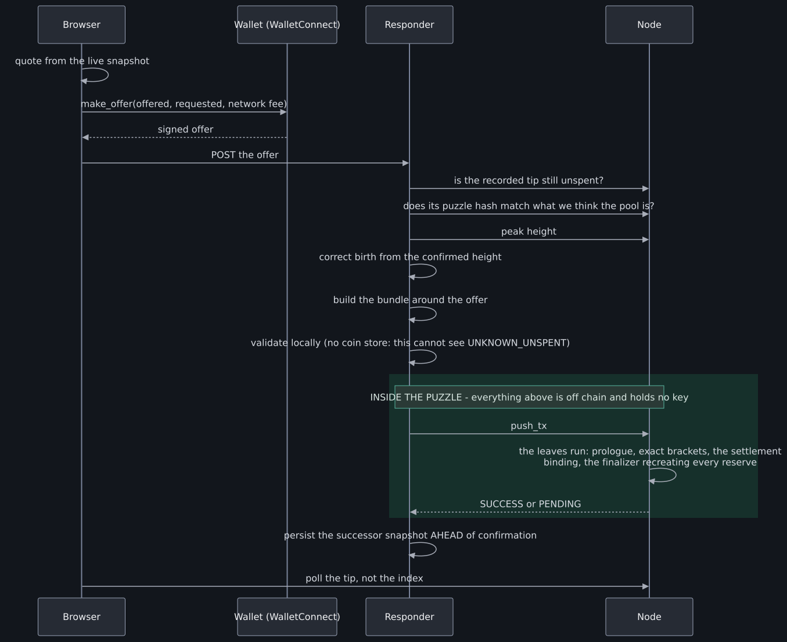

CHIP Number   | 0062
:-------------|:----
Title         | The Forge: Weighted N-Asset AMM
Description   | The Forge: a single-singleton AMM holding any number of assets at fixed weights, on CHIP-0050's action layer.
Author        | [aWizard](https://github.com/awizardxch)
Editor        | [Dan Perry](https://github.com/danieljperry)
Comments-URI  | [CHIPs repo, PR #217](https://github.com/Chia-Network/chips/pull/217)
Status        | Review
Category      | Informational
Sub-Category  | Puzzle
Requires      | [0025](https://github.com/Chia-Network/chips/blob/main/CHIPs/chip-0025.md), [0050](https://github.com/Chia-Network/chips/blob/main/CHIPs/chip-0050.md)
Replaces      | -
Superseded-By | -

## Abstract

This CHIP describes **the Forge**, a weighted constant-function market maker in which one singleton holds any number of assets, each in its own reserve coin, at weights fixed when the pool is created. *The Forge* names both the design set out here and its reference implementation; a pool built to it is a *Forge pool*. The pool is an action-layer inner puzzle (CHIP-0050) whose leaves are `swap`, `add`, `remove`, `collect`, `observe` and a DAO-fee decrease; a finalizer extended to manage N reserves recreates every one of them from the committed state on every spend. Every authorization - a reserve releasing value, an LP CAT minting or melting, a fee rate changing - is a CHIP-0025 message whose receiver coin id the pool *derives* rather than accepts, so consensus binds sender puzzle and receiver coin and no coin an attacker supplies can stand in. Trades are ordinary Offers: a trader signs one, a keyless router settles it against the pool, and the router cannot alter what was signed. The result is a pool primitive that generalises the two-asset AMM to N assets and arbitrary weights without adding a trusted party.

## Motivation

**The problem.** Chia's existing AMM design is one pair per singleton at equal weight. Anything else - a three-asset pool, an 80/20 pool, a stable set - has to be assembled from pairs, which multiplies the coins involved, compounds the fee on every hop, and prices a basket worse than a single curve would. There is no published Chia primitive for a pool that holds N assets at chosen weights.

**Why this benefits the ecosystem.** A weighted N-asset pool is the building block behind index-style baskets, low-slippage sets of correlated assets, and single-pool routing that would otherwise be a multi-hop path. It also removes a class of implementation risk: with one curve and one authorization mechanism, there are fewer hand-written bindings to get wrong than in a chain of pairs.

**Use cases.**

* A basket of CATs traded as one asset, rebalanced by arbitrage rather than by an operator.
* Asymmetric pools (for example 80/20) so a project can seed liquidity without taking equal exposure to the paired asset.
* Routing a trade across one pool rather than several, compounding fewer fees.
* A price oracle per pool, accumulated in the pool's own state, usable by other puzzles without a third-party feed.

**Why this is its own CHIP.** CHIP-0050 anticipates it: the action layer's reference implementation carries several dApps built on it - CATalog, XCHandles, the Reward Distributor - and states that they "will have their own subsequent CHIPs." The Forge is such a dApp. This proposal documents one application of the action layer rather than proposing a change to it.

**Feasibility.** It is implemented and running. A reference implementation is deployed on testnet11 with thirty-two pools of varying shapes. The puzzle is built on CHIP-0050's upstream action layer, unchanged. The pool's finalizer is **not** upstream: it is Forge's own multi-reserve finalizer, which this proposal specifies in full - curried with the reserve hashes, the configuration hash and the leaf module hashes, sending one CHIP-0025 message per reserve on every spend, and asserting that the action layer's merkle root is the root of exactly that configuration. It is the custom code a reviewer should read first. The upstream finalizer is vendored unchanged and serves only the registry singleton. Nothing in this proposal requires a consensus change or a soft fork; it is a puzzle that any wallet can already spend.

## Backwards Compatibility

This proposal introduces no backwards incompatibilities. It describes a puzzle, not a change to Chia's consensus, the CAT standard, or the Offer format. Pools built to this design are ordinary singletons with ordinary CAT reserves, and are traded with ordinary Offers.

Two compatibility notes worth recording:

* **It depends on CHIP-0025 message conditions**, which are consensus and therefore require a node past the relevant soft fork. This is a dependency, not an incompatibility.
* **Revisions of the puzzle are not interchangeable.** A pool's configuration is curried, so a change to the leaf set or the config layout produces a different puzzle hash and, in effect, a different pool. The design carries an explicit protocol version in the LP TAIL's assertions so that an LP token minted under one revision can never be authorized by a pool of another. Two revisions can be live at once: the reference implementation keeps V14 (protocol 15) serving beside V15 (protocol 16), each pool spent by its own revision's leaves, and a trade routed across the two is composed off chain from one pool spend per revision in one bundle; nothing on chain joins them. Migration is by deploying new pools, not by upgrading old ones - which is deliberate, because a pool that can be upgraded is a pool someone can upgrade.

Alternatives considered and rejected are in **Rationale**.

## Rationale

**Why the action layer rather than a monolithic puzzle.** An earlier generation of this design was one large puzzle with a mode selector. Moving to CHIP-0050 reduced the project's hand-written binding checks by roughly a factor of five, because reserves stop being bound by ad-hoc announcements and become the finalizer's responsibility. That matters more than elegance: the great majority of serious bugs found in this project's own history were in hand-rolled bindings between a reserve and the thing authorizing its release, and that category cannot be expressed once the finalizer owns it.

**Why a derived receiver rather than a supplied one.** Every authorization in this design computes the coin id it is talking to from values the pool already holds - a parent, a puzzle hash with a pinned inner, an exact amount - and sends a CHIP-0025 message to *that*. Nothing accepts a coin id as input. This is the difference between "the caller told us which coin to trust" and "only one coin in existence can receive this", and it is the single most important design decision in the proposal. The publicly documented failure of another Chia AMM in 2023 was precisely a binding that could be satisfied by a coin other than the intended one.

**Why fees accrue rather than pay out.** A protocol or DAO fee is taken as a slice of a swap's output and left *inside* the reserve it came from, recorded as owed in state, rather than paid to a second coin in the same spend. This keeps a swap to one output coin, and makes the fee a property of state that can be reconciled, rather than a payment that has to be checked. `collect` pays the accrued balances out in batches.

**Why a DAO fee that can only fall.** The rate lives in state and the recipient is curried config. The leaf that changes the rate asserts the new rate is strictly lower than the current one, so a pool's fee can be reduced by its DAO but never raised on existing liquidity providers. The alternative - a settable rate - gives a pool operator a lever over people who have already deposited.

**Alternatives considered.**

* *A pair-of-pairs construction*, composing existing two-asset pools. Rejected: it compounds fees per hop and multiplies the coins in a trade, and the weights are still fixed at 50/50 within each pair.
* *A single reserve coin holding all assets.* Not possible for CATs, which are distinct coins by construction.
* *An upgradeable pool*, so revisions could migrate. Rejected: an upgrade path is an authorization path, and the set of parties who can take it is the set who can take the pool.
* *Announcement-based binding* rather than messages. Rejected on the evidence: an announcement can be emitted by any coin, so binding by announcement means binding by convention.

**How the design was shaped by discussion.** The largest change this design has undergone came out of conversation in Chia's Discord. An earlier revision was a monolithic pool puzzle with a mode selector, written before CHIP-0050 existed; discussion there is what led to rebuilding it on the action layer. That was not a refinement but a rewrite of the pool's whole structure, and it is the reason the current revision has roughly a fifth of the hand-written binding checks the previous one carried. If this proposal has a single piece of evidence that community review improves it, that is the piece.

Development has also been discussed as it happened in the aWizard Discord, where features were argued over before and after they shipped, and milestones have been posted from the author's account ([@speechlesszi](https://x.com/speechlesszi)) and the project's ([@aWizardxch](https://x.com/aWizardxch)), as well as raised in X Spaces. Those Spaces were not recorded, so they are named here for completeness rather than offered as citable evidence; the X posts are announcements of progress rather than design review, and should be read as such.

**What has been presented, and what has not.** The idea this CHIP describes - a single singleton holding N assets at fixed weights - was raised in Chia's Discord here:

> [The N-asset pool proposal, as first put to the channel](https://discord.com/channels/1034523881404370984/1041838182402117672/1545231197339390022)

That is the vetting CHIP-0001 asks for before submission, and the link is given so a reviewer can read what was actually said rather than take this paragraph's word for it. What has *not* been circulated there is this draft: the specification below is more precise than what was discussed, and the action-layer structure it now rests on came later.

No endorsement by CHIP-0050's author or by CNI is claimed or implied; the design follows CHIP-0050's conventions because they are the right ones, not because it has been blessed. No external security audit has been carried out.

**What will be added here.** Each substantive objection raised against this draft, and how the design answers it - or, where it does not, why. Objections that change nothing should be recorded as readily as those that change something.

## Specification

> The full specification, including coin layout, the config and state
> structures, the prologue, each leaf's solution and conditions, the finalizer
> extension, the registry and the oracle, is provided in the reference material
> listed under **Additional Assets**. What follows is the normative summary; the
> detailed document is the part that allows a competing implementation.



*The whole life of a pool. Everything inside the dashed boundary is a leaf this proposal specifies; the deployment index and the resync beneath it are the reference implementation's own bookkeeping and are out of scope.*

### Coin layout

A Forge pool is:

* one **singleton**, whose inner puzzle is the CHIP-0050 action layer curried with a merkle root over the pool's leaves and the pool's configuration;
* a **finalizer** curried with the configuration's hash and the leaf module hashes, which recomputes the merkle root from them and asserts it against the action layer's on every spend;
* one **reserve coin per asset**, each a `p2_delegated_by_singleton` coin (XCH) or a CAT wrapping one (CATs), controlled solely by that singleton;
* one **LP CAT**, whose TAIL permits issuance and melt only on a message from the pool singleton.



*A leaf never addresses a reserve. It emits a tagged condition; the finalizer routes it, derives the receiver's coin id from committed state, and is the only thing that recreates the singleton. The red edge is the path that does not exist.*

### Configuration and state

**Configuration** is curried and therefore immutable for the life of a pool: asset ids in canonical order, the weight of each, the trade fee in basis points (`fee_bps`), the protocol fee in basis points (`protocol_fee_bps`, denominator 10,000, at most 100), the protocol fee recipient, the LP TAIL hash, the oracle's price scale and window, and the DAO recipient's puzzle hash. The reference implementation uses the same names and the same denominator. Both oracle parameters MUST be bounded, so that a pool cannot be created whose first spend exceeds the block cost limit, or whose inclusion window is unbounded.

**State** is committed by the finalizer into each successor: the reserve balance per asset, total LP outstanding, fees owed per asset, the DAO rate and DAO owed per asset, the oracle accumulator with its last height and the spot prices it last credited, the previous state root, and the parent coin id of each reserve. That last field is written by the finalizer from the reserve coins it has just messaged and is never read from a solution, so no solution can name a coin the pool should treat as a reserve.

**One configuration per pool coin.** The action layer proves that each leaf a spend runs is a member of the merkle root. It does not say that the leaves agree with one another: six leaves curried with six different configurations form a perfectly valid root, and each leaf then validates only its own. A conforming implementation MUST therefore bind the whole leaf set to one configuration at the coin level, by currying the configuration's hash and the leaf module hashes into the finalizer, recomputing the root from them, and asserting it equals the root the action layer carries. Without that binding, a pool whose `remove` leaf names a different LP TAIL than its other leaves will release its reserves against a worthless self-minted asset, and nothing on the coin distinguishes such a pool from a genuine one. The binding cannot prevent an unrelated puzzle from existing, and is not meant to: what it provides is legibility. The leaf module hashes and the configuration hash sit in the finalizer's curry in the clear, so a verifier reads them off the coin and compares them with the published set, and a pool that does not match is no longer impersonating a conforming one. A registry that recomputes the root from a single configuration protects the pools it lists; the binding lets anyone perform the same check on a pool that is not listed.

### The invariant

For reserves `r_i` with weights `w_i`, the pool preserves

```
  Π (r_i ^ w_i)
```

across a swap, net of fees. A swap supplying `x` of asset `i` and claiming `y` of asset `j` is admissible exactly when the claimed output is the unique value satisfying the invariant for the post-trade reserves after the trade fee is deducted from the input. Implementations MUST bracket the claimed output exactly: the puzzle accepts one value and refuses both `y+1` and `y-1`. Deposits and withdrawals use the corresponding invariant forms for minting and burning LP.

### Leaves

| Leaf | Effect |
|---|---|
| `swap` | One reserve rises, one falls. Requires a positive input and a positive claimed output, distinct in-range asset indices, and an exact invariant match. The protocol and DAO slices are taken from the output and accrued in state. It MUST bind the settlement it consumes by **parent and amount**: see Authorization. |
| `add` | Deposits to one or more reserves, minting LP. Requires a positive LP delta, non-negative deposits, and at least one positive deposit. It MUST bind each **positive** deposit's settlement by parent and amount, and MUST skip a zero slot rather than bind it. |
| `remove` | Burns LP and pays a proportional share of every reserve. Requires the burn to be positive and to leave at least the locked minimum outstanding, so the pool outlives every withdrawal. That minimum needs to be exactly **one unit**: it exists so the pool is never spendable-but-empty, and one unit does that. A larger floor strands a proportion of every reserve for no property the puzzle gains. The floor is on total supply, not on any particular holding, so the genesis mint MUST place that minimum beyond recovery and registration MUST verify that it did: see Registry. |
| `collect` | Pays accrued protocol and DAO balances to their recipients. |
| `observe` | Advances the oracle accumulator without moving value. |
| DAO fee | Lowers the DAO rate on a message from the configured recipient. The new rate MUST be strictly lower than the current one. |

One or more leaves may run in a single spend; the action layer threads state from each to the next, and the finalizer commits the last. A spend that runs no leaf is refused: the action layer asserts a non-empty action list, so the pool cannot be re-created without at least one action having been checked.



*A trade from signature to settlement. The router holds no key and takes no custody; everything above the dashed span is off chain, and the span itself is the only part this proposal specifies. A conforming implementation may compose that bundle however it likes.*

The first leaf of a spend runs a prologue that pins the spend to a height: it asserts the claimed height `h` as an absolute height with a window for inclusion, and it asserts the pool coin's own birth height (`ASSERT_MY_BIRTH_HEIGHT`). It MUST also require `birth > last_height` and `h >= birth`. Both hold for every real chain of spends, because a claimed height is checked against the previous transaction block while the coin it creates is born in a later one, and together they make the two intervals below non-negative. They also close the cross-generation case outright: a successor created in the block being made cannot be spent in it, since the largest legal `h` is the previous transaction block's height while the successor's birth is one greater, so `h >= birth` has no solution.

A spend is signed at one height and included at another, and the state it replaces stays in force until the block that includes it. An oracle that credits only `h - birth` therefore loses the blocks between the previous spend's claimed height and its inclusion, and loses them permanently once `last_height` has moved past them. A party spending at `h = birth` every time can hold the accumulator still while real blocks pass, and a pool spent honestly in every transaction block does the same by accident. A conforming implementation MUST credit both intervals: the previous state over `(last_height, birth]` at the spot price that state recorded, and the current state over `[birth, h]` at the spot price on the pre-spend reserves. State therefore carries the last credited spot alongside the accumulator. Every block between two consecutive claimed heights is then credited exactly once, at the price in force during it; understating `h` defers credit to the next spend rather than destroying it; and no height can fabricate credit, because `birth` is a consensus fact and `h` cannot exceed the block that includes the spend.

### Authorization

Every reserve release and every LP mint or melt is a CHIP-0025 `SendMessage` with mode `SENDER_PUZZLE | RECEIVER_COIN`. The receiver's coin id MUST be derived by the pool from values it already holds, and MUST NOT be taken from the solution. A conforming implementation therefore cannot be satisfied by a substituted coin.

The same rule applies to the settlement coin a leaf consumes. A leaf that asserts only the settlement's announcement binds the asset and the coin id the solver wrote into the nonce, and says nothing about how much that coin holds. A leaf that takes value MUST therefore be given the settlement's **parent and amount**, and MUST derive its coin id as `coinid(parent, settlement_puzzle_hash, amount)`. The third input is not a solution field and MUST NOT be one: the settlement puzzle hash is determined by the asset the leaf is crediting - the offer settlement puzzle for a native-XCH input, that puzzle inside the asset's CAT wrapper for a CAT - and the leaf already knows which asset it credits, because the index is its own. The leaf MUST then assert both that announcement and `ASSERT_CONCURRENT_SPEND` on the derived coin, with the named amount at least the input the leaf is crediting. The amount bound is the settlement's own rather than the leaf's input, because a router may carve its fee from the same coin; binding the input exactly would refuse every fee-paying trade.



*The difference the requirement makes. On the left, a one-mojo coin satisfies a leaf crediting 250,000 when another coin supplies the value.*

**What this does not guarantee.** An assertion is not consumed, so two actions in one spend that name the same settlement both pass. What decides such a pair is conservation, and conservation is a property of the **whole bundle** rather than of an action: a bundle with nothing spare in it cannot fund the second action and is refused, while a bundle carrying a network fee can, because the fee is slack. This has been observed on chain. The guarantee a conforming implementation gives is therefore **which coin, and how much it holds** - never "this coin paid for this action". An implementation that composes bundles on behalf of several traders at once MUST account for that itself; the puzzle cannot.

### Registry

Pools register in a sorted on-chain registry keyed by the canonical asset set, the weights, the fee parameters and the DAO recipient, so that one market cannot exist twice under the same parameters. Registration is a singleton spend that proves the key's position in the sort order, requires the genesis supply to exceed the locked minimum, and asserts the launcher's creation announcement with the key-value list `(total_lp, eve_coin_id)`. The LP TAIL's genesis branch asserts that same list with its own coin id, so exactly one eve coin can mint the genesis supply and the supply it mints is the one the registry recorded.

**Registration MUST observe that each reserve exists, and not merely that one was claimed.** This is the sharpest rule in this section, and it is here because an earlier revision of the reference implementation omitted it. A registry that rebuilds the pool's puzzle hash from reserve parents named in the solution, and reads the reserve amounts from that same solution, will admit a pool whose reserves were never funded. Nothing is stolen by this, and that is what makes it easy to miss: the pool simply cannot be spent by anyone, ever, because the finalizer derives every reserve coin id from those parents and the first real interaction fails message pairing. The market's key is then gone permanently for the price of one creation fee, and a dilution defence that relies on depositing into the squatted pool cannot be executed either.

A conforming registry MUST therefore observe something that exists only if the reserve does. The reference implementation does it with a **reserve launcher**: a puzzle whose only behaviour is to create one coin at the puzzle hash it is given, for its whole amount, hinted with the pool's launcher id, and to announce that it did so. The registration bundle spends one per reserve, `register` is handed each reserve's **grandparent**, and it derives

```
P_i = coinid(grandparent_i, launcher_hash_i, reserves[i])
```

where `launcher_hash_i` is the reserve launcher's puzzle hash for a native-XCH reserve, or that hash inside the asset's CAT wrapper for a CAT reserve. It then asserts a coin announcement from `P_i`. A coin id commits to its puzzle hash, so the only coin that can make that announcement is one running the launcher, and the launcher does nothing but create one coin at the hash it was given. The reserve parent stops being a field of the solution and becomes a value the registry derives.

**Deriving `P_i` binds which coin announced; the message is what binds what that coin did**, and both halves are required. A conforming launcher's announcement MUST commit to the puzzle hash it was given, the amount it created it for, and the pool's launcher id. The registry MUST build the expected message from the reserve puzzle hash **it derives from the pool's own configuration**, and MUST NOT take that hash from the solution. Without this half a launcher may create a coin at some other puzzle hash, announce it truthfully, and satisfy an assertion that only checks that *a* coin was created - leaving a pool whose reserves the finalizer will never recognise, which occupies the market key exactly as an unfunded reserve did. The message therefore carries a tree hash over `(created_puzzle_hash, amount, launcher_id)` behind its ASCII tag.

**Three hashes appear in this rule and a CAT reserve keeps them apart.** The launcher runs as the CAT's *inner* puzzle, so the CAT layer wraps the `CREATE_COIN` it emits, and an implementation that treats any two of these as the same value is wrong:

| In the rule | For a native-XCH reserve | For a CAT reserve |
| --- | --- | --- |
| `launcher_hash_i`, the second input to `P_i` | the reserve launcher's puzzle hash | that hash **inside the CAT wrapper** |
| `created_puzzle_hash`, what the launcher is given and announces | the reserve's inner puzzle hash | the reserve's inner puzzle hash, **unwrapped** |
| the coin that appears on chain | that same inner hash | that inner hash **inside the CAT wrapper** |

A conforming registry MUST therefore derive `P_i` from the wrapped launcher hash and build the expected message from the **inner** reserve hash, both from the pool's own configuration. Handing the wrapped hash to the launcher instead creates a doubly wrapped coin: the announcement still matches, the registration is still accepted, and the reserve is one the finalizer will never recognise - the same permanently occupied market key by another route.



*One lineage per reserve, all inside the registration bundle. The registry is given the grandparent and derives the rest, so a reserve that was never funded has no announcement to assert.*

Two notes for implementers. Prefix the announcement's message with an ASCII tag that names the protocol and the revision, so that no other 32-byte hash a coin announces can be mistaken for it. The prefix is a namespace, not a guard: the CAT layer refuses an inner coin announcement only when it is exactly 33 bytes and begins with its ring marker `0xcb` (revision 10 of this text said any message beginning `0xcb`, which was wrong; measured against the CAT2 puzzle, a bare 32-byte hash is never refused whatever its first byte). The one-in-256 failure the reference implementation did suffer was in its off-chain creation lane, which skipped every announcement beginning `0xcb` when collecting the asserts its signed spend adds, and it is fixed there. And the obvious cheaper alternatives do not work, which is worth recording so they are not re-attempted. A *puzzle* announcement binds the puzzle and not the announcing coin, and admits a funded reserve under a wrong parent. A coin announcement from an arbitrary coin binds the coin and not the deed. Spending the genesis eve to prove the reserve cannot be built at all, because a coin created and spent in one block may not carry `ASSERT_MY_BIRTH_HEIGHT`.

The key describes a market, so it carries the parameters that make one: the assets, the weights, the fee rates and the DAO recipient. The remaining configuration values are protocol parameters rather than market parameters, and a registry MUST pin them to its own constants rather than accept a registrant's choice. Chief among them is the protocol fee recipient. Were it free, a registrant could occupy a market's key with a pool that pays the protocol fee to themselves, and two pools differing only in who is paid would collide on one key.

**The creation fee is registry state, not a registry constant.** Revisions through V14 curried the fee into the registry, so changing it meant launching a successor registry and listing the old one's pools from a retired record. V15 holds it in the registry's state alongside the initialized flag and the pool count: `init` seeds it from the launch constant, `register` asserts the fee settlement for whatever the state holds at the time of the spend (zero means a free registration, and then no settlement is asserted), and a `set_fee` leaf is the only thing that moves it, in either direction. Its authorization is the DAO-fee handshake turned to the treasury: a coin whose puzzle hash IS the treasury's sends a CHIP-0025 message with the sender committed by puzzle hash and the receiver by coin id, naming the new fee, and the leaf receives it. Consensus commits the receiver to that registry coin, so the message cannot be replayed against another spend of it, and the treasury proves control of its recipient by spending a coin at it; no signature scheme enters the puzzle. The treasury is typically a vault, which emits the message from its own spend with the receiving registry spend attached in the same bundle. The dev-fee recipient and the puzzle set stay constants: changing those is still a new registry, because every pool carries its recipient curried in.

The genesis mint MUST place the locked minimum beyond recovery, in the same transaction that mints it, and registration MUST verify that it did. One unit suffices, and more is a cost rather than a property: the residue a pool can never release is `minimum / total_lp` of every reserve, so a floor of a thousand units stranded a median 2.21% of each pool's liquidity in the reference implementation's measurements, against about 0.002% at one. The pool itself cannot: the puzzle sees a total supply and a burn, never who holds which unit, so it can only require that the locked minimum remains outstanding. If the minimum were instead retained by the creator, it would be a transferable CAT holding that can never be burned, and its eventual holder would be in exactly the position this rule exists to prevent. The registry can verify it, because the genesis supply passes through a settlement whose payments are announced: `register` asserts the announcement of a payment of the locked minimum to a puzzle hash with no preimage, under the launcher id as nonce. The reference implementation uses Chia's burn address, the puzzle hash `0x000...dead`, which wallets and explorers recognize as a burn. Only the TAIL's genesis branch can create that asset, so the same assertion proves the mint happened rather than merely that it was authorized. The burned units remain a claim on the reserves, and that claim belongs to nobody, which is what makes every later holder's position redeemable in full.

## Test Cases

The reference implementation's suites are listed under **Additional Assets**. They are written to run the compiled puzzles rather than to assert over hashes, and they include both acceptance and refusal cases, on the principle that a puzzle is defined as much by what it declines as by what it does. Among them:

* every leaf accepted on well-formed input, and refused on each malformed one  - including a claimed output one mojo either side of the exact bracket;
* the invariant checked against an independent mirror across thousands of randomised cases;
* chained actions within a single spend - the flash-loan analog - with the actor's closing position valued at pre-sequence prices, never above the start;
* the upstream CHIP-0050 puzzles required to hash byte-for-byte to their pinned values, so a divergence from upstream cannot pass unnoticed;
* **mutation testing**: each assertion in each leaf deleted in turn, the puzzle rebuilt, and the suites re-run, to distinguish assertions that are load-bearing from assertions no probe reaches;
* the coin-id derivations probed with malformed inputs (a 31- or 33-byte parent, an amount with a leading zero, a leading-zero height) against both the previous and the current build, so the text can say where each refusal lives;
* the registry's fee: seeded at init, refused before init, refused without the treasury's message, from a puzzle that is not the treasury, with a message naming another fee, negative, or addressed to another registry coin; a raise accepted and charged by the next registration; zero accepted and a registration with no settlement passing.

A note on reading that last one, because this proposal got it wrong once. A mutation verdict of "survived" means **no probe in the suite reaches the line**. It does not mean the line is redundant, and the two are easy to conflate when the search itself runs through a mirror carrying the same guard as the puzzle - which is how an author can test the guard they are trying to test and read its refusal as the leaf's. A conforming test method SHOULD report such a line as *unreached* and require either a probe that reaches it or a written argument for why none can, rather than allowing it to be recorded as redundant.

## Reference Implementation

The reference implementation is **the Forge**, published at <https://github.com/awizardxch/forge-puzzles>. It contains the pool puzzle and its leaves, the multi-reserve finalizer, the registry, the LP CAT's TAIL, and the suites that exercise all of them. A complete deployment is running on testnet11 with a matrix of pools of varying shapes and weights, and every action a user can take - swap, deposit, withdrawal, multi-hop route and split route - has settled on chain through a wallet-signed Offer handed to the keyless router.

The off-chain half - the keyless router that settles Offers against a pool, the quoting, and the interface at forge.awizard.dev - lives in a separate repository and is outside this proposal's scope.

Per CHIP-0001 the reference implementation need not be complete to enter _Draft_, but must be before _Review_. It is complete; what it has not had is an external audit, and this CHIP should not be advanced to _Review_ on the strength of the implementation alone.

## Security

**This design has not been externally audited.** It is deployed on testnet only and has never held mainnet funds. That is stated first because everything below is the author's own assessment of their own work.

**Design decisions taken for security reasons.**

* *Receivers are derived, never supplied.* The single most important property here. An authorization that accepts a coin id from its solution can be pointed at a coin the attacker controls; one that computes the id from committed values cannot.
* *Reserves are owned by the finalizer.* Each is recreated from committed state on every spend rather than bound by a per-leaf check, which removes the class of bug where one path forgets a binding another path makes.
* *Configuration is immutable and curried.* A pool cannot be reconfigured, so there is no privileged party who can change its terms after liquidity arrives.
* *The DAO rate can only fall.* Depositors cannot have a fee raised on them.
* *Exact brackets, not bounds.* Claimed outputs are matched exactly rather than bounded, which removes rounding as an attack surface.
* *Every coin id by `coinid`, every hashed atom canonical.* V15 derives the last two coin ids that were still built by hashing a concatenation (the LP action coin and the registered launcher) with the `coinid` operator, which refuses a parent that is not 32 bytes and an amount with a redundant leading zero in the leaf itself rather than deriving an id no coin has and failing downstream; and it stores every solution-supplied integer that enters hashed state after arithmetic, so the state's tree hash is canonical by construction and never diverges from a mirror because of how a solution spelled a number. Neither closed an exploit, since consensus already refused both shapes; both move the refusal into the puzzle, where a validator that only runs the puzzle sees it.
* *Existence is proved, not claimed.* Where a puzzle depends on a coin it did not create - a reserve at registration, a settlement at a trade - it derives that coin's id from committed values and observes something only the real coin could produce. Requiring an announcement is the cheap version of this; it is what distinguishes "a reserve was described" from "a reserve was made".

**Threats considered, and how they are addressed.**

| Threat | Addressed by |
|---|---|
| A substituted coin satisfying an authorization | Derived receiver ids; CHIP-0025 mode binds sender puzzle and receiver coin at consensus |
| Value extracted by chaining actions in one spend | The invariant holds per action; suites value the actor's closing position at pre-sequence prices |
| A negative or reversed trade amount, reversing the fee | Sign assertions in the leaf, and an invariant unsatisfiable for such inputs |
| LP minted or melted without the pool's consent | The TAIL requires a message from the pool and a CAT parent; the melt inner's only behaviour is to destroy its whole amount |
| A second genesis eve reusing the launcher's announcement | The announced list names the eve's coin id; the TAIL asserts it with its own |
| A decoy reserve coin substituted for the real one | Reserve parent ids live in state, written by the finalizer; the solution has no field for them |
| A pool registered whose reserves were never funded, taking a market key permanently | Registration derives each reserve's coin id and asserts an announcement only a coin running the reserve launcher can make |
| A settlement worth less than the input a leaf credits | The leaf derives the settlement's id from its parent and amount and asserts `ASSERT_CONCURRENT_SPEND` on it, with the amount at least the input |
| An LP token used against a pool of a different revision | The TAIL asserts the protocol version |
| Two pools claiming the same market | The sorted registry |
| A creation fee frozen for the registry's life, or changed by anyone but the treasury | The fee is registry state, moved only by `set_fee` on a message from a coin at the treasury's own puzzle hash |
| Oracle manipulation within one spend, or across generations in one bundle | The accumulator advances on pre-spend prices over `h - birth`, with the pool coin's birth height asserted by consensus and the height pinned across every action in a bundle |

**Guidance for implementers.** Derive every receiver. Bracket exactly. When assembling a bundle off chain, remember that an unsigned spend is an optional spend: a farmer can drop it or rewrite its solution unless some signed spend in the bundle asserts an announcement only that spend makes, so bind every keyless spend you rely on to the signer's own spend, and test by dropping it. Treat any value taken from the solution as hostile until it has been checked against committed state. And test refusals at least as heavily as acceptances: in this project's experience, and in the publicly documented failures of others, the bug is never in the path that was exercised.

**Known gaps.** No external audit; no bug bounty at the time of writing; the off-chain router and interface are outside this proposal's scope and have their own failure modes, though the router holds no key and cannot alter a signed Offer.

**Revocable CATs are out of scope, and refused by construction.** A reserve and every settlement must hash to exactly the asset's CAT around the puzzle the pool derives, so a coin inside a CHIP-0038 revocation layer is refused whatever its hidden puzzle hash, alone or mixed with a genuine coin; the reference implementation measured this on a simulator and on testnet11 (the 2026-09-24 run under Additional Assets). Supporting the layer safely would need the issuer's hidden puzzle hash fixed in the pool's configuration at creation, an issuer lane for splits, merges and revocations, and a way for a revoked reserve to freeze only itself, which is an asset class, an action and a finalizer change. Following the editor's recommendation at the September 24 discussion, that is left for a follow-up CHIP if demand appears; this proposal keeps its scope.

## Additional Assets

These live alongside the reference implementation, in the public [`forge-puzzles`](https://github.com/awizardxch/forge-puzzles) repository, so that the specification and the code it describes cannot drift apart.

* What V16 changes and why, with the testnet record: the locked minimum burned to Chia's burn address `0x000...dead`, and V15 and V14 kept live beside it - [`FORGE_PUZZLE_V16.md`](https://github.com/awizardxch/forge-puzzles/blob/main/docs/FORGE_PUZZLE_V16.md)
* What V15 changes and why, with the testnet record: the `coinid` derivations, canonical state atoms, the creation fee as registry state and the `set_fee` leaf, and V14 kept live beside it - [`FORGE_PUZZLE_V15.md`](https://github.com/awizardxch/forge-puzzles/blob/main/docs/FORGE_PUZZLE_V15.md)
* Full protocol specification, with what each leaf asserts and which test pins each refusal - [`FORGE_PUZZLE_V14.md`](https://github.com/awizardxch/forge-puzzles/blob/main/docs/FORGE_PUZZLE_V14.md)
* The design decisions, and the five candidate fixes simulated against consensus before one was chosen - [`FORGE_PUZZLE_V14_SPEC.md`](https://github.com/awizardxch/forge-puzzles/blob/main/docs/FORGE_PUZZLE_V14_SPEC.md)
* Architecture as built: coin topology, spend anatomy, authorization, the registry and the off-chain lanes - [`FORGE_V14_ARCHITECTURE.md`](https://github.com/awizardxch/forge-puzzles/blob/main/docs/FORGE_V14_ARCHITECTURE.md)
* The written CLVM pass, leaf by leaf: every assertion, what it closes, and which suite pins it - [`FORGE_V14_CLVM_PASS.md`](https://github.com/awizardxch/forge-puzzles/blob/main/docs/FORGE_V14_CLVM_PASS.md)
* Security notes and scope - [`FORGE_SECURITY.md`](https://github.com/awizardxch/forge-puzzles/blob/main/docs/FORGE_SECURITY.md)
* Comparison against publicly documented AMM failures - [`FORGE_AUDIT_TIBETSWAP.md`](https://github.com/awizardxch/forge-puzzles/blob/main/docs/FORGE_AUDIT_TIBETSWAP.md)
* Reference implementation and test suites - <https://github.com/awizardxch/forge-puzzles> (`contracts/v15` is the revision this text describes; `contracts/v14` remains live and is kept)

The five figures in **Specification** are carried in this repository, at `assets/chip-0062/`, so the proposal reads without a network fetch. Each ships as the Mermaid source beside the rendered SVG, so a figure diffs like text and can be regenerated rather than redrawn; the SVGs are self-contained, referencing no font or script, and carry their own background. The documents above remain in the reference repository so that the specification and the code it describes cannot drift apart; if the Editor would rather they were carried here too, they can be copied alongside the figures.

## Revision History

* **Revision 12 (2026-10-09).** Tracks V16 (protocol 17) of the reference implementation. One change, to where the locked minimum is burned: the genesis settlement pays it to Chia's burn address, the puzzle hash `0x000...dead`, and `register` asserts that payment. Earlier revisions burned it to the all-zero puzzle hash. Both have no preimage, so the rule in Registry is unchanged; the burn address is what wallets and explorers recognize as a burn, and an all-zero hash is also what an unset field looks like. Registry names the address, and Additional Assets gains the document recording the change. V15 and V14 pools remain live beside V16, as Backwards Compatibility describes.

* **Revision 11 (2026-10-07).** Tracks V15 (protocol 16) of the reference implementation, cut after a sixth review. Three changes to the design as described, one correction to the text, one note on coexistence. The registry's creation fee becomes state, moved only by a `set_fee` leaf on a message from a coin at the treasury's puzzle hash (Registry, Security). The last two coin ids still derived by hashing a concatenation are derived with `coinid`, and every solution-supplied integer that enters hashed state is stored canonically (Security). The reserve-announcement note claimed the CAT layer refuses any inner coin announcement beginning `0xcb`; it refuses only a 33-byte one, so the ASCII prefix is a namespace rather than a guard, and the one-in-256 failure was in the off-chain creation lane (Registry). Backwards Compatibility records that two revisions can be live at once, each pool spent by its own leaves, with cross-revision routes composed off chain. The sixth review's substantive findings were against the off-chain composer, not the puzzles, and are recorded in the reference implementation; the one lesson that generalizes is in Guidance: an unsigned spend in a bundle is optional unless a signed spend asserts something only it announces. Test Cases and Additional Assets gain the corresponding suites and document. Security records the decision taken from the September 24 discussion: revocable CATs stay out of scope and refused by construction, with support left to a follow-up CHIP.

* **Revision 10 (2026-09-17).** A third finding from the same automated review, again against the text and again correct. The reserve rule spoke of "the puzzle hash it created" and of "the reserve puzzle hash the registry derives" as though they were one value. For a CAT reserve they differ by exactly one wrap: the launcher runs as the CAT's inner puzzle, so the hash it is given and announces is the reserve's **inner** hash, while the coin that appears on chain is that hash inside the CAT wrapper, and `launcher_hash_i` - the second input to `P_i` - is the *launcher's* hash inside that same wrapper. An implementation that handed the wrapped hash to the launcher would create a doubly wrapped coin whose announcement still matched, register successfully, and leave a reserve the finalizer will never recognise: the permanently occupied market key that revision 8 exists to prevent, reached by another route. Registry now tabulates all three hashes for both reserve kinds, and the Registry figure names each one. The reference implementation already keeps them apart - `reserve_launcher_full_hash` wraps the launcher, `reserve_inner_hashes` does not wrap the reserve - and is unchanged.

* **Revision 9 (2026-09-16).** Two corrections from an automated review of revision 8, both to the text rather than the design; the reference implementation is unchanged by either, and each construction below is what it already does.

  The settlement rule said a leaf derives its coin id from the settlement's parent and amount. A coin id is `coinid(parent, puzzle_hash, amount)`, so as written the rule was not implementable: it omitted the third input and left an implementer to guess where it comes from. It comes from the asset the leaf is crediting, and it is precisely not a solution field, which is the point of the rule. Specification says so.

  The reserve rule said registration asserts a coin announcement from the derived `P_i`, and left the announcement's *message* unspecified. Deriving `P_i` binds which coin announced, but a message that does not commit to what the launcher created lets a launcher fund a coin at some other puzzle hash, announce it truthfully, and satisfy the assertion - taking the market key exactly as an unfunded reserve did. The message MUST commit to the created puzzle hash, the amount and the launcher id, and the registry MUST build the expected message from the reserve hash it derives from the pool's configuration. The figure under Registry is updated to show the message's payload rather than eliding it.

* **Revision 8 (2026-09-16).** In response to the fourth independent review of the reference implementation. One change is normative and it is the most serious finding this proposal has had: **registration must observe that each reserve exists.** The previous text had registration prove the launcher's authorization of a configuration without proving that the coins the configuration describes were ever made, so a registration naming parents that created nothing was admissible - and the pool it created could never be spent by anyone, taking the market's key permanently for one creation fee. Specification now requires the registry to derive each reserve's coin id and observe an announcement only the real coin can make, with the reference implementation's reserve launcher given as the construction, the ASCII-prefix requirement that keeps it clear of the CAT ring marker, and the three cheaper alternatives that consensus refuses.

  Two further requirements are stated that the text had left to the implementation. A leaf that takes value must bind its settlement by **parent and amount** and assert the derived coin, rather than asserting an announcement that says nothing about how much the coin holds; and the section says plainly what that does *not* guarantee, since an assertion is not consumed and conservation is a property of the whole bundle. And the locked minimum is **one unit**: it exists so a pool is never spendable-but-empty, and a larger floor only strands liquidity, measured at a median 2.21% per pool against about 0.002%.

  Test Cases gains the rule that a mutation verdict of "survived" means *unreached*, never *redundant* - the method error behind revision 7's correction, now written down as guidance rather than as an apology. Specification gains five figures, in `assets/chip-0062/`, each with its Mermaid source beside it: the pool lifecycle, one pool spend, a trade end to end, the settlement binding against the shape it replaces, and the reserve proof at registration. The lifecycle and the trade carry a dashed boundary marking where this proposal's normative surface stops, because a reader of a CHIP needs to know which half of a diagram is being specified and which half is one implementation's choice. The reference implementation has moved to V14 (protocol 15); V13's testnet liquidity was withdrawn and its sources removed from the public repository, as V12's and V11's were, and the Additional Assets list names the V14 documents.

* **Revision 7 (2026-09-15).** Two corrections, no design change. The Feasibility section said the puzzle uses CHIP-0050's upstream action layer and finalizer with no changes to either; the action layer is upstream and unchanged, but the pool's finalizer is this proposal's own multi-reserve finalizer, and the text now says so, because it is the custom code a reviewer must read and it is where the cross-leaf binding of revision 5 lives. And the author's reply to the fourth review stated that the `add` leaf's non-negative-deposit assertion was redundant; it is load-bearing, as that review demonstrated and the author has reproduced, so the reference implementation's regression suite now pins it. The reference implementation itself is unchanged by either.
* **Revision 6 (2026-09-15).** Housekeeping, no design change. The Additional Assets list named the previous revision's specification, which was withdrawn from the reference repository when this revision replaced it, so the link resolved to nothing; it now names the current one. The architecture description and the written CLVM pass have been brought to this revision and are listed alongside it, restoring the three-document set the list carried before those two were withdrawn with the revision they described.
* **Revision 5 (2026-09-14).** In response to a second independent review of the reference implementation, which tested configuration and registry admission rather than the single well-formed pool the first review exercised. Three changes are normative. An implementation must bind its whole leaf set to one configuration at the coin level, because the action layer proves a leaf's membership of the root and not the leaves' agreement with each other, and a pool assembled from leaves of differing configurations releases its reserves against an asset of the attacker's choosing. The oracle must credit the interval between a spend's claimed height and its inclusion, at the price in force during it, rather than discarding it; the previous text's claim that a claimed height can understate the interval by at most the window was wrong in the case where it understates it to nothing. And registration must verify the genesis burn rather than only require it in prose, which it can do because the genesis supply passes through a settlement whose payments are announced. Alongside those: the genesis supply must exceed the locked minimum rather than merely reach it, the protocol fee recipient and the oracle parameters are pinned by the registry rather than chosen by the registrant, and both oracle parameters are bounded.
* **Revision 4 (2026-09-14).** Two corrections from an automated review of revision 3, both to the text rather than the design. The oracle paragraph described `h - birth` without stating the `h >= birth` assertion that keeps it non-negative, and said a same-block successor accumulates nothing; it cannot be spent at all, because `ASSERT_HEIGHT_ABSOLUTE` is checked against the previous transaction block while such a coin's birth is one higher. Both are now stated. Separately, `remove`'s row claimed the locked minimum is the creator's and that every later holder can redeem in full; the floor is on total supply, so that only holds if the minimum is put beyond recovery at genesis, which is now normative and explained in Specification.
* **Revision 3 (2026-09-13).** Housekeeping against the review, no design change. The Additional Assets list pointed at three documents that the reference repository no longer carries: the retired revision's specification, architecture and CLVM pass were withdrawn from it when the shipping revision replaced them, so the list now names the one specification that exists. Comments-URI named the wrong pull request. The deployment is thirty-three pools rather than twenty, and every action a user can take has now settled on chain through a wallet-signed Offer handed to the keyless router, which was not yet true when revision 2 was written.
* **Revision 2 (2026-09-11).** In response to the Draft review by CNI (four P1 findings and one P0, two of them reproduced with accepted spend bundles against the reference implementation's previous revision): the genesis announcement now names the eve coin; oracle elapsed time is measured from the pool coin's asserted birth height; a minimum liquidity is locked at genesis and enforced at registration and in `remove`; reserve parent ids moved from the finalizer's solution into state. The protocol fee's unit is corrected to basis points, and the non-empty action list is stated. The reference implementation's previous revision was never deployed to mainnet; its testnet liquidity was withdrawn and the pools re-created under the revised puzzles.
* **Revision 1 (2026-09-11).** Editor's formatting, fee-unit correction, non-empty action sentence.
* **Revision 0 (2026-09-10).** Submitted.

## Copyright

Copyright and related rights waived via [CC0](https://creativecommons.org/publicdomain/zero/1.0/).
