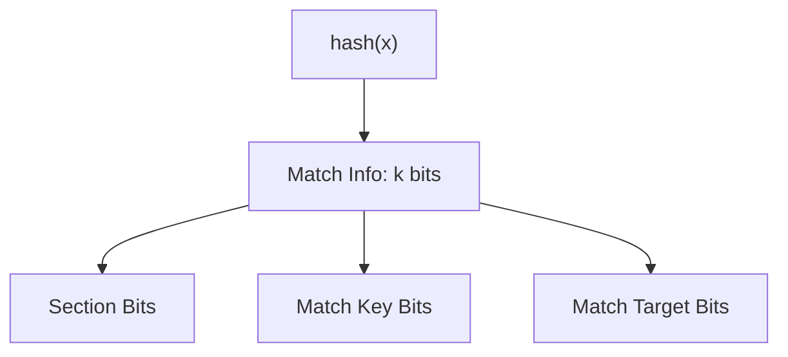
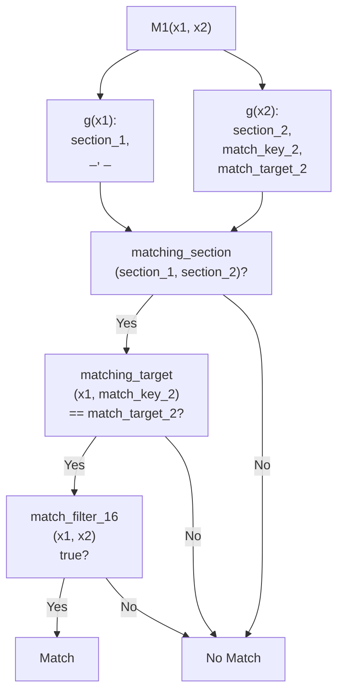
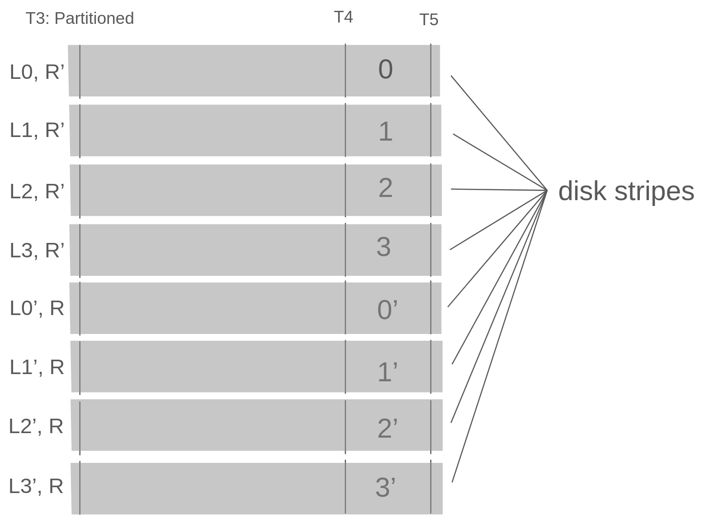
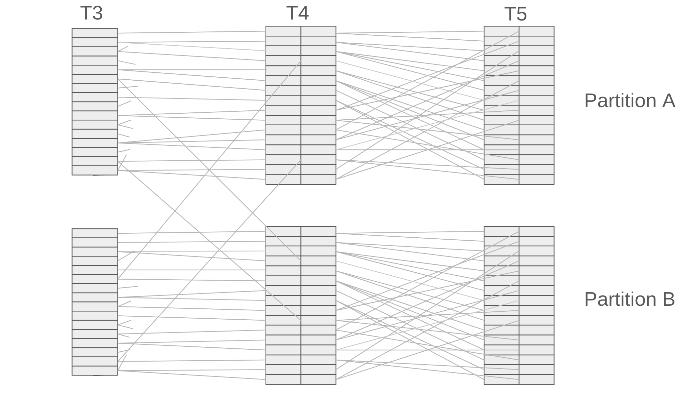
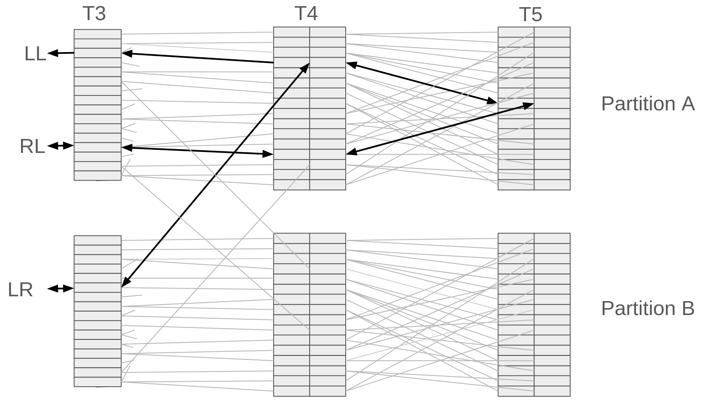
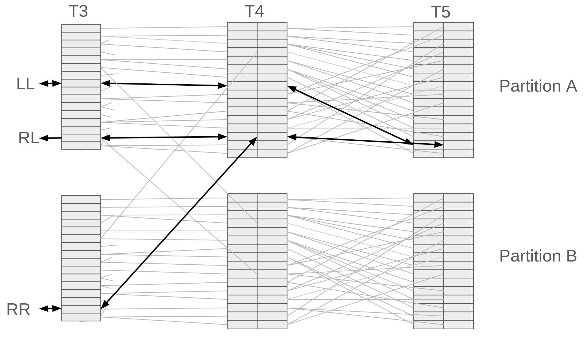
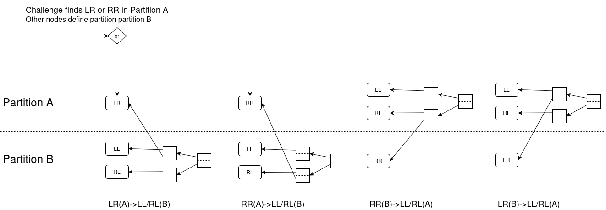
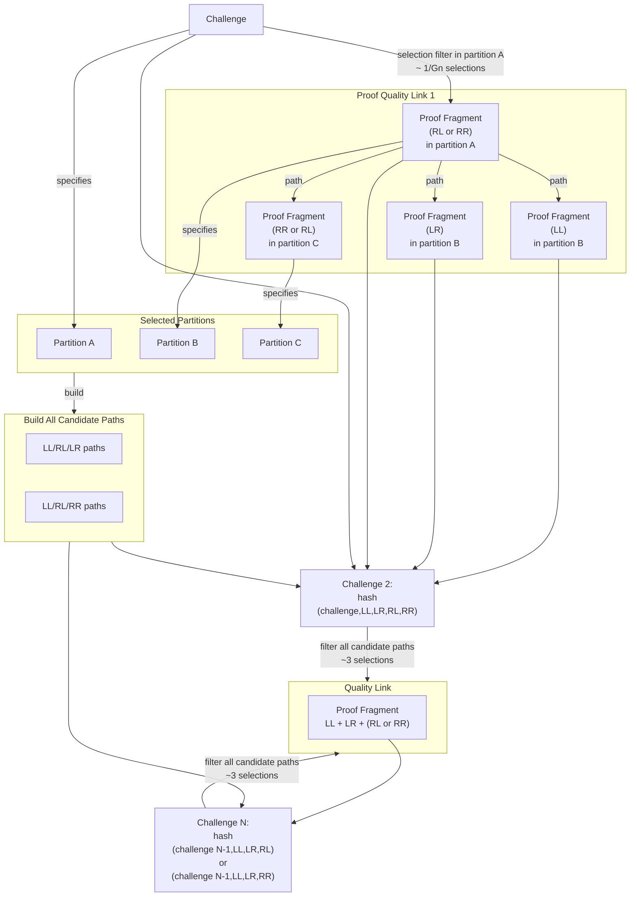

>[!NOTE]
>This section is still a work in progress, pending the Prover reference implementation that will clarify the Chaining specification sections.

# Table of Contents

- [Table of Contents](#table-of-contents)
- [Definitions](#definitions)
- [Proof Format](#proof-format)
- [New Matching Algorithm](#new-matching-algorithm)
  - [Matching Bits](#matching-bits)
  - [match\_info](#match_info)
  - [sub\_k and partition bits](#sub_k-and-partition-bits)
  - [g function](#g-function)
  - [matching\_target hash](#matching_target-hash)
- [matching section](#matching-section)
  - [M1(x1,x2)](#m1x1x2)
    - [Matching algorithm diagram](#matching-algorithm-diagram)
  - [M2(x1,x2,x3,x4)](#m2x1x2x3x4)
  - [M3 (x1,x2,...x8)](#m3-x1x2x8)
    - [Proof Fragments specify partitions](#proof-fragments-specify-partitions)
  - [M4 (x1...x16)](#m4-x1x16)
  - [M5 (x1...x32)](#m5-x1x32)
  - [Collation functions](#collation-functions)
  - [get partition bits](#get-partition-bits)
- [Proof Fragments and Feistel Cipher](#proof-fragments-and-feistel-cipher)
- [Compressing Tables](#compressing-tables)
  - [Benes Compression](#benes-compression)
  - [Optimizing Fanouts](#optimizing-fanouts)
- [Chaining Specification](#chaining-specification)
    - [T4 Input Filtering](#t4-input-filtering)
  - [Paths between Partitions](#paths-between-partitions)
  - [Challenge to Chains](#challenge-to-chains)


# Definitions

x || y denotes zero-padded concatenation: for the implied domain y [2^z] it is (x << z) + y
<<, >> bitwise left shift and right shift operators

# Proof Format

For a given 32-byte plot id, and a space parameter k where k is in (28,30,32), a sub-k parameter in (20,21,22) and a 32-byte challenge chosen by a verifier, a proof of space is a chain of 16 proofs of 32 x-values each for a total of 512 k bits where:

    Proof 1 = x1, x2, ... x32 (with x in [0..<2^k])
    Proof 2 = x33, x34, ... x64
    ...
    Proof 16 = x480, x481, ... x512

**Initialization**  
 \(c_0\) = 32-bit challenge provided by the verifier.

**Chain Growth**  
For \(i = 1,2,\dots,16\):

\[
        \{x_{32(i-1)+1},\,x_{32(i-1)+2},\,\dots,\,x_{32i}\}
        =
        \begin{cases}
          x_1,\dots,x_{32}, & i=1,\\
          x_{33},\dots,x_{64}, & i=2,\\
          \vdots\\
          x_{481},\dots,x_{512}, & i=16.
        \end{cases}
      \]
\[
        c_i \;=\; \mathrm{ChainLink}\bigl(c_{i-1},\,x_{32(i-1)+1},\dots,x_{32i}\bigr),
      \] 

which internally runs the cascade of \(M_5\to M_4\to M_3\to M_2\to M_1\), Feistel, and collation functions \(C_1\)–\(C_5\).

**Threshold Check**  
      \[
        \text{if } c_i \;\ge\; T_i 
        \quad\text{then the proof fails,}
      \]
      where  
      \[
        T_1 = \text{first\_threshold},
        \quad
        T_{2\ldots16} = \text{next\_threshold}.
      \]

**Validation**  
   The proof is **valid** if and only if
   \[
     c_i < T_i
     \quad\text{for all }i=1,\dots,16.
   \]


<!--
# Proof Format


A Proof Fragment is 2k bits derived from 8 x-values in one of four child nodes (LL,LR,RL,or RR) of a 32 x-values proof (x1,x2,...x32), bit-dropped and encrypted with the FeistelCipher as follows:

    Proof Fragment LL = FeistelCipher(x1 >> (k / 2), x3 >> (k / 2), x5 >> (k / 2), x7 >> (k / 2))
    Proof Fragment LR = FeistelCipher(x9 >> (k / 2), x11 >> (k / 2), x13 >> (k / 2), x15 >> (k / 2))
    Proof Fragment RL = FeistelCipher(x17 >> (k / 2), x19 >> (k / 2), x21 >> (k / 2), x23 >> (k / 2))
    Proof Fragment RR = FeistelCipher(x25 >> (k / 2), x27 >> (k / 2), x29 >> (k / 2), x31 >> (k / 2))

The Proof Fragment encodes partitions as follows:

    Proof Fragment (2k bits) : [ (k - sub_k) bits as Partition L ][ 1 top order bit ][ ... ][ last (k - sub_k) bits as Partition R ]

A Quality Link comprises three Proof Fragments, either:

    Quality Link LR that includes Proof Fragment LL, RL, and LR
    Quality Link RR that includes Proof Fragment LL, RL, and RR

A proof of space is valid when:

    M5(x1,x2,...,x32)
    and
    M5(x33, x34,...,x64)
    and
    ...
    and
    M5(x480, x481,..., x512)

and

    ChainLink1(challenge, x1,x2,...,x32)
    and
    ChainLink2(ChainLink1 result, x33, x34, .. x64)
    and
    ChainLink3(ChainLink2 result, x65, x66, .. x96)
    ...
    and
    ChainFilter16(ChainLink 15 result, x480, x481, ... x512)

## ChainLink


Each proof creates Proof Fragments of 2k bits each where

    ProofFragment_LL = cipher(x1 >> k/2  ||  x3 >> k/2 ||  x5 >> k/2 ||  x7 >> k/2)
    ProofFragment_LR = cipher(x9 >> k/2  || x11 >> k/2 || x13 >> k/2 || x15 >> k/2)
    ProofFragment_RL = cipher(x17 >> k/2 || x19 >> k/2 || x21 >> k/2 || x23 >> k/2)
    ProofFragment_RR = cipher(x25 >> k/2 || x27 >> k/2 || x29 >> k/2 || x31 >> k/2)

Using ProofFragments we form a chain of proofs where

    (todo: needs proper chaining sequence)
    ProofFragment_1_LL = chain(EncryptedXs_proof1_LR, EncryptedXs_proof1_LL)
    EncryptedXs_proof3_LL = chain(EncryptedXs_proof2_LR, EncryptedXs_proof2_LR, EncryptedXs_proof1_LR, EncryptedXs_proof1_LL)
    ...
    EncryptedXs_proof8_LL = chain(EncryptedXs_proof1_LR....)


This chain of proofs using ProofFragments also forms the quality string.

The full proof is the aggregate of all x's from proofs that are part of the chain of proofs.

-->

# New Matching Algorithm

The matching algorithm for all tables has changed, and now forms the basis of security. It is a memory hard algorithm which can be tuned to take more or less time by adjusting the number of match indexes to test for whether two entries match.

The benefit of this algorithm is that we can set the difficulty very high so that plotting will take longer and compression attacks will be more expensive, yet it incurs negligible cost when validating a proof. Since validation is “free”, we can tune this to be as difficult as we need, without adding extra compute expense to the network.

## Matching Bits

The matching algorithm takes an additional index number which is used to show that a match works. The left value and the index results in a bucket. This must match a bucket which the right value hashes to, and the matching combination of them have to pass an additional filter. Index bits will be included in proofs to make verification fast. To keep required memory down, entries are sorted into sections. All of the buckets to which a left value hashes will land in the same section.

## match_info

Matching functions operate over section bits that define particular sections, match_key bits that define how many iterations are used to find matches, and match_target bits that define collisions for matching.

    match_info comprises k bits that define [section | match_key | match_target ]



The number of bits used in match info for each table is:

    t1,t2,t3       : num section bits = (k-26)
    t4,t5          : num section bits = 2
    t1             : num match key bits = 4
    t2,t3,t4,t5    : num match key bits = 2
    t1,t2,t3,t4,t5 : match target bits are remaining k - num_section_bits - num_match_key_bits

Note that section bits and match key bits can be tuned and may be subject to change.

## sub_k and partition bits

T4 and T5 are partitioned tables, where each partition holds a unique range 2^sub_k in 2^k, and there are 2^partition_bits total partitions, where partition_bits = k - sub_k

    The value for sub_k depends on k size. For:
        k = 28 : sub_k is 16, partition bits is 12
        k = 30 : sub_k is 17, partition bits is 13
        k = 32 : sub_k is 18, partition bits is 14

## g function

The g function is used on the initial x-values range [0..2^k] and starts tehe generation of tables.

    g(x) = chacha(plot_id || x) -> match_info k bit result


## matching_target hash

The matching target forms the basis of randomly pairing a left side entry with right side entry's `matchInfo` bits. It takes a left side meta data (meta_l) and a right side entries key, and checks if their hash matches the right side target bits from `matchInfo`

    matching_target(meta_l, key_r) = match_target_bits of blake3(plot_id, meta_l, key_r)

# matching section

A match must occur between two different sections, with the "left" side match being in the lower half of the sections, and the "right" side match being in a corresponding section in the upper half of the sections.

```python
def matching_section(self, table_id, section):
        num_section_bits = self.params.get_num_section_bits(table_id)
        num_sections = self.params.get_num_sections(table_id)
        rotated_left = (section << 1) | (section >> (num_section_bits - 1))
        rotated_left_plus_1 = (rotated_left + 1) & (num_sections - 1)
        section = (rotated_left_plus_1 >> 1) | (rotated_left_plus_1 << (num_section_bits - 1))
        return section & (num_sections - 1)
    
    # a section will always match 2 other sections from the other opposite lower/higher range, use this to find the other from a given section.
    def inverse_matching_section(self, table_id, section):
        num_section_bits = self.params.get_num_section_bits(table_id)
        num_sections = self.params.get_num_sections(table_id)
        # Invert the right rotation by rotating left by 1.
        rotated_left = ((section << 1) | (section >> (num_section_bits - 1))) & (num_sections - 1)
    
        # Invert the addition (subtract 1 modulo num_sections).
        rotated_left_minus_1 = (rotated_left - 1) & (num_sections - 1)
    
        # Invert the left rotation by rotating right by 1.
        section_l = ((rotated_left_minus_1 >> 1) | (rotated_left_minus_1 << (num_section_bits - 1))) & (num_sections - 1)
    
        return section_l
    
    def get_matching_sections(self, table_id, section):
        return self.matching_section(table_id, section), self.inverse_matching_section(table_id, section)
```

## M1(x1,x2)

x1 and x2 match iff:

    section_1,           _,              _ = g(x1)
    section_2, match_key_2, match_target_2 = g(x2)

    where:

        matching_section(section_1, section_2) must be true

    and

        matching_target(x1, match_key_2) == match_target_2

    and

        match_filter_16(x1 & 15, x2 & 15) is true


### Matching algorithm diagram



    
## M2(x1,x2,x3,x4)

x1,x2,x3,x4 match iff:

    M1(x1,x2) and M1(x3,x4)

    match_info_l, meta_l = C1(x1,x2)
    match_info_r, meta_r = C1(x3,x4)

    section_L,           _,              _ = match_info_l where match_key_bits is 2
    section_R, match_key_R, match_target_R = match_info_r where match_key_bits is 2

    where:

        matching_section(section_L, section_R) must be true

    and

        matching_target(meta_l, match_key_R) == match_target_R

    and

        match_filter_4(meta_l & 15, meta_r & 15) is true

## M3 (x1,x2,...x8)

x1,x2,x3,x4,x5,x6,x7,x8 match iff:

    M2(x1,x2,x3,x4) and M2(x5,x6,x7,x8)

    match_info_l, meta_l = C2(C1(x1,x2), C1(x3,x4))
    match_info_r, meta_r = C2(C1(x5,x6), C1(x7,x8))

    section_L,           _,              _ = match_info_l where match_key_bits is 2
    section_R, match_key_R, match_target_R = match_info_r where match_key_bits is 2

    where:

        matching_section(section_L, section_R) must be true

    and

        matching_target(meta_l, match_key_R) == match_target_R

    and

        match_filter_4(meta_l & 15, meta_r & 15) is true

### Proof Fragments specify partitions

- Proof Fragment is 2k bits
- partition_bits = (k-sub_k) bits
- first partition_bits of an encryptedXs specify the lateral partition
- next 2 bits specify order bits
- lower partition_bits specify cross-over partition (R)
- if the top order bit is 0:
    - lateral goes into upper partition, cross-over goes into lower partition
    otherwise
    - lateral goes into lower partition, cross-over goes into upper partition


| **Segment**                 | **Bit Length**                   | **Description**                                                  | **Placement Based on Top Order Bit**                   |
|-----------------------------|----------------------------------|------------------------------------------------------------------|--------------------------------------------------------|
| **Lateral Partition (L)**       | \( \text{partition\_bits} = k - \text{sub\_k} \) bits | The first \( \text{partition\_bits} \) of the encryptedXs specify the lateral partition. | If top order bit = 0: goes to **Upper Partition**; if top order bit = 1: goes to **Lower Partition**. |
| **Order Bits**              | 2 bits                           | The next 2 bits that determine the ordering.                     | Top order bit determines the placement of lateral and cross-over partitions. |
| **Cross-over Partition (R)**| \( \text{partition\_bits} = k - \text{sub\_k} \) bits | The lower \( \text{partition\_bits} \) of the encryptedXs specify the cross-over partition (R). | If top order bit = 0: goes to **Lower Partition**; if top order bit = 1: goes to **Upper Partition**. |


## M4 (x1...x16)

x1,x2,x3,x4,x5,x6,x7,x8,...x16 match iff:


    # this is commented out as it was an earlier matching function (may revert)

    M3(x1...x8) and M3(x9...x16)

    proof_fragment_l = encrypt(x1 >> k/2 ||  x3 >> k/2 ||  x5 >> k/2 ||  x7 >> k/2)
    proof_fragment_r = encrypt(x9 >> k/2 || x11 >> k/2 || x13 >> k/2 || x15 >> k/2)

    num_partition_bits = 
        if k = 28: 8
        if k = 30: 9
        if k = 32: 10

    top_order_bit_l = proof_fragment_l >> (k - num_partition_bits - 1) & 1
    top_order_bit_r = proof_fragment_r >> (k - num_partition_bits - 1) & 1

    partition_l = get_l_partition_bits(proof_fragment_l)
    partition_r = get_r_partition_bits(proof_fragment_r)
    
    match_info_l, meta_l = C3(top_order_bit_l, C2(C1(x1,x2), C1(x3,x4)), C2(C1(x5,x6), C1(x7,x8)))
    match_info_r, meta_r = C3(top_order_bit_r, C2(C1(x9,x10), C1(x11,x12)), C2(C1(x13,x14), C1(x15,x16)))

    section_L,           _,              _ = match_info_l where match_key_bits is 2
    section_R, match_key_R, match_target_R = match_info_r where match_key_bits is 2

    where:
        (note top_order_bit_l/r are redundant tests)
        top_order_bit_l == 0
        top_order_bit_r == 1
        partition_l == partition_r

    and

        matching_section(section_L, section_R) must be true

    and

        matching_target(meta_l, match_key_R) == match_target_R

    and

        match_filter_4(meta_l & 15, meta_r & 15) is true


## M5 (x1...x32)

x1,x2,x3,x4,x5,x6,x7,x8,...x32 match iff:

    M4(x1...x16) and M3(x17...x32)

    proof_fragment_ll = encrypt(x1 >> k/2  ||  x3 >> k/2  ||  x5 >> k/2  ||  x7 >> k/2)
    proof_fragment_rl = encrypt(x16 >> k/2 ||  x17 >> k/2 ||  x18 >> k/2 ||  x19 >> k/2)
    
    num_partition_bits = 
        if k = 28: 12
        if k = 30: 13
        if k = 32: 14

    second_order_bit_ll = proof_fragment_ll >> (k - num_partition_bits - 2) & 1
    second_order_bit_rl = proof_fragment_rl >> (k - num_partition_bits - 2) & 1
    
    match_info_l, meta_l =  C4(second_order_bit_ll, 
                                C3(0, C2(C1(x1,x2), C1(x3,x4)), C2(C1(x5,x6), C1(x7,x8))), 
                                C3(1, C2(C1(x9,x10), C1(x11,x12)), C2(C1(x13,x14), C1(x15,x16))
                            )
    match_info_r, meta_r =  C4(second_order_bit_rl, 
                                C3(0, C2(C1(x17,x18), C1(x19,x20)), C2(C1(x21,x22), C1(x23,x24))), 
                                C3(1, C2(C1(x25,x26), C1(x27,x28)), C2(C1(x29,x30), C1(x31,x32))
                            )

    section_L,           _,              _ = match_info_l where match_key_bits is 2
    section_R, match_key_R, match_target_R = match_info_r where match_key_bits is 2

    where:
        (note: these are redundant tests)
        second_order_bit_ll == 0
        second_order_bit_rl == 1

    and

        matching_section(section_L, section_R) must be true

    and

        matching_target(meta_l, match_key_R) == match_target_R

    and

        C5(meta_l, meta_r) < 855570511
       
Note that since T5 is the final table, the collation function C5 returns 32 filter bits.  The chance of passing is 0.1992030328 or 855570511 out of 2^32. This will result in T3, T4, and T5 number of entries in the table be approximately the same after pruning.

## Collation functions

    C1(x1,x2) = blake(x1 || x2) -> k bits   as match info
                (x1 || x2) 2k bits          as meta

    C2(l,r)   = blake3(l || r) -> k bits match_info, 2k bits meta

    C3(order_bit, l,r)   = blake3(l || r) -> 
        order_bit || (sub_k - 1) bits   as match_info
        2k bits                     as meta
    
    C4(order_bit, l, r) = blake3(l || r) ->
        order_bit || (sub_k - 1) bits     as match_info
        2k bits                           as meta

    C5(l, r) = blake3(l || r) -> 32 bit filter value


## get partition bits

A Proof Fragment defines which partition of T4 and T5 they move into.

    num_partition_bits = k - sub_k

    Proof Fragment 2k bits: num_partition_bits partition_L || 2 order bits || (k - 2 - num_partition_bits * 2) bits || num_partition_bits partition_R


# Proof Fragments and Feistel Cipher

Create ciphertext from 2k bits from k/2 bits of each odd number x (4 in total).  It is encrypted with plot id bytes and can be decrypted with same plot id bytes. Refer to the reference implementation.


# Compressing Tables

## Benes Compression

Will be added later.

## Optimizing Fanouts

Benes will include two fanouts that represent the L and R side pointers from T4 back to T3.  Either side could include a fanout of 0, meaning the entry was not used for that side (pruned) but was kept for the other side pointer. Note that both sides cannot have a fanout of 0, as otherwise that entry would have been pruned and removed from the plot. We use this to compress additional bits as follows:

| L fanout | R fanout | notes | encoding L fanout | encoding R fanout | decompression notes |
|----------|----------|-------|-------------------|-------------------|---------------------|
| 0        | 0        | No occurences due to pruning | | | |
| 1..n        | 0..n        | L has fanout of 1 or more, R is zero or more, no change to encoding | as is | as is | if L fanout > 0, use values as is |
| 0 | 1..n | L has fanout of 0, R must be 1 or more. Use -1 in R encoding | 0 | (n-1) | if L is 0, R is value + 1 |


# Chaining Specification

>[!NOTE]
>This section is still a work in progress, pending the Prover reference implementation.


In the following section we describe how to chain Quality Links to form the Quality Chain. A Quality Link is comprised of four Proof Fragments in order, denoted as: `LL`, `LR`, `RL`, `RR`. Consider these as the leaves of a proof tree.

### T4 Input Filtering

Note that during construction, since each T3 entry is used by both partition and partition', we use 2^(sub_k+1) inputs into each partition of T4 and a matching function to reduce matches by 50%, to produce 2^sub_k outputs.

This is done to increase the number of unique entries from T3 that are matched in a T4 partition, and significantly helps against T4 Partition attacks. Without this measure an attacker could group fewer inputs targetted to recompute the two partitions used on the chaining process and potentially drop T4 and T5 entirely.  The list of Proof Fragments that receive R pointers used for the initial challenge lookup benefits from being sorted, so an attacker would also have to use more of these entries to do a lookup and add data to their attack. See section in security for a deeper analysis.


## Paths between Partitions



*Figure: partitions organized into logical stripes on disk.*

We are able to organize partitions as shown in the Figure above, such that all pointers in T5, and all lateral (L) pointers from T4 through to T3 are contained in the same logical disk sector. The R pointers from T4 bridge to other disk stripes. Following this representation, we can now look at how data flows across two partitions that will be used in chaining.

{ width=600 }
*Figure: Back pointer connections between any two partitions A and B. Each box in T3 represents an Proof Fragment. The left boxes in T4 and T5 are L back pointers, and right boxes are R pointers respectively.  Note that all L pointers from T4 to T3 point back to the same partition in T3. All R pointers from T4 to T3 will point from a lower partition to any of the upper partitions, or from an upper partition to any of the lower partitions.  The amount of R pointers from T4 partition A to partition B will be about ~2^sub_k / 2^(k - sub_k)*



*Figure: LR/RL paths. Contains Proof Fragments LL, RL, and LR. The RR Proof Fragment will be in another partition. Approximately 2^sub_k / 2^(k-sub_k) paths.*


*Figure: LL/RR paths. Contains Proof Fragments LL, RL, and RR. The LR Proof Fragment will be in another partition. Approximately 2^sub_k / 2^(k-sub_k) paths.*

Note that all the above paths pass through the parent node. This is critical since an attacker could drop bits on back pointers in the parent node, so we pass through include all points where bit dropping could occur.

Currently we expect the following k and sub_k sizes, subject to further security analysis.

| k size | sub_k size | # partitions | Expected #possible paths<br>2^sub_k / 2^(k-sub_k)|
|--------|------------|--------------|--------------------------------------------------|
| 28 | 20 | 256 * 2 | 4096 * 2 |
| 30 | 21 | 512 * 2 | 4096 * 2 |
| 32 | 22 | 1024 * 2| 4096 * 2 |


## Challenge to Chains

{width=400}
*Figure: In this example (1) a challenge finds a passing Proof Fragment in partition 1. In (2) the Proof Fragment specifies an R' partition, in this case partition 2', and we find the pointer in T4 that points back to our selected Proof Fragment. In (3) we find the T5 parent node so that in (4) we traverse down to find the other child node for the Proof Fragments that are part of the Quality Link. Thus, we have two partitions between which to use our chain of Quality Links. The R path from L2',R is restricted to just those in the origin partition 1. The R' path from L1 is restricted to partition 2' that was defined in the passing first Proof Fragment. Note that if we had additional Proof Fragments that passed the first stage of the filter, this would result in additional Quality Chains but only 1 additional partition per additional Proof Fragment as the origin partition remains the same.*


*Figure: Full set of possible Quality Link patterns.*



