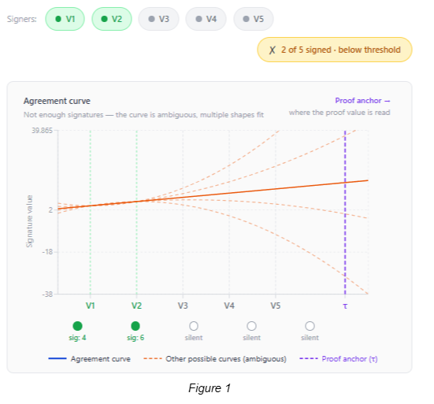
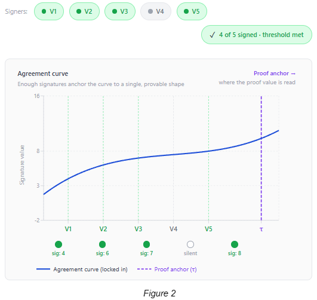

# Groth16, CLVM, and ballot finalization (companion to CHIP draft)

**What this doc is:** how **Ballot Coin `finalize`** checks a Groth16 proof plus aggregate **BLS** in CLVM ([CHIP-0011](https://github.com/Chia-Network/chips/blob/main/CHIPs/chip-0011.md)), **why** that combination is sound, and **informative** context on prover cost and a possible **BLS12-377** future. **Threshold intuition:** PNG figures below (`figure_1.png`, `figure_2.png`) sit in this same `assets/chip-scaled-parallel-voting/` folder (mirrored in the reference repo’s [`assets/`](https://github.com/DIG-Network/chia-scaled-parallel-voting/tree/main/assets)); they are **not** literal CRS diagrams.

**Code:** [DIG-Network/chia-scaled-parallel-voting](https://github.com/DIG-Network/chia-scaled-parallel-voting) on `main`. **Public-input order and Merkle rules:** [chip-witnesses-encoding.md](./chip-witnesses-encoding.md). **Spec overview:** [chip-scaled-parallel-voting.md](../../CHIPs/chip-scaled-parallel-voting.md).

---

## What CLVM contributes

**CLVM is not a general ZK virtual machine.** Under [CHIP-0011](https://github.com/Chia-Network/chips/blob/main/CHIPs/chip-0011.md) it exposes **BLS12-381** curve opcodes: enough for the **Groth16 verifier** as a fixed pairing-product check, and for **`bls_verify`** on aggregated signatures.

**Ballot `finalize`** ([`puzzles/ballot_coin/finalize.rue`](https://github.com/DIG-Network/chia-scaled-parallel-voting/blob/main/puzzles/ballot_coin/finalize.rue)) does the following in order:

1. Rebuilds the **Groth16 instance** from the proof \((A,B,C)\), the **verification key** \((\alpha,\beta,\gamma,\delta)\) and **input commitment** points **IC[0..8]** curried at deploy.
2. Derives eight **scalar inputs** \(s_1,\ldots,s_8\) from **on-chain-visible** data (registration snapshot, weights, `vote_message`, threshold pack, ballot id, num/den) and compares them to scalars supplied in the spend, so the proof cannot be replayed against a different ballot or election snapshot.
3. Computes **vk_input** \(= \mathrm{IC}_0 + \sum_{i=1}^{8} \mathrm{IC}_i \cdot s_i\) in G1 (same linear structure as standard Groth16 IC).
4. Uses **`bls_pairing_identity`** to assert the usual Groth16 pairing product holds for \((A,B,C)\), **vk_input**, and **VK** (i.e. the CLVM checks a **constant-size proof** in time that depends on **pairing cost**, not on the number of voters).
5. Separately runs **`bls_pairing_identity`** with **`g2_map`** on **`vote_message`** so the aggregate signature is bound to the same outcome message the circuit and announcements use.

**Bottom line:** Groth16 proves off-chain that the voting R1CS holds for those public inputs; CLVM reruns the verifier equation on the VK and scalars reconstructed from chain state.

---

## What the circuit proves (off-chain) vs what the chain checks (on-chain)

| Layer | Responsibility |
|--------|----------------|
| **R1CS + Groth16 (prover)** | Produces a proof that the circuit’s constraints are satisfied for the **committed** public inputs (e.g. that a **quorum / majority** relation over registered weight and the claimed signer set is consistent with the circuit definition (see comments in [`sdk/src/prover/circuit.rs`](https://github.com/DIG-Network/chia-scaled-parallel-voting/blob/main/sdk/src/prover/circuit.rs)). **Proof bytes ↔ arkworks:** [`sdk/src/prover/proof.rs`](https://github.com/DIG-Network/chia-scaled-parallel-voting/blob/main/sdk/src/prover/proof.rs). |
| **Ballot `finalize` (CLVM)** | Verifies the Groth16 proof with **CHIP-0011** pairings in [`finalize.rue`](https://github.com/DIG-Network/chia-scaled-parallel-voting/blob/main/puzzles/ballot_coin/finalize.rue); **re-derives** \(s_1..s_8\) from curried and solution fields; verifies **BLS aggregation** over **`vote_message`**. |
| **Registration / Voting puzzles** | Enroll voters in the registration SPT ([`register.rue`](https://github.com/DIG-Network/chia-scaled-parallel-voting/blob/main/puzzles/election/register.rue)), pin per-ballot **oracle** ([`oracle.rue`](https://github.com/DIG-Network/chia-scaled-parallel-voting/blob/main/puzzles/ballot_coin/oracle.rue); mint/update: [`mint_voting_coin.rue`](https://github.com/DIG-Network/chia-scaled-parallel-voting/blob/main/puzzles/registration_coin/mint_voting_coin.rue), [`update_vote.rue`](https://github.com/DIG-Network/chia-scaled-parallel-voting/blob/main/puzzles/voting_coin/update_vote.rue)), and keep voting state off the Election singleton’s hot path. |

**Why both Groth16 and `bls_verify`?** BLS aggregation gives a compact signature over **`vote_message`** tied to **`agg_signers`**. It does not, by itself, prove statements about **global** registration roots, **weights**, or **threshold arithmetic** inside a single cheap opcode. The circuit is where those predicates live as R1CS; Groth16 compresses that check to **three curve points and a handful of pairings** on-chain. The **oracle** spend on the Ballot Coin is still needed where the proof does not encode every pin (e.g. **`VOTE_CLOSE_HEIGHT`** and **`VOTE_OPTIONS_ROOT`** for mint/update).

**Finalize bundle assembly (off-chain):** [`sdk/src/actors/aggregator.rs`](https://github.com/DIG-Network/chia-scaled-parallel-voting/blob/main/sdk/src/actors/aggregator.rs). Example tests: [`sdk/tests/finalize_per_ballot_e2e.rs`](https://github.com/DIG-Network/chia-scaled-parallel-voting/blob/main/sdk/tests/finalize_per_ballot_e2e.rs), [`finalize_one_third_threshold_e2e.rs`](https://github.com/DIG-Network/chia-scaled-parallel-voting/blob/main/sdk/tests/finalize_one_third_threshold_e2e.rs).

---

## Why proving hurts today, and what BLS12-377 could change (informative)

**Informative only.** This section does not change interoperability requirements: ballot **`finalize`** still **MUST** verify Groth16 and **`bls_verify`** on **BLS12-381** per [CHIP-0011](https://github.com/Chia-Network/chips/blob/main/CHIPs/chip-0011.md). Discussion of **BLS12-377** below is **not** part of that requirement set.

**On-chain verification is the small, predictable part.** The puzzle takes a proof bundle and runs the pairing checks. That work stays **flat** for scale in the usual sense: `finalize` is not replaying tens of thousands of per-voter updates on chain.

**Off-chain proving is usually the expensive part.** The circuit stays in the **BLS12-381** Groth16 world, but many statements do not **fit** the scalar field natively, so the R1CS ends up **emulating heavier BLS12-381 arithmetic inside the BLS12-381 scalar circuit**. That pattern is called **field emulation**; in this protocol’s circuit stack it shows up as **tower-style** gadgets, with **k = 10** used here as shorthand for “deep emulation tower,” not as a normative constant for implementations. **Result:** proof generation can be **slow**, while **checking** the proof on chain stays comparatively cheap.

**BLS12-377 is the “what if CLVM grew a second pairing?” case.** **BLS12-377** and **BLS12-381** form a **cycle**: the curves are set up so a proof system can move between them instead of emulating **381** inside **381** forever. **If** consensus ever added **BLS12-377** pairing opcodes alongside today’s **381** surface, a plausible layout is **Groth16 verification on 377** in `finalize` with **voter BLS and `bls_verify` still on 381**. That split is the usual pattern people point at for **recursive proofs** and **L2-style consensus**: do the heavy batch proof on one side of the cycle, anchor the result on L1 on the other.

**Not part of this CHIP:** nothing here **requires** **377**. The goal is to document **where prover time goes today** and **what extra CLVM curve support could change later**.

---

## Why the on-chain scalar bindings matter

**The VK fixes the circuit; the public inputs fix the election/ballot instance.** If the prover’s scalars do not match what the puzzle recomputes from chain fields, **vk_input** is wrong and the pairing check fails.

Groth16’s **verification key** is tied to a **fixed circuit shape** and a **ceremony-produced** structured reference string. In [`finalize.rue`](https://github.com/DIG-Network/chia-scaled-parallel-voting/blob/main/puzzles/ballot_coin/finalize.rue), the prover supplies **Scalars** \(s_1,\ldots,s_8\); the puzzle **recomputes** the expected scalars from:

- `REGISTRATION_MERKLE_ROOT_SNAPSHOT`, `REGISTRATION_VOTE_WEIGHT_SNAPSHOT` (snapshotted at `createBallot`; [`create_ballot.rue`](https://github.com/DIG-Network/chia-scaled-parallel-voting/blob/main/puzzles/election/create_ballot.rue)),
- `agg_signers`, `vote_message`, `threshold_pack(VOTE_THRESHOLD_NUM, VOTE_THRESHOLD_DEN)`, `BALLOT_LAUNCHER_ID`,
- and the raw field encodings for num/den,

and **asserts equality** with the proof’s public scalars (hashes mod \(r\) where specified in the puzzle). Any mismatch means **vk_input** does not match what the prover used, and **pairing verification fails**. That is what prevents **cross-ballot replay** or **changing** the registration commitment **after** the ballot was created.

---

## Trusted setup and `vk_hash`

**Groth16 needs a circuit-specific CRS / VK.** This CHIP assumes a **multi-party ceremony** (see [chip-ceremony.md](./chip-ceremony.md); puzzles [`puzzles/ceremony_singleton/`](https://github.com/DIG-Network/chia-scaled-parallel-voting/tree/main/puzzles/ceremony_singleton)) yields a **verification key** whose **SHA-256** is **`vk_hash`** on the Election Singleton. Implementations **must** treat **`vk_hash`** and voucher binding as part of the trust model: a malicious VK breaks soundness regardless of CLVM correctness.

---

## Figures (pedagogical intuition)

**Not protocol diagrams.** The PNGs hosted with the reference implementation (`figure_1.png`, `figure_2.png` under [`assets/`](https://github.com/DIG-Network/chia-scaled-parallel-voting/tree/main/assets)) are **not** literal CLVM opcode or Groth16 CRS pictures. They illustrate **why a threshold can pin an outcome** before one talks about pairings: with **too few** contributions, many “curves” are still consistent with the observed data; with **enough** contributions, the aggregate constraint set can **lock** the relevant commitment. **τ** in the figures (“where the proof value is read”) is a visual stand-in for **evaluating a committed polynomial / SRS at a secret point** (the same *flavor* of idea that makes polynomial-based SNARKs work) without replacing the formal definition of Groth16.

### Figure 1: below threshold (ambiguous)

<figure>
  
  <figcaption align="center"><em>Figure 1: Too few signers leave the curve ambiguous (pedagogical).</em></figcaption>
</figure>

*Interpretation:* Until enough voters (by weight / quorum rule) are committed inside the proof’s statement, an adversary could still be consistent with **multiple** outcomes or weights, analogous to **many** degree-(\(n\)-1) curves through **too few** points.

### Figure 2: threshold met (curve locked)

<figure>
  
  <figcaption align="center"><em>Figure 2: Enough signers lock a single curve; τ is where the proof value is read (pedagogical).</em></figcaption>
</figure>

*Interpretation:* Once the threshold relation enforced in the circuit holds, the **public inputs** pin down the instance; Groth16 then proves that instance in zero knowledge (witness privacy is secondary here; **soundness** of the vote outcome + quorum claim is primary).

---

Companion index: [README.md](./README.md).
